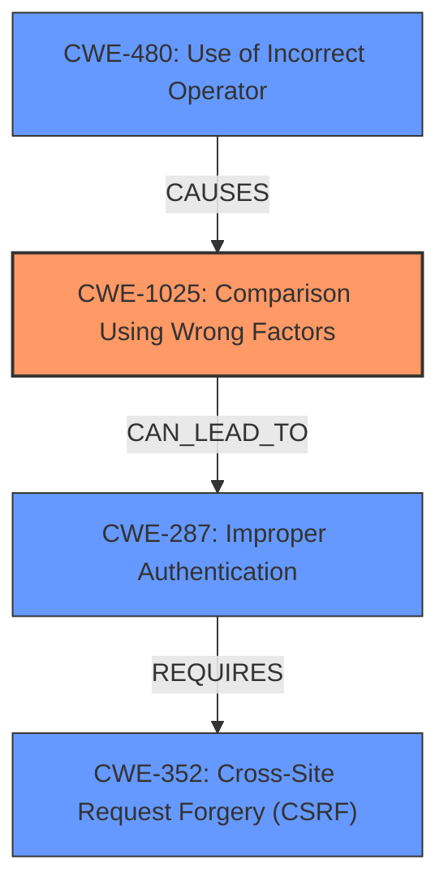

# Raw Analyzer Response for CVE-2021-29487

# Summary

| CWE ID    | CWE Name                                                                    | Confidence | CWE Abstraction Level | CWE Vulnerability Mapping Label | CWE-Vulnerability Mapping Notes |
| :-------- | :-------------------------------------------------------------------------- | :--------- | :-------------------- | :------------------------------ | :------------------------------ |
| CWE-1025  | Comparison Using Wrong Factors                                              | 0.8        | Base                  | Primary                         | Allowed                       |
| CWE-480   | Use of Incorrect Operator                                                   | 0.7        | Base                  | Secondary                       | Allowed                       |
| CWE-287   | Improper Authentication                                                     | 0.6        | Class                 | Secondary                       | Discouraged                    |
| CWE-352   | Cross-Site Request Forgery (CSRF)                                         | 0.5        | Compound              | Secondary                       | Allowed                       |

## Evidence and Confidence

*   **Confidence Score:** 0.8
*   **Evidence Strength:** HIGH

## Relationship Analysis

The primary weakness is **CWE-1025 Comparison Using Wrong Factors** because the code used loose comparison operators (`==`) instead of strict comparison operators (`===`) when checking permission values, leading to type juggling issues. **CWE-480 Use of Incorrect Operator** is related because the use of `==` instead of `===` is an instance of using the wrong operator. **CWE-287 Improper Authentication** is related because the **incorrect** comparison led to an authentication bypass. **CWE-352 Cross-Site Request Forgery (CSRF)** is present because of the crafted request and the need to know the Laravel secret key, which are required to exploit the vulnerability.

## Vulnerability Chain

The vulnerability chain starts with the **incorrect** comparison operators (**CWE-480 Use of Incorrect Operator**) which leads to **Comparison Using Wrong Factors** (**CWE-1025**) which then results in an **Improper Authentication** (**CWE-287**) and requires a **Cross-Site Request Forgery (CSRF)** (**CWE-352**) to exploit the vulnerability.

## Summary of Analysis

The initial assessment focused on identifying the root cause of the vulnerability. The evidence clearly points to the use of **incorrect** comparison operators leading to type juggling issues. The vulnerability description explicitly mentions the use of loose comparison operators (`==`) instead of strict comparison operators (`===`). This is a direct instance of **CWE-480 Use of Incorrect Operator** and **CWE-1025 Comparison Using Wrong Factors**, where the **incorrect** comparison allows an attacker to bypass authentication. The reference link summary states, "The code used loose comparison operators (`==`) instead of strict comparison operators (`===`) when checking permission values, leading to type juggling issues where string values could be interpreted as integers." This confirms that the **incorrect** comparison is the primary cause.

The graph relationships further support this assessment. The chain starts with the **incorrect** comparison, leading to authentication bypass and the exploitation involving CSRF. The selection of **CWE-1025 Comparison Using Wrong Factors** as the primary CWE is based on the fact that the **incorrect** comparison directly enables the type juggling, which is the core issue. **CWE-480 Use of Incorrect Operator** is also important because it is the direct cause of the **incorrect** comparison.

The selected CWEs are at the optimal level of specificity. **CWE-1025 Comparison Using Wrong Factors** is a Base-level CWE that accurately describes the specific issue. **CWE-480 Use of Incorrect Operator** is also a Base-level CWE that describes the direct cause of the **incorrect** comparison.
**CWE-287 Improper Authentication** is a Class-level CWE because it's a general authentication issue.
**CWE-352 Cross-Site Request Forgery (CSRF)** is a Compound-level CWE because it describes multiple weaknesses.

Relevant CWE Information:

# Enhanced Context (25 CWEs)

## CWE-1025: Comparison Using Wrong Factors
**Abstraction Level**: Base
**Similarity Score**: 0.272
**Source**: sparse

**Description**:
The code performs a comparison between two entities, but the comparison examines the wrong factors or characteristics of the entities, which can lead to incorrect results and resultant weaknesses.

**Mapping Guidance**:
- Usage: Allowed
- Rationale: This CWE entry is at the Base level of abstraction, which is a preferred level of abstraction for mapping to the root causes of vulnerabilities.

## CWE-480: Use of Incorrect Operator
**Abstraction Level**: Base
**Similarity Score**: 0.212
**Source**: sparse

**Description**:
The product accidentally uses the wrong operator, which changes the logic in security-relevant ways.

**Mapping Guidance**:
- Usage: Allowed
- Rationale: This CWE entry is at the Base level of abstraction, which is a preferred level of abstraction for mapping to the root causes of vulnerabilities.

## CWE-287: Improper Authentication
**Abstraction Level**: Class
**Similarity Score**: 0.183
**Source**: sparse

**Description**:
When an actor claims to have a given identity, the product does not prove or insufficiently proves that the claim is correct.

**Mapping Guidance**:
- Usage: Discouraged
- Rationale: This CWE entry might be misused when lower-level CWE entries are likely to be applicable. It is a level-1 Class (i.e., a child of a Pillar).

## CWE-352: Cross-Site Request Forgery (CSRF)
**Abstraction Level**: Compound
**Similarity Score**: 0.550
**Source**: dense

**Description**:
The web application does not, or can not, sufficiently verify whether a well-formed, valid, consistent request was intentionally provided by the user who submitted the request.

**Mapping Guidance**:
- Usage: Allowed
- Rationale: This is a well-known Composite of multiple weaknesses that must all occur simultaneously, although it is attack-oriented in nature.