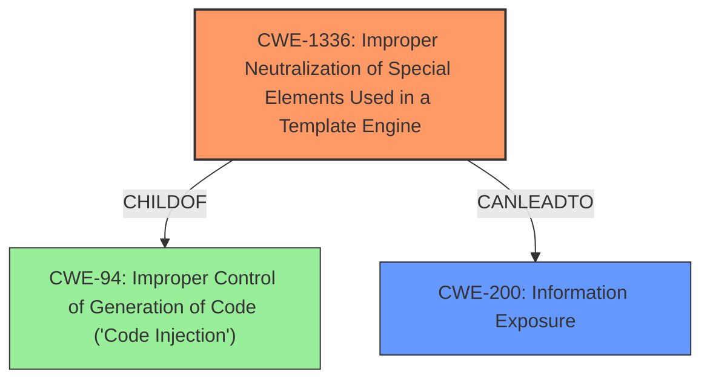

# Analysis for CVE-2021-29502

# Summary
| CWE ID  | CWE Name  | Confidence | CWE Abstraction Level | CWE Vulnerability Mapping Label | CWE-Vulnerability Mapping Notes |
|---|---|---|---|---|---|
| CWE-1336 | Improper Neutralization of Special Elements Used in a Template Engine | 1.0 | Base | Allowed | Primary CWE.  The **improper input sanitization** allows attackers to inject template expressions. |
| CWE-200 | Information Exposure | 0.7 | Class | Allowed | Secondary CWE.  The **improper input sanitization** results in access to sensitive information. |

## Evidence and Confidence

*   **Confidence Score:** 0.9
*   **Evidence Strength:** HIGH

## Relationship Analysis
The primary CWE is CWE-1336, which directly addresses the **improper neutralization** of special elements in a template engine. This maps directly to the vulnerability description's mention of **improper input sanitization** and the CVE's explanation of format string injection. The relationship to CWE-200 is that the exploitation of the template injection leads to **information exposure**, making it a secondary impact.

## Vulnerability Chain
The vulnerability chain starts with the **improper input sanitization** (CWE-1336), leading to the ability to inject malicious code into the template. This results in the execution of unintended code, allowing the attacker to access sensitive information (CWE-200).

## Summary of Analysis
The initial analysis and the provided evidence strongly support the selection of CWE-1336 as the primary CWE. The vulnerability description mentions **improper input sanitization**, and the CVE reference summary describes format string injection. This directly aligns with the CWE-1336 description of **improper neutralization** of special elements in a template engine.
The relationship graph emphasizes that CWE-1336 is a specific type of code injection. This makes the selection of CWE-1336 at the optimal level of specificity. The evidence to support this is as follows:
- "Vulnerability Description Key Phrases: **rootcause:** **improper input sanitization**"
- "CVE Reference Links Content Summary: The vulnerability stems from the way the `warnsystem` module formats embed descriptions. Specifically, it uses Python's string formatting (`.format()`) on user-provided input (the warn description template), without proper sanitization. This allows for the injection of malicious code within the format string, leading to remote code execution."
- "CVE Reference Links Content Summary: Attackers can use the vulnerability to access sensitive information by setting up specific templates. The code is able to access and format attributes of discord objects (like members, roles), making potentially sensitive information available to the attacker."

The retriever results listed several other CWEs, including CWE-201, CWE-863, CWE-184, and CWE-116.
- CWE-201 (Insertion of Sensitive Information Into Sent Data) was considered as a secondary weakness, but it is an impact of the primary weakness.
- CWE-863 (Incorrect Authorization) was not selected because the vulnerability does not stem from authorization issues, but rather from **improper input sanitization**.
- CWE-184 (Incomplete List of Disallowed Inputs) was not selected because the vulnerability is not due to an incomplete list of disallowed inputs, but rather from the lack of sanitization of user-provided input.
- CWE-116 (Improper Encoding or Escaping of Output) was not selected because the issue is not related to encoding or escaping of output, but rather to the **improper neutralization** of special elements used in a template engine.

Relevant CWE Information:

# Enhanced Context (25 CWEs)
The following CWEs were identified as potentially relevant to this vulnerability:

## CWE-184: Incomplete List of Disallowed Inputs
**Abstraction Level**: Base
**Similarity Score**: 0.80
**Source**: dense

**Description**:
The product implements a protection mechanism that relies on a list of inputs (or properties of inputs) that are not allowed by policy or otherwise require other action to neutralize before additional processing takes place, but the list is incomplete.

**Mapping Guidance**:
- Usage: Allowed
- Rationale: This CWE entry is at the Base level of abstraction, which is a preferred level of abstraction for mapping to the root causes of vulnerabilities.

## CWE-41: Improper Resolution of Path Equivalence
**Abstraction Level**: Base
**Similarity Score**: 0.80
**Source**: dense

**Description**:
The product is vulnerable to file system contents disclosure through path equivalence. Path equivalence involves the use of special characters in file and directory names. The associated manipulations are intended to generate multiple names for the same object.

**Mapping Guidance**:
- Usage: Allowed
- Rationale: This CWE entry is at the Base level of abstraction, which is a preferred level of abstraction for mapping to the root causes of vulnerabilities.

## CWE-23: Relative Path Traversal
**Abstraction Level**: Base
**Similarity Score**: 0.80
**Source**: dense

**Description**:
The product uses external input to construct a pathname that should be within a restricted directory, but it does not properly neutralize sequences such as ".." that can resolve to a location that is outside of that directory.

**Mapping Guidance**:
- Usage: Allowed
- Rationale: This CWE entry is at the Base level of abstraction, which is a preferred level of abstraction for mapping to the root causes of vulnerabilities.

## CWE-73: External Control of File Name or Path
**Abstraction Level**: Base
**Similarity Score**: 0.79
**Source**: dense

**Description**:
The product allows user input to control or influence paths or file names that are used in filesystem operations.

**Mapping Guidance**:
- Usage: Allowed
- Rationale: This CWE entry is at the Base level of abstraction, which is a preferred level of abstraction for mapping to the root causes of vulnerabilities.

## CWE-74: Improper Neutralization of Special Elements in Output Used by a Downstream Component ('Injection')
**Abstraction Level**: Class
**Similarity Score**: 0.79
**Source**: dense

**Description**:
The product constructs all or part of a command, data structure, or record using externally-influenced input from an upstream component, but it does not neutralize or incorrectly neutralizes special elements that could modify how it is parsed or interpreted when it is sent to a downstream component.

**Mapping Guidance**:
- Usage: Discouraged
- Rationale: CWE-74 is high-level and often misused when lower-level weaknesses are more appropriate.

## CWE-138: Improper Neutralization of Special Elements
**Abstraction Level**: Class
**Similarity Score**: 0.78
**Source**: dense

**Description**:
The product receives input from an upstream component, but it does not neutralize or incorrectly neutralizes special elements that could be interpreted as control elements or syntactic markers when they are sent to a downstream component.

**Mapping Guidance**:
- Usage: Discouraged
- Rationale: This CWE entry is a level-1 Class (i.e., a child of a Pillar). It might have lower-level children that would be more appropriate

## CWE-59: Improper Link Resolution Before File Access ('Link Following')
**Abstraction Level**: Base
**Similarity Score**: 0.78
**Source**: dense

**Description**:
The product attempts to access a file based on the filename, but it does not properly prevent that filename from identifying a link or shortcut that resolves to an unintended resource.

**Mapping Guidance**:
- Usage: Allowed
- Rationale: This CWE entry is at the Base level of abstraction, which is a preferred level of abstraction for mapping to the root causes of vulnerabilities.

## CWE-1289: Improper Validation of Unsafe Equivalence in Input
**Abstraction Level**: Base
**Similarity Score**: 0.78
**Source**: dense

**Description**:
The product receives an input value that is used as a resource identifier or other type of reference, but it does not validate or incorrectly validates that the input is equivalent to a potentially-unsafe value.

**Mapping Guidance**:
- Usage: Allowed
- Rationale: This CWE entry is at the Base level of abstraction, which is a preferred level of abstraction for mapping to the root causes of vulnerabilities.

## CWE-36: Absolute Path Traversal
**Abstraction Level**: Base
**Similarity Score**: 0.78
**Source**: dense

**Description**:
The product uses external input to construct a pathname that should be within a restricted directory, but it does not