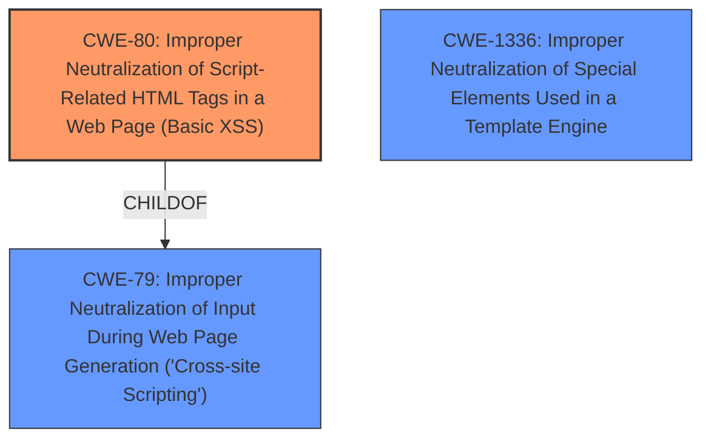

# Analysis Report for CVE-2021-29503

# Vulnerability Analysis Report: CVE-2021-29503

## Description


## Analysis (with Relationship Data)

# Summary
| CWE ID | CWE Name | Confidence | CWE Abstraction Level | CWE Vulnerability Mapping Label | CWE-Vulnerability Mapping Notes |
|---|---|---|---|---|---|
| CWE-80 | Improper Neutralization of Script-Related HTML Tags in a Web Page (Basic XSS) | 1.0 | Variant | Allowed | Primary CWE |
| CWE-79 | Improper Neutralization of Input During Web Page Generation ('Cross-site Scripting') | 0.7 | Base | Allowed | Secondary Candidate |
| CWE-1336 | Improper Neutralization of Special Elements Used in a Template Engine | 0.5 | Base | Allowed | Secondary Candidate |

## Evidence and Confidence

*   **Confidence Score:** 0.8
*   **Evidence Strength:** HIGH

## Relationship Analysis
The primary CWE selected is CWE-80, a Variant of CWE-79. This choice reflects the specific nature of the XSS vulnerability, which involves the improper neutralization of script-related HTML tags. CWE-79 is a more general Base class for XSS, while CWE-80 is a specific type. CWE-1336 relates to template engine vulnerabilities and may be applicable as a secondary weakness if the YAML metadata is processed via a template engine.



## Vulnerability Chain
The vulnerability chain starts with the **improper neutralization** of user-controlled input within the YAML metadata of a note. This leads to the ability to inject HTML tags, specifically `<script>` tags, into the Open Graph metadata section. The frontend then renders the script tag, resulting in the execution of arbitrary JavaScript code in the user's browser, which is **Cross-Site Scripting (XSS)**.
  - **Root Cause:** **Improper Neutralization**
  - **Weakness:** **Cross-Site Scripting (XSS)**
  - **Impact:** Arbitrary JavaScript Execution

## Summary of Analysis
The initial analysis identified a **cross-site scripting** vulnerability in HedgeDoc. The vulnerability allows an attacker with write access to a note to embed HTML tags in the Open Graph metadata section of the note, resulting in the frontend rendering the script tag as part of the `` section. The primary CWE selected, CWE-80, accurately reflects the root cause of the vulnerability, which is the improper neutralization of script-related HTML tags. This choice is supported by the vulnerability description and the CVE Reference Links Content Summary, which explicitly mentions the **improper neutralization** of script-related HTML tags within the Open Graph metadata. The retriever results also confirm the relevance of CWE-80.

The choice of CWE-80 as the primary CWE is further justified by its Abstraction Level as a Variant, which is preferred for mapping to root causes. The MITRE mapping guidance for CWE-80 allows its usage.

CWE-79 was considered as a more general case of XSS, but CWE-80 was selected as more specific because it directly involves script-related HTML tags.

CWE-1336 was also considered as a potential secondary CWE if the YAML metadata is processed by a template engine, but there is insufficient evidence to confirm the involvement of a template engine.

Evidence from the Vulnerability Description Key Phrases:
- **weakness:** **cross-site scripting**
Evidence from the CVE Reference Links Content Summary:
- "The vulnerability stems from the **improper neutralization** of script-related HTML tags within the Open Graph metadata of a note in HedgeDoc."
- "**Cross-Site Scripting (XSS):** The primary vulnerability is XSS, where malicious scripts can be injected into web pages."
- "**Improper Neutralization:** The application failed to neutralize or sanitize user-provided data used in the Open Graph meta tags."

The final decision to select CWE-80 as the primary CWE is based on the evidence that it accurately represents the specific vulnerability described and is at the optimal level of specificity.


## CWE Relationship Analysis

Current CWEs represent these abstraction levels: .


### Vulnerability Chain Analysis

**Chain starting from CWE-1336:**
- 1336 (Improper Neutralization of Special Elements Used in a Template Engine) - ROOT


**Chain starting from CWE-79:**
- 79 (Improper Neutralization of Input During Web Page Generation ('Cross-site Scripting')) - ROOT


### CWE Relationship Diagram

```mermaid
graph TD
    classDef primary fill:#f96,stroke:#333,stroke-width:2px
    classDef secondary fill:#69f,stroke:#333
    classDef tertiary fill:#9e9,stroke:#333
```


*Report generated on 2025-04-02 02:15:52*
