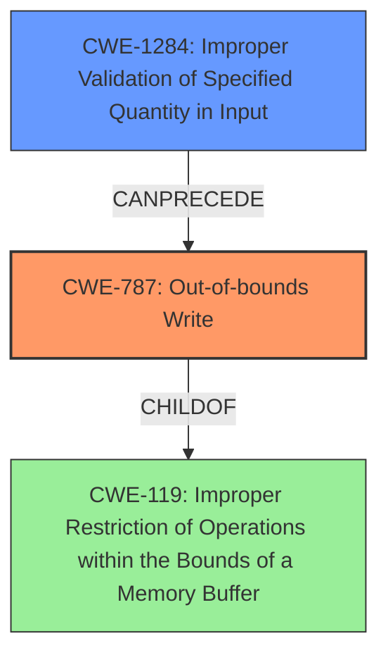

# Analysis for CVE-2021-29512

# Summary
| CWE ID | CWE Name | Confidence | CWE Abstraction Level | CWE Vulnerability Mapping Label | CWE-Vulnerability Mapping Notes |
|---|---|---|---|---|---|
| CWE-787 | Out-of-bounds Write | 0.9 | Base | Allowed | Primary CWE. The code writes data past the end of the `splits` tensor's buffer due to the **unchecked input**, leading to memory corruption. |
| CWE-1284 | Improper Validation of Specified Quantity in Input | 0.8 | Base | Allowed | The `splits` input to the `RaggedBincount` op is not properly validated to ensure it represents a valid `SparseTensor`, allowing an attacker to control the `splits` array and cause an out-of-bounds read. |
| CWE-119 | Improper Restriction of Operations within the Bounds of a Memory Buffer | 0.6 | Class | Discouraged | CWE-119 is a general class, and although the vulnerability falls under this category, CWE-787 is a more specific match. |

## Evidence and Confidence

*   **Confidence Score:** 0.85
*   **Evidence Strength:** HIGH

## Relationship Analysis
The primary weakness is CWE-787, which is a child of the more general CWE-119. CWE-1284 is related as it describes the **improper validation** that leads to the vulnerability. Specifically, the lack of validation allows an attacker to craft the `splits` array to trigger the out-of-bounds write.

## Vulnerability Chain
The vulnerability chain starts with **improper input validation** (CWE-1284) of the `splits` argument in the `RaggedBincount` operation. This leads to an out-of-bounds read and subsequent **heap buffer overflow** (CWE-787) when the code attempts to access `splits(1)` which is outside the bounds of the `splits` tensor buffer.

## Summary of Analysis
The analysis is based on the provided vulnerability description and CVE reference summary. The description clearly states that the vulnerability is a **heap buffer overflow** due to an **unchecked input**, which aligns with the characteristics of CWE-787.

The evidence includes:
- "If the `splits` argument of `RaggedBincount` does not specify a valid `SparseTensor`, then an attacker can trigger a **heap buffer overflow**."
- "This will cause a read from outside the bounds of the `splits` tensor buffer"
- "The user controls the `splits` array, making it contain only one element, 0. Thus, the code in the `while` loop would increment `batch_idx` and then try to read `splits(1)`, which is outside of bounds."

The retriever results also support the selection of CWE-787, although the graph score is low, the vulnerability description makes it apparent that the heap buffer overflow is the correct CWE to choose. The relationship between CWE-1284 and CWE-787 is that the improper validation allows for the out-of-bounds write to occur.

CWE-119 was considered but not used as the primary CWE because it is a more general class. While the vulnerability does involve improper restriction of operations within the bounds of a memory buffer, CWE-787 provides a more specific classification of the weakness as an out-of-bounds write.

The selected CWEs are at the optimal level of specificity because they accurately represent the root cause and resulting weakness. CWE-787 describes the specific type of memory corruption that occurs, and CWE-1284 describes the **lack of input validation** that enables the vulnerability.