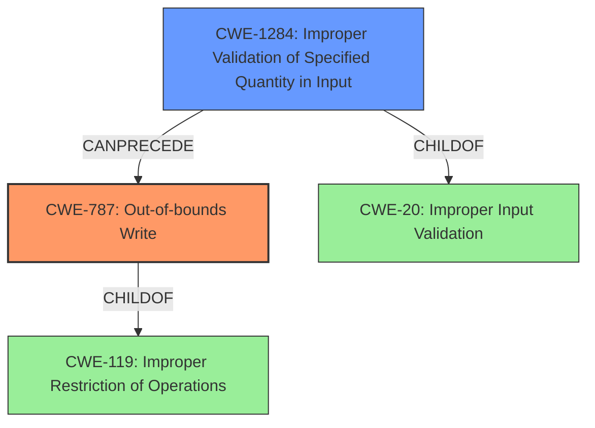

# Enhanced Analysis for CVE-2021-29520

# Summary
| CWE ID  | CWE Name  | Confidence | CWE Abstraction Level | CWE Vulnerability Mapping Label | CWE-Vulnerability Mapping Notes |
|---|---|---|---|---|---|
| CWE-787 | Out-of-bounds Write | 1.0 | Base | Allowed | Primary CWE |
| CWE-1284 | Improper Validation of Specified Quantity in Input | 0.9 | Base | Allowed | Secondary Candidate |

## Evidence and Confidence

*   **Confidence Score:** 0.95
*   **Evidence Strength:** HIGH

## Relationship Analysis
The primary CWE selected is CWE-787 (**Out-of-bounds Write**), which is directly related to the **heap buffer overflow** described in the vulnerability.  CWE-787 is a child of CWE-119 (**Improper Restriction of Operations within the Bounds of a Memory Buffer**), indicating a more specific type of buffer handling issue. CWE-1284 (**Improper Validation of Specified Quantity in Input**) can lead to conditions that precede out-of-bounds writes, as it deals with validating input quantities, and its selection is based on the **missing validation** aspect. The chosen CWEs are at the Base level of abstraction which is preferred.



## Vulnerability Chain
The vulnerability chain starts with **missing validation** of input tensors to `tf.raw_ops.Conv3DBackprop*` operations (CWE-1284).  This leads to an assumption that the tensors have the same shape. Because of this **missing validation**, a **heap buffer overflow** (CWE-787) occurs, as the implementation accesses the tensors in parallel without proper bounds checking.

## Summary of Analysis
The analysis indicates that the vulnerability is primarily a **heap buffer overflow** (CWE-787) resulting from **missing validation** (CWE-1284) of the shapes of input tensors.

The vulnerability description clearly states: "**Missing validation between arguments to `tf.raw_ops.Conv3DBackprop*` operations can result in heap buffer overflows.**" This statement directly supports the selection of CWE-787 as the primary weakness and CWE-1284 as a secondary weakness. The "CVE Reference Links Content Summary" section reinforces this by stating: "**Root cause of vulnerability: Missing validation between arguments to `tf.raw_ops.Conv3DBackprop*` operations.**" and "**Weaknesses/vulnerabilities present: Heap buffer overflow due to lack of shape validation**".

The selection of CWE-787 is at the appropriate level of specificity because the vulnerability involves writing data past the end of a heap-allocated buffer. CWE-1284 is also appropriately selected as it identifies the **missing validation** of specified quantities, which in this case are the tensor shapes.

Relevant CWE Information:

# Enhanced Context (25 CWEs)

## CWE-415: Double Free
**Abstraction Level**: Variant
**Similarity Score**: 0.78
**Source**: dense
*Rationale for not selecting*: There is no evidence to support a double free condition. The vulnerability is due to a buffer overflow.

## CWE-131: Incorrect Calculation of Buffer Size
**Abstraction Level**: Base
**Similarity Score**: 0.77
**Source**: dense
*Rationale for not selecting*: While a buffer overflow occurs, the root cause is **missing validation** of the input shapes, not an incorrect calculation of the buffer size itself.

## CWE-824: Access of Uninitialized Pointer
**Abstraction Level**: Base
**Similarity Score**: 0.76
**Source**: dense
*Rationale for not selecting*: There is no evidence to suggest that an uninitialized pointer is involved in the vulnerability.

## CWE-191: Integer Underflow (Wrap or Wraparound)
**Abstraction Level**: Base
**Similarity Score**: 0.76
**Source**: dense
*Rationale for not selecting*: There is no evidence to support integer underflow

## CWE-125: Out-of-bounds Read
**Abstraction Level**: Base
**Similarity Score**: 0.76
**Source**: dense
*Rationale for not selecting*: The primary weakness is a write out-of-bounds not a read.

## CWE-226: Sensitive Information in Resource Not Removed Before Reuse
**Abstraction Level**: Base
**Similarity Score**: 0.76
**Source**: dense
*Rationale for not selecting*: Not relevant. The vulnerability does not involve sensitive information or resource reuse.

## CWE-193: Off-by-one Error
**Abstraction Level**: Base
**Similarity Score**: 0.76
**Source**: dense
*Rationale for not selecting*: An off-by-one error is not the primary cause of the vulnerability. The issue is a more general lack of shape validation leading to a buffer overflow.

## CWE-404: Improper Resource Shutdown or Release
**Abstraction Level**: Class
**Similarity Score**: 0.76
**Source**: dense
*Rationale for not selecting*: Not relevant. The vulnerability is not related to resource shutdown or release.

## CWE-681: Incorrect Conversion between Numeric Types
**Abstraction Level**: Base
**Similarity Score**: 0.76
**Source**: dense
*Rationale for not selecting*: There is no evidence to support incorrect conversion between numeric types.

## CWE-667: Improper Locking
**Abstraction Level**: Class
**Similarity Score**: 0.76
**Source**: dense
*Rationale for not selecting*: Not relevant. The vulnerability does not involve locking issues.

## CWE-190: Integer Overflow or Wraparound
**Abstraction Level**: Base
**Similarity Score**: 6824.76
**Source**: sparse
*Rationale for not selecting*: While an integer overflow could theoretically occur due to the **missing validation**, the primary issue and stated vulnerability is the buffer overflow, not the integer overflow itself.

## CWE-1284: Improper Validation of Specified Quantity in Input
**Abstraction Level**: Base
**Similarity Score**: 6371.94
**Source**: sparse
*Rationale for selecting*: The **missing validation** of input tensor shapes is a key aspect of the vulnerability. This leads to the **heap buffer overflow**.

## CWE-1287: Improper Validation of Specified Type of Input
**Abstraction Level**: Base
**Similarity Score**: 3.64
**Source**: graph
*Rationale for not selecting*: Input type is not the primary concern. The shapes or sizes are.

## CWE-787: Out-of-bounds Write
**Abstraction Level**: base
**Similarity Score**: 4.33
**Source**: graph
*Rationale for selecting*: This directly matches the **heap buffer overflow** vulnerability caused by the **missing validation**.

## CWE-122: Heap-based Buffer Overflow
**Abstraction Level**: Variant
**Similarity Score**: 0.906
**Source**: sparse
*Rationale for selecting CWE-787 instead*:  CWE-122 is a `Variant` of CWE-787, but the description focuses on the location of the buffer.  The vulnerability is primarily about the out-of-bounds write, not specifically that it's heap-based.  CWE-787 is more directly descriptive.


## CWE Relationship Analysis

Current CWEs represent these abstraction levels: .


### Vulnerability Chain Analysis

**Chain starting from CWE-667:**
- 667 (Improper Locking) - ROOT


**Chain starting from CWE-787:**
- 787 (Out-of-bounds Write) - ROOT


### CWE Relationship Diagram

```mermaid
graph TD
    classDef primary fill:#f96,stroke:#333,stroke-width:2px
    classDef secondary fill:#69f,stroke:#333
    classDef tertiary fill:#9e9,stroke:#333
```