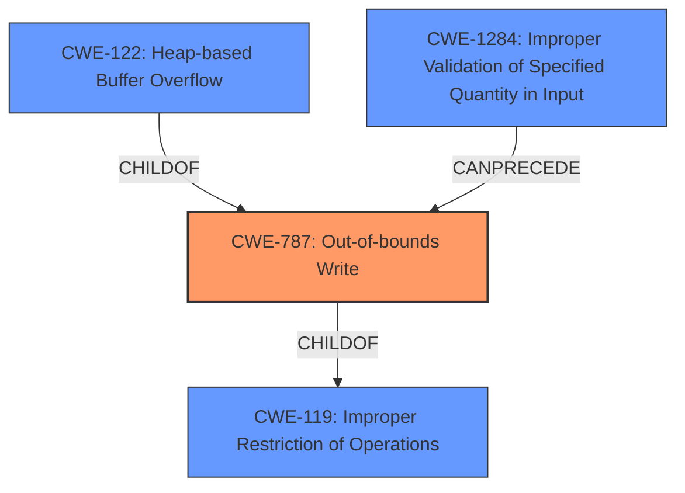

# Enhanced Analysis for CVE-2021-29536

# Summary
| CWE ID  | CWE Name  | Confidence | CWE Abstraction Level | CWE Vulnerability Mapping Label | CWE-Vulnerability Mapping Notes |
|---|---|---|---|---|---|
| CWE-787 | Out-of-bounds Write | 1.0  | Base  | ALLOWED  | Primary CWE |
| CWE-122 | Heap-based Buffer Overflow | 0.9 | Variant  | ALLOWED  | Secondary Candidate |
| CWE-1284 | Improper Validation of Specified Quantity in Input | 0.7 | Base  | ALLOWED  | Secondary Candidate |
| CWE-119 | Improper Restriction of Operations within the Bounds of a Memory Buffer | 0.5  | Class  | DISCOURAGED  | Secondary Candidate |

## Evidence and Confidence

*   **Confidence Score:** 0.9
*   **Evidence Strength:** HIGH

## Relationship Analysis
The primary weakness is CWE-787 (**Out-of-bounds Write**), which is a base-level CWE. CWE-122 (**Heap-based Buffer Overflow**) is a variant of CWE-787 and could be applicable, but lacks the broader context of missing input validation. CWE-119 (**Improper Restriction of Operations within the Bounds of a Memory Buffer**) is a class-level CWE and is too general. CWE-1284 (**Improper Validation of Specified Quantity in Input**) can precede CWE-787 since the **missing** validation leads to the **out-of-bounds write**.



## Vulnerability Chain
The vulnerability chain starts with **missing** input validation (CWE-1284), which leads to an **out-of-bounds write** (CWE-787), resulting in a **heap buffer overflow**.

## Summary of Analysis
The initial analysis identified a **heap buffer overflow** due to **missing** input validation in TensorFlow. The provided evidence clearly indicates an **out-of-bounds write** when the code attempts to access elements of empty tensors without proper validation.

The selection of CWE-787 (**Out-of-bounds Write**) as the primary CWE is based on the following evidence:

- The vulnerability description explicitly states that the code tries to access the element at position 0 of an empty buffer, resulting in overflow. This directly aligns with the definition of CWE-787, which involves writing data past the end or before the beginning of the intended buffer.
- The "CVE Reference Links Content Summary" confirms the **heap buffer overflow** and the **lack of proper validation** of the input tensors. It specifically mentions that the code doesn't check if the input tensors are empty before attempting to read values, leading to the overflow.

CWE-122 (**Heap-based Buffer Overflow**) was considered as a more specific variant of CWE-787, and it is relevant since the overflow occurs in the heap. However, CWE-787 is more appropriate because it is a base CWE and the heap allocation is not the root cause. The root cause is that there is a **write** outside the intended buffer.

CWE-1284 (**Improper Validation of Specified Quantity in Input**) was considered because the vulnerability stems from the **lack of validation** of the input tensors' size or length. The code assumes the input is a scalar or a vector with a single element. The retriever results also list this CWE as a potential match. This is a contributing factor but not the direct cause of the **out-of-bounds write**.

CWE-119 (**Improper Restriction of Operations within the Bounds of a Memory Buffer**) was initially considered as a general classification for buffer overflows. However, the MITRE mapping guidance discourages the use of CWE-119 when more specific CWEs are available.

Based on the evidence and the relationship analysis, CWE-787 is the most appropriate primary CWE, as it accurately captures the **out-of-bounds write** condition, while CWE-122 and CWE-1284 are secondary candidates.


## CWE Relationship Analysis

Current CWEs represent these abstraction levels: .


### Vulnerability Chain Analysis

**Chain starting from CWE-1284:**
- 1284 (Improper Validation of Specified Quantity in Input) - ROOT


**Chain starting from CWE-787:**
- 787 (Out-of-bounds Write) - ROOT


### CWE Relationship Diagram

```mermaid
graph TD
    classDef primary fill:#f96,stroke:#333,stroke-width:2px
    classDef secondary fill:#69f,stroke:#333
    classDef tertiary fill:#9e9,stroke:#333
```