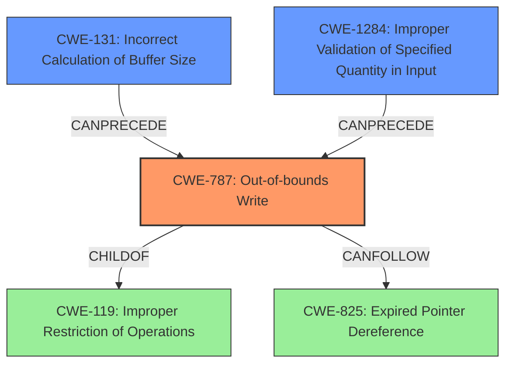

# Raw Analyzer Response for CVE-2021-29540

# Summary
| CWE ID | CWE Name | Confidence | CWE Abstraction Level | CWE Vulnerability Mapping Label | CWE-Vulnerability Mapping Notes |
|---|---|---|---|---|---|
| CWE-787 | Out-of-bounds Write | 1.0 | Base | Allowed | Primary CWE |
| CWE-131 | Incorrect Calculation of Buffer Size | 0.8 | Base | Allowed | Secondary Candidate |
| CWE-1284 | Improper Validation of Specified Quantity in Input | 0.7 | Base | Allowed | Secondary Candidate |

## Evidence and Confidence

*   **Confidence Score:** 0.9
*   **Evidence Strength:** HIGH

## Relationship Analysis
The primary CWE is CWE-787, which directly addresses the **out-of-bounds write**. CWE-131 and CWE-1284 are related because they point to the root cause of the vulnerability. CWE-131 (Incorrect Calculation of Buffer Size) describes how the buffer size was incorrectly determined, leading to the out-of-bounds write. CWE-1284 (Improper Validation of Specified Quantity in Input) highlights the lack of validation on the size of the input. These relationships help to establish both the direct weakness and the underlying causes.

## Vulnerability Chain
The vulnerability chain begins with **incorrect calculation of the filter tensor size** (CWE-131) and **improper validation of the input size** (CWE-1284). This leads to an **out-of-bounds write** (CWE-787) when the code writes to the buffer using the incorrect size, potentially causing a heap buffer overflow.
- CWE-131: Incorrect Calculation of Buffer Size
- CWE-1284: Improper Validation of Specified Quantity in Input
- CWE-787: Out-of-bounds Write

## Summary of Analysis
This analysis identifies CWE-787 as the primary weakness, with CWE-131 and CWE-1284 as contributing factors. The vulnerability description clearly states that a **heap buffer overflow** can occur due to the **incorrect size calculation** of the filter tensor, leading to an **out-of-bounds write**.

The evidence supporting these mappings is found in the "CVE Reference Links Content Summary" section:
- "**Root cause of vulnerability:** The vulnerability stems from an **incorrect calculation** of the filter tensor size...". This supports CWE-131 and contributes to the **out-of-bounds write** (CWE-787).
- "The implementation computes the size of the filter tensor based on `filter_sizes` dimensions but doesn't validate that this computed size matches the actual number of elements in `filter_sizes`." This supports CWE-1284 and contributes to the **out-of-bounds write** (CWE-787).
- "**Weaknesses/vulnerabilities present:** - Heap buffer overflow: Due to the incorrect size calculation, a buffer overflow can occur when writing to the filter tensor, leading to memory corruption." This clearly supports the assignment of CWE-787.

The retriever results and graph relationships confirm that CWE-787 is a strong candidate due to the **out-of-bounds write**, and the related CWEs help to explain the root cause.

The selected CWEs are at the optimal level of specificity because CWE-787 directly addresses the **out-of-bounds write** condition, while CWE-131 and CWE-1284 identify the root causes that led to the vulnerability. Using more general CWEs like CWE-119 would not provide sufficient detail regarding the specific nature of the flaw.

Relevant CWE Information:
- CWE-191: Integer Underflow (Wrap or Wraparound) - Not applicable because there is no mention of integer underflow.
- CWE-805: Buffer Access with Incorrect Length Value - This is related to CWE-131, but CWE-131 describes it more accurately.
- CWE-125: Out-of-bounds Read - Not applicable because the vulnerability is about writing out of bounds, not reading.
- CWE-193: Off-by-one Error - Not applicable because the error is not necessarily off-by-one.
- CWE-824: Access of Uninitialized Pointer - Not applicable because the vulnerability is not about accessing an uninitialized pointer.
- CWE-681: Incorrect Conversion between Numeric Types - Not applicable because there is no mention of incorrect conversion between numeric types.
- CWE-126: Buffer Over-read - Not applicable because the vulnerability is about writing out of bounds, not reading.
- CWE-197: Numeric Truncation Error - Not applicable because there is no mention of numeric truncation error.
- CWE-190: Integer Overflow or Wraparound - Not directly applicable, but could be a consequence of the incorrect buffer size calculation in some scenarios, but there is no evidence.
- CWE-170: Improper Null Termination - Not applicable because the vulnerability is not about null termination.
- CWE-617: Reachable Assertion - Not applicable because the vulnerability is not about assertions.
- CWE-476: NULL Pointer Dereference - Not applicable because the vulnerability is not about null pointer dereference.
- CWE-252: Unchecked Return Value - Not applicable because the vulnerability is not about unchecked return values.
- CWE-123: Write-what-where Condition - Related, but CWE-787 is more specific to the vulnerability.
- CWE-128: Wrap-around Error - Not directly applicable, but could be a consequence of the incorrect buffer size calculation.
- CWE-1339: Insufficient Precision or Accuracy of a Real Number - Not applicable because the vulnerability is not related to real number precision.