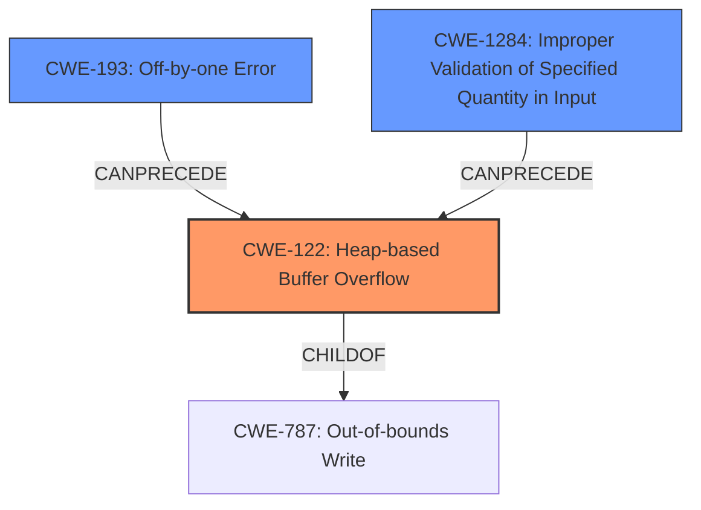

# Analysis for CVE-2021-29542

# Summary
| CWE ID | CWE Name | Confidence | CWE Abstraction Level | CWE Vulnerability Mapping Label | CWE-Vulnerability Mapping Notes |
|---|---|---|---|---|---|
| CWE-122 | Heap-based Buffer Overflow | 0.9 | Variant | Allowed | Primary CWE |
| CWE-193 | Off-by-one Error | 0.6 | Base | Allowed | Secondary Candidate |
| CWE-1284 | Improper Validation of Specified Quantity in Input | 0.5 | Base | Allowed | Secondary Candidate |

## Evidence and Confidence

*   **Confidence Score:** 0.8
*   **Evidence Strength:** HIGH

## Relationship Analysis
The primary CWE is CWE-122, which is a variant of CWE-787 (Out-of-bounds Write). The vulnerability also involves a failure to properly validate input quantities, which could be related to CWE-1284. An off-by-one error (CWE-193) might be a contributing factor to the heap buffer overflow.

## Vulnerability Chain
The vulnerability chain starts with **improper handling of corner cases** where the input to `tf.raw_ops.StringNGrams` is crafted such that generated tokens contain only padding. This leads to accessing `data[-1]` when `num_tokens` is 0, resulting in a **heap buffer overflow** (CWE-122). The **failure to consider corner cases** implies a lack of proper validation (CWE-1284) which could be a contributing factor. Furthermore, the indexing issue with `data[-1]` could be related to an off-by-one error (CWE-193).

## Summary of Analysis
The initial analysis identified the **heap buffer overflow** as the primary weakness, triggered by crafted inputs to `tf.raw_ops.StringNGrams`. The root cause involves the **failure to consider corner cases**, leading to an out-of-bounds read. The relationship graph shows that CWE-122 is a child of CWE-787 (Out-of-bounds Write). While CWE-119 (Improper Restriction of Operations within the Bounds of a Memory Buffer) is a more general category, CWE-787 and its variant CWE-122 are more specific. CWE-193 (Off-by-one Error) and CWE-1284 (Improper Validation of Specified Quantity in Input) are included as secondary factors that could contribute to the vulnerability.

The selected CWEs are at the optimal level of specificity because CWE-122 directly describes the type of buffer overflow (heap-based), and CWE-193 and CWE-1284 capture the potential contributing factors related to indexing and input validation, respectively.

The evidence is based on the following excerpts:
- "an attacker can cause a **heap buffer overflow** by passing crafted inputs to `tf.raw_ops.StringNGrams`"
- "the implementation **fails to consider corner cases**"
- "If input is such that `num_tokens` is 0, then, for `data_start_index=0` (when left padding is present), the marked line would result in reading `data[-1]`."

# Relevant CWE Information:

## CWE-415: Double Free
This CWE was considered because memory corruption is present. However, the description does not mention double freeing. Therefore, it was not selected.

## CWE-131: Incorrect Calculation of Buffer Size
This CWE was considered because there is a heap buffer overflow. However, the description does not state the calculation of the buffer size is incorrect. Therefore, it was not selected.

## CWE-824: Access of Uninitialized Pointer
This CWE was considered because memory corruption is present. However, the description does not mention an uninitialized pointer. Therefore, it was not selected.

## CWE-191: Integer Underflow (Wrap or Wraparound)
This CWE was considered because memory corruption is present. However, the description does not mention an integer underflow. Therefore, it was not selected.

## CWE-226: Sensitive Information in Resource Not Removed Before Reuse
This CWE was considered because memory corruption is present. However, the description does not mention sensitive information in a resource. Therefore, it was not selected.

## CWE-125: Out-of-bounds Read
This CWE was considered because reading out of bounds can cause memory corruption. However, the description specifically mentions a **heap buffer overflow** so it is more specific to assign CWE-122. Therefore, it was not selected.

## CWE-193: Off-by-one Error
This CWE was considered because accessing `data[-1]` could be caused by an off-by-one error, as the index is one less than the start of the buffer. Therefore, it was selected as a secondary candidate.

## CWE-667: Improper Locking
This CWE was considered because there is a memory corruption. However, the description does not mention improper locking. Therefore, it was not selected.

## CWE-404: Improper Resource Shutdown or Release
This CWE was considered because there is a memory corruption. However, the description does not mention improper resource shutdown or release. Therefore, it was not selected.

## CWE-681: Incorrect Conversion between Numeric Types
This CWE was considered because there is a memory corruption. However, the description does not mention incorrect conversion between numeric types. Therefore, it was not selected.

## CWE-190: Integer Overflow or Wraparound
This CWE was considered because there is a memory corruption. However, the description does not mention integer overflow. Therefore, it was not selected.

## CWE-1284: Improper Validation of Specified Quantity in Input
This CWE was considered because the implementation **fails to consider corner cases**. This would cause improper validation in the input data, so it was selected as a secondary candidate.

## CWE-123: Write-what-where Condition
This CWE was considered because there is memory corruption. However, the description is more specific to an out-of-bounds write caused by a heap buffer overflow. Therefore, it was not selected.

## CWE-128: Wrap-around Error
This CWE was considered because there is memory corruption. However, the description does not mention wrap-around error. Therefore, it was not selected.

## CWE-416: Use After Free
This CWE was considered because there is memory corruption. However, the description does not mention use-after-free. Therefore, it was not selected.

## CWE-195: Signed to Unsigned Conversion Error
This CWE was considered because there is memory corruption. However, the description does not mention signed to unsigned conversion error. Therefore, it was not selected.

## CWE-787: Out-of-bounds Write
This CWE was considered because there is memory corruption. However, the description is more specific to a heap buffer overflow so it is more specific to assign CWE-122. Therefore, it was not selected.

## CWE-825: Expired Pointer Dereference
This CWE was considered because there is memory corruption. However, the description does not mention expired pointer dereference. Therefore, it was not selected.

## CWE-170: Improper Null Termination
This CWE was considered because there is memory corruption. However, the description does not mention improper null termination. Therefore, it was not selected.

## CWE-617: Reachable Assertion
This CWE was considered because there is memory corruption. However, the description does not mention reachable assertion. Therefore, it was not selected.

## CWE-1341: Multiple Releases of Same Resource or Handle
This CWE was considered because there is memory corruption. However, the description does not mention multiple releases of the same resource or handle. Therefore, it was not selected.