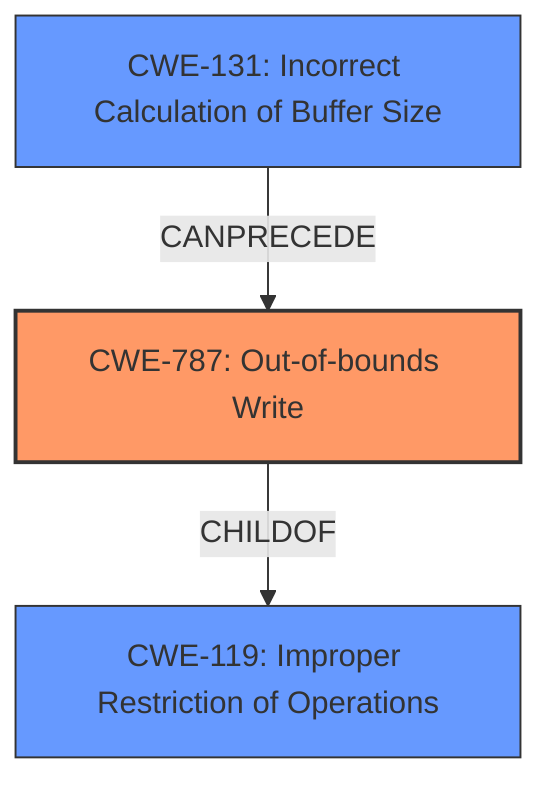

# Analysis Report for CVE-2021-29558

# Vulnerability Analysis Report: CVE-2021-29558

## Description


## Analysis (with Relationship Data)

# Summary
| CWE ID | CWE Name | Confidence | CWE Abstraction Level | CWE Vulnerability Mapping Label | CWE-Vulnerability Mapping Notes |
|---|---|---|---|---|---|
| CWE-787 | Out-of-bounds Write | 1.0 | Base | Primary | Allowed |
| CWE-131 | Incorrect Calculation of Buffer Size | 0.7 | Base | Secondary | Allowed |

## Evidence and Confidence

*   **Confidence Score:** 0.9
*   **Evidence Strength:** HIGH

## Relationship Analysis
The primary CWE is CWE-787 (**Out-of-bounds Write**), which is a base-level CWE. The description indicates a heap buffer overflow due to writing past the allocated boundary of an array, which directly aligns with CWE-787. The secondary CWE is CWE-131 (**Incorrect Calculation of Buffer Size**), as the vulnerability arises from accessing an array element based on a user-controlled offset, implying a potential miscalculation of the required buffer size.



## Vulnerability Chain
The vulnerability chain starts with the **incorrect or missing bounds check** on user-controlled input (`split_dim`, `indices`, `shape`, and `num_split`). This leads to an **incorrect calculation of the index** (`slice_index`). Finally, the **out-of-bounds write** to the `num_values` array occurs.
  - Improper Input Validation --> Incorrect Calculation of Buffer Size --> Out-of-bounds Write --> Heap Corruption

## Summary of Analysis
The initial assessment, based on the provided evidence, indicates a **heap buffer overflow** due to a **missing bounds check** on a user-controlled offset.

The key evidence includes:
- **"heap buffer overflow"** from the "Vulnerability Description Key Phrases".
- **"Heap buffer overflow: The core issue is writing past the allocated boundary of the `num_values` array."** from the "CVE Reference Links Content Summary" section.
- **"Missing Bounds Check: The `slice_index` is calculated using user-controlled input (`dim`), `split_size` and `residual` parameters, which are not validated before accessing the array."** from the "CVE Reference Links Content Summary" section.

The graph relationships help solidify the assessment by showing how various CWEs can precede or follow each other. For example, CWE-131 (**Incorrect Calculation of Buffer Size**) can precede CWE-787 (**Out-of-bounds Write**), which aligns with the vulnerability description.

CWE-787 (**Out-of-bounds Write**) is the most specific and accurate representation of the vulnerability, as it directly describes the **writing past the allocated boundary of the `num_values` array**. CWE-131 (**Incorrect Calculation of Buffer Size**) is also relevant, as it highlights the **potential miscalculation of the required buffer size** due to the user-controlled offset.

Other CWEs Considered but Not Used:

*   CWE-119 (**Improper Restriction of Operations within the Bounds of a Memory Buffer**): While this is a broader category that includes out-of-bounds writes, CWE-787 (**Out-of-bounds Write**) is more specific and therefore a better fit. It's discouraged to use CWE-119 when a more specific child is available.
*   CWE-122 (**Heap-based Buffer Overflow**): While the vulnerability is a heap-based buffer overflow, CWE-787 (**Out-of-bounds Write**) describes the root cause more accurately. CWE-122 is a variant describing the location of the buffer while CWE-787 describes the root cause.
*   CWE-190 (**Integer Overflow or Wraparound**): While an integer overflow could potentially lead to an incorrect index calculation, the primary issue is the lack of bounds checking on the user-controlled offset, not an integer overflow itself.
*   CWE-824 (**Access of Uninitialized Pointer**): This CWE doesn't fit the description, as the issue is not about accessing an uninitialized pointer but rather writing past the end of a buffer.
*   CWE-681 (**Incorrect Conversion between Numeric Types**): There is no evidence to suggest that an incorrect conversion between numeric types is the cause of this vulnerability.
*   CWE-1284 (**Improper Validation of Specified Quantity in Input**): This is similar to the lack of bounds checking, but CWE-131 (**Incorrect Calculation of Buffer Size**) is more closely related to the buffer size calculation aspect.
*   CWE-128 (**Wrap-around Error**): Similar to integer overflow, but not the primary cause.
*   CWE-193 (**Off-by-one Error**): The issue is not specifically an off-by-one error, but rather a broader out-of-bounds write.
*   CWE-674 (**Uncontrolled Recursion**): This is not related to recursion.
*   CWE-415 (**Double Free**): This is not related to freeing memory.

The final selection of CWE-787 (**Out-of-bounds Write**) as the primary CWE and CWE-131 (**Incorrect Calculation of Buffer Size**) as the secondary CWEs is based on the detailed analysis of the vulnerability description, the relationships between different CWEs, and the MITRE mapping guidance. The selected CWEs are at the optimal level of specificity, accurately representing the root cause and contributing factors of the vulnerability.


## CWE Relationship Analysis

Current CWEs represent these abstraction levels: .


### Vulnerability Chain Analysis

**Chain starting from CWE-787:**
- 787 (Out-of-bounds Write) - ROOT


**Chain starting from CWE-415:**
- 415 (Double Free) - ROOT


### CWE Relationship Diagram

```mermaid
graph TD
    classDef primary fill:#f96,stroke:#333,stroke-width:2px
    classDef secondary fill:#69f,stroke:#333
    classDef tertiary fill:#9e9,stroke:#333
```


*Report generated on 2025-04-02 07:32:01*
