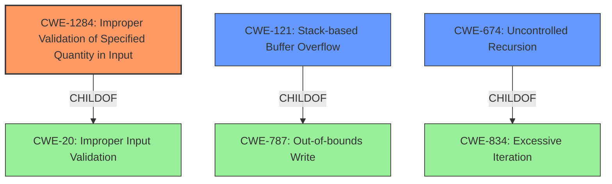

# Analysis Report for CVE-2021-29575

# Vulnerability Analysis Report: CVE-2021-29575

## Description


## Analysis (with Relationship Data)

# Summary
| CWE ID | CWE Name | Confidence | CWE Abstraction Level | CWE Vulnerability Mapping Label | CWE-Vulnerability Mapping Notes |
|---|---|---|---|---|---|
| CWE-1284 | Improper Validation of Specified Quantity in Input | 0.9 | Base | Allowed | Primary CWE. The root cause is the **failure to validate** the `seq_dim` and `batch_dim` arguments. |
| CWE-121 | Stack-based Buffer Overflow | 0.7 | Variant | Allowed | Secondary CWE. Negative values can lead to **stack overflow** due to the **improper validation** of `seq_dim`. |
| CWE-674 | Uncontrolled Recursion | 0.5 | Class | Allowed-with-Review | Secondary CWE. Invalid `seq_dim` or `batch_dim` values leading to stack exhaustion through uncontrolled recursion. |

## Evidence and Confidence

*   **Confidence Score:** 0.8
*   **Evidence Strength:** HIGH

## Relationship Analysis
The primary weakness is the **improper validation** of the input quantity, which directly relates to `CWE-1284`. `CWE-121` is a consequence of this **missing validation** when negative values for `seq_dim` cause a **stack overflow**. `CWE-674` is a broader category encompassing stack exhaustion due to uncontrolled recursion, which can be triggered by the same **improper validation**. `CWE-1284` is a child of `CWE-20 (Improper Input Validation)`, while `CWE-121` is a variant of `CWE-787 (Out-of-bounds Write)`.



## Vulnerability Chain
The vulnerability chain starts with the **improper validation** of input (`CWE-1284`). If a negative value for `seq_dim` is provided, this can lead to a **stack overflow** (`CWE-121`) or a `CHECK`-failure resulting in denial of service. Alternatively, the **improper validation** can result in uncontrolled recursion (`CWE-674`) also resulting in stack exhaustion and denial of service.

## Summary of Analysis
The primary cause is the **failure to validate** the `seq_dim` and `batch_dim` arguments in the `tf.raw_ops.ReverseSequence` operation, as stated in the "Vulnerability Description Key Phrases". This directly corresponds to `CWE-1284`. The "CVE Reference Links Content Summary" also confirms the **missing validation** of `seq_dim` and `batch_dim` as a root cause. The resulting **stack overflow** due to negative `seq_dim` values maps to `CWE-121`. The possibility of a `CHECK`-failure and denial of service may involve uncontrolled recursion triggered by invalid inputs (`CWE-674`).

The selection of `CWE-1284` is the most specific and accurate because it directly addresses the **root cause**: the **improper validation** of input quantities. While `CWE-121` and `CWE-674` are consequences, they are secondary to the initial flaw. The evidence supports these choices, and the relationship analysis clarifies the chain of events. `CWE-1284` is the best choice because the vulnerability description states the "implementation **fails to validate** that `seq_dim` and `batch_dim` arguments are valid".

CWEs considered but not used:
* CWE-190: Integer Overflow or Wraparound - While integer overflows can happen, the provided vulnerability description focuses on the lack of input validation leading to a stack overflow and/or denial of service via a check failure. Thus, this CWE is less directly applicable than CWE-1284 and CWE-121.
* CWE-787: Out-of-bounds Write - While stack overflows can be considered out-of-bounds writes, CWE-121 is a more specific variant for Stack-based Buffer Overflow and is a better fit.
* CWE-20: Improper Input Validation - While CWE-20 is a parent of CWE-1284 and applies in a general sense, CWE-1284 is more specific, dealing with quantity.
Relevant CWE Information:

# Enhanced Context (25 CWEs)
The following CWEs were identified as potentially relevant to this vulnerability:

## CWE-674: Uncontrolled Recursion
**Abstraction Level**: Class
**Similarity Score**: 0.75
**Source**: dense

**Description**:
The product does not properly control the amount of recursion that takes place,  consuming excessive resources, such as allocated memory or the program stack.

**Mapping Guidance**:
- Usage: Allowed-with-Review
- Rationale: This CWE entry is a Class and might have Base-level children that would be more appropriate


## CWE-131: Incorrect Calculation of Buffer Size
**Abstraction Level**: Base
**Similarity Score**: 0.74
**Source**: dense

**Description**:
The product does not correctly calculate the size to be used when allocating a buffer, which could lead to a buffer overflow.

**Mapping Guidance**:
- Usage: Allowed
- Rationale: This CWE entry is at the Base level of abstraction, which is a preferred level of abstraction for mapping to the root causes of vulnerabilities.


## CWE-191: Integer Underflow (Wrap or Wraparound)
**Abstraction Level**: Base
**Similarity Score**: 0.74
**Source**: dense

**Description**:
The product subtracts one value from another, such that the result is less than the minimum allowable integer value, which produces a value that is not equal to the correct result.

**Mapping Guidance**:
- Usage: Allowed
- Rationale: This CWE entry is at the Base level of abstraction, which is a preferred level of abstraction for mapping to the root causes of vulnerabilities.


## CWE-824: Access of Uninitialized Pointer
**Abstraction Level**: Base
**Similarity Score**: 0.74
**Source**: dense

**Description**:
The product accesses or uses a pointer that has not been initialized.

**Mapping Guidance**:
- Usage: Allowed
- Rationale: This CWE entry is at the Base level of abstraction, which is a preferred level of abstraction for mapping to the root causes of vulnerabilities.


## CWE-125: Out-of-bounds Read
**Abstraction Level**: Base
**Similarity Score**: 0.74
**Source**: dense

**Description**:
The product reads data past the end, or before the beginning, of the intended buffer.

**Mapping Guidance**:
- Usage: Allowed
- Rationale: This CWE entry is at the Base level of abstraction, which is a preferred level of abstraction for mapping to the root causes of vulnerabilities.


## CWE-681: Incorrect Conversion between Numeric Types
**Abstraction Level**: Base
**Similarity Score**: 0.74
**Source**: dense

**Description**:
When converting from one data type to another, such as long to integer, data can be omitted or translated in a way that produces unexpected values. If the resulting values are used in a sensitive context, then dangerous behaviors may occur.

**Mapping Guidance**:
- Usage: Allowed
- Rationale: This CWE entry is at the Base level of abstraction, which is a preferred level of abstraction for mapping to the root causes of vulnerabilities.


## CWE-667: Improper Locking
**Abstraction Level**: Class
**Similarity Score**: 0.74
**Source**: dense

**Description**:
The product does not properly acquire or release a lock on a resource, leading to unexpected resource state changes and behaviors.

**Mapping Guidance**:
- Usage: Allowed-with-Review
- Rationale: This CWE entry is a Class and might have Base-level children that would be more appropriate


## CWE-1325: Improperly Controlled Sequential Memory Allocation
**Abstraction Level**: Base
**Similarity Score**: 0.74
**Source**: dense

**Description**:
The product manages a group of objects or resources and performs a separate memory allocation for each object, but it does not properly limit the


## CWE Relationship Analysis

Current CWEs represent these abstraction levels: .


### Vulnerability Chain Analysis

**Chain starting from CWE-667:**
- 667 (Improper Locking) - ROOT


**Chain starting from CWE-121:**
- 121 (Stack-based Buffer Overflow) - ROOT


### CWE Relationship Diagram

```mermaid
graph TD
    classDef primary fill:#f96,stroke:#333,stroke-width:2px
    classDef secondary fill:#69f,stroke:#333
    classDef tertiary fill:#9e9,stroke:#333
```


*Report generated on 2025-04-02 11:17:26*
