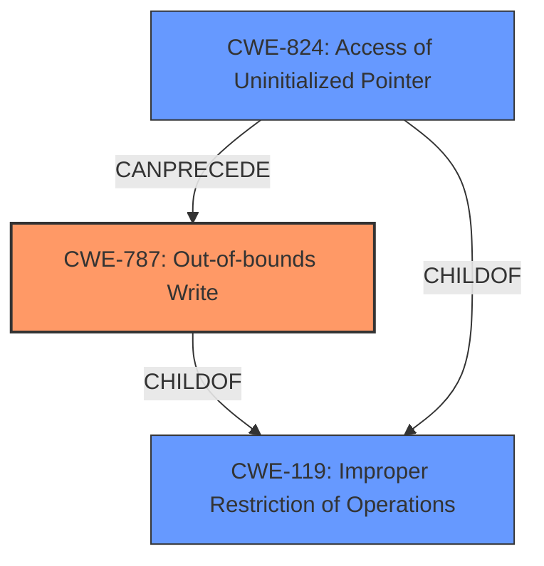

# Enhanced Analysis for CVE-2021-29576

# Summary
| CWE ID | CWE Name | Confidence | CWE Abstraction Level | CWE Vulnerability Mapping Label | CWE-Vulnerability Mapping Notes |
|---|---|---|---|---|---|
| CWE-787 | Out-of-bounds Write | 0.9 | Base | Allowed | Primary CWE |
| CWE-824 | Access of Uninitialized Pointer | 0.7 | Base | Allowed | Secondary Candidate |

## Evidence and Confidence

*   **Confidence Score:** 0.8
*   **Evidence Strength:** HIGH

## Relationship Analysis
The primary CWE is CWE-787, representing the **heap buffer overflow**. CWE-824 is included as a secondary CWE to describe the root cause of the overflow caused by the usage of the uninitialized `params` variable.



## Vulnerability Chain
The vulnerability chain starts with the **failure to check the successful initialization** of `Pool3dParameters`. This leads to an **access of uninitialized data** via the `params` variable (CWE-824). Subsequently, the code uses this uninitialized data in memory access operations, leading to a **heap buffer overflow** (CWE-787).

## Summary of Analysis
The analysis identifies CWE-787 as the primary weakness, representing the **heap buffer overflow**. The root cause is the **failure to validate the initialization** of `Pool3dParameters`, which results in the usage of uninitialized data leading to memory corruption.

Evidence:

*   Vulnerability Description: "The implementation of `tf.raw_ops.MaxPool3DGradGrad` is vulnerable to a **heap buffer overflow**."
*   Vulnerability Description Key Phrases: "**does not check that the initialization of Pool3dParameters completes successfully**"
*   CVE Reference Links Content Summary: "The vulnerability arises from the fact that the `Pool3dParameters` constructor... If any of these validation checks fail, the constructor exits early, leaving `params` with invalid/uninitialized data... which can lead to a **heap buffer overflow**."

The Retriever Results also suggest CWE-787 and CWE-824 as potentially relevant.

I am assigning CWE-787 as the primary CWE because the vulnerability description explicitly mentions a **heap buffer overflow**. The root cause of this overflow is the **failure to check the successful initialization** of the `Pool3dParameters` object, which is best described by CWE-824. The usage of the uninitialized `params` results in writing data outside the intended memory boundaries, leading to a heap overflow.

CWE-119 (Improper Restriction of Operations within the Bounds of a Memory Buffer) was considered but not selected as the primary CWE. While it is a parent of CWE-787, the description explicitly mentions a heap buffer overflow, making CWE-787 a more specific and accurate representation of the vulnerability.

CWE-122 (Heap-based Buffer Overflow) was considered because the vulnerability description mentions a **heap buffer overflow**. However, CWE-787 is a more general case of out-of-bounds write and doesn't imply the location of the buffer. Therefore, it is more appropriate to assign CWE-787.

CWE-190 (Integer Overflow or Wraparound), CWE-681 (Incorrect Conversion between Numeric Types), CWE-193 (Off-by-one Error), and CWE-1284 (Improper Validation of Specified Quantity in Input) were considered but not selected. While these could potentially contribute to buffer overflows, the primary issue here is the use of uninitialized data leading to a direct out-of-bounds write.


## CWE Relationship Analysis

Current CWEs represent these abstraction levels: .


### Vulnerability Chain Analysis

**Chain starting from CWE-787:**
- 787 (Out-of-bounds Write) - ROOT


**Chain starting from CWE-193:**
- 193 (Off-by-one Error) - ROOT


### CWE Relationship Diagram

```mermaid
graph TD
    classDef primary fill:#f96,stroke:#333,stroke-width:2px
    classDef secondary fill:#69f,stroke:#333
    classDef tertiary fill:#9e9,stroke:#333
```