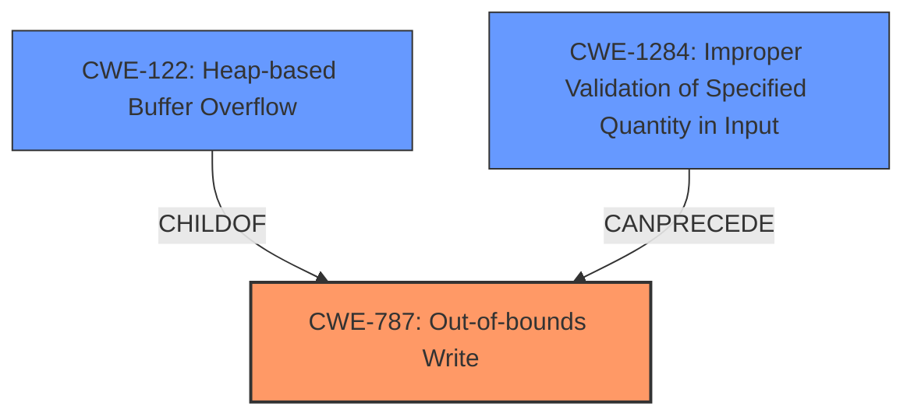

# Analysis for CVE-2021-29578

# Summary
| CWE ID    | CWE Name                                                                  | Confidence | CWE Abstraction Level | CWE Vulnerability Mapping Label | CWE-Vulnerability Mapping Notes |
| :--------- | :------------------------------------------------------------------------ | :--------- | :---------------------- | :------------------------------ | :------------------------------ |
| CWE-787   | Out-of-bounds Write                                                        | 1.0        | Base                    | Primary                        | Allowed                       |
| CWE-122   | Heap-based Buffer Overflow                                                 | 0.9        | Variant                 | Secondary                       | Allowed                       |
| CWE-1284  | Improper Validation of Specified Quantity in Input                         | 0.7        | Base                    | Secondary                       | Allowed                       |

## Evidence and Confidence

*   **Confidence Score:** 0.9
*   **Evidence Strength:** HIGH

## Relationship Analysis
The primary weakness is **CWE-787 (Out-of-bounds Write)**, a base-level CWE describing the fundamental issue. **CWE-122 (Heap-based Buffer Overflow)** is a variant that specifies the location of the buffer, providing more context. **CWE-1284 (Improper Validation of Specified Quantity in Input)** can precede **CWE-787** because the **lack of input validation** can lead to an out-of-bounds write.

## Vulnerability Chain
The vulnerability chain starts with **CWE-1284 (Improper Validation of Specified Quantity in Input)**. The input `row_pooling_sequence` and `col_pooling_sequence` are not validated to ensure they have enough elements as required by the `out_backprop` tensor shape. This **lack of validation** leads to **CWE-787 (Out-of-bounds Write)**, resulting in a **heap buffer overflow** when the code attempts to access memory outside the bounds of the allocated buffers. **CWE-122 (Heap-based Buffer Overflow)** specifies that the overflow occurs on the heap.

## Summary of Analysis
The initial analysis identified **CWE-787 (Out-of-bounds Write)** as the primary weakness due to the code writing outside the bounds of a buffer. The vulnerability description states: "The implementation of `tf.raw_ops.FractionalAvgPoolGrad` is vulnerable to a **heap buffer overflow**...The implementation fails to validate that the pooling sequence arguments have enough elements as required by the `out_backprop` tensor shape." This directly supports **CWE-787 (Out-of-bounds Write)**.

The "CVE Reference Links Content Summary" section reinforces this with the following:
"**Root Cause:** The vulnerability stems from a **missing input validation** in the `FractionalAvgPoolGrad` operation within TensorFlow. Specifically, the code failed to ensure that the `row_pooling_sequence` and `col_pooling_sequence` tensors have enough elements as required by the shape of the `out_backprop` tensor."

"**Weaknesses/Vulnerabilities:** **Heap buffer overflow:** Due to the **lack of validation** on the sizes of `row_pooling_sequence` and `col_pooling_sequence` tensors, the code can attempt to access memory outside the bounds of these allocated buffers."

The relationship graph shows that **CWE-122 (Heap-based Buffer Overflow)** is a child of **CWE-787 (Out-of-bounds Write)**, which confirms that **CWE-787 (Out-of-bounds Write)** is more general and that **CWE-122 (Heap-based Buffer Overflow)** is more specific. The base CWE of **CWE-787 (Out-of-bounds Write)** is the most accurate and appropriate. The **lack of validation** of the input quantities also makes **CWE-1284 (Improper Validation of Specified Quantity in Input)** a relevant weakness, because it describes the root cause that precedes the out-of-bounds write.

I considered **CWE-119 (Improper Restriction of Operations within the Bounds of a Memory Buffer)**, but it is a class-level CWE that is discouraged when more specific CWEs are available. I also considered **CWE-190 (Integer Overflow or Wraparound)** because integer overflows can lead to buffer overflows, but there is no direct evidence of an integer overflow in the provided text. Therefore, **CWE-787 (Out-of-bounds Write)**, **CWE-122 (Heap-based Buffer Overflow)** and **CWE-1284 (Improper Validation of Specified Quantity in Input)** are the most relevant and specific CWEs for this vulnerability.