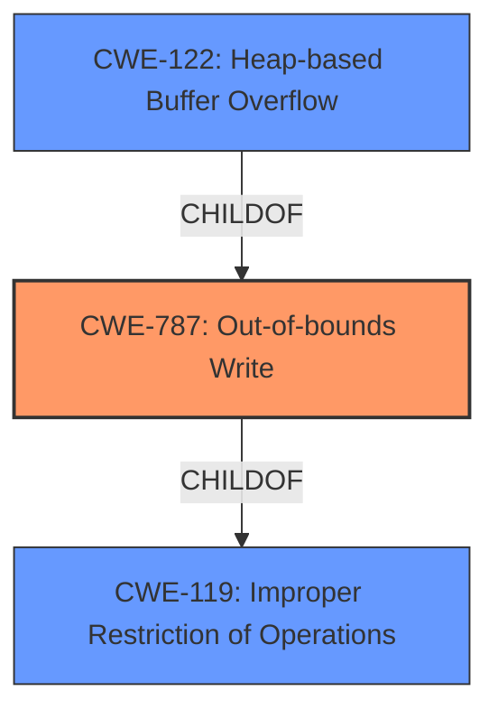

# Raw Analyzer Response for CVE-2021-29579

# Summary
| CWE ID | CWE Name | Confidence | CWE Abstraction Level | CWE Vulnerability Mapping Label | CWE-Vulnerability Mapping Notes |
|---|---|---|---|---|---|
| CWE-787 | Out-of-bounds Write | 1.0 | Base | Allowed | Primary CWE |
| CWE-119 | Improper Restriction of Operations within the Bounds of a Memory Buffer | 0.7 | Class | Discouraged | Secondary Candidate |
| CWE-122 | Heap-based Buffer Overflow | 0.7 | Variant | Allowed | Secondary Candidate |

## Evidence and Confidence

*   **Confidence Score:** 0.9
*   **Evidence Strength:** HIGH

## Relationship Analysis
The primary CWE is CWE-787 **Out-of-bounds Write**, which is a base-level CWE. CWE-787 is a child of CWE-119 **Improper Restriction of Operations within the Bounds of a Memory Buffer**, which is a class-level CWE. CWE-122 **Heap-based Buffer Overflow** is a variant of CWE-787, specifying the location of the overflow. The relationships helped to confirm that CWE-787 is the most specific and appropriate CWE for this vulnerability.

## Vulnerability Chain
The vulnerability chain involves the following steps:
1.  **Improper Input Validation:** The code **fails to validate that indices used to access elements of input/output arrays are valid**.
2.  **Out-of-bounds Write (CWE-787):** Due to the missing validation, the code writes data outside the intended buffer, leading to a **heap buffer overflow**.

## Summary of Analysis
The initial assessment identified that the root cause of the vulnerability is the **failure to validate indices used to access elements of input/output arrays**, which results in an out-of-bounds write. This aligns directly with CWE-787 **Out-of-bounds Write**, which describes a scenario where a product writes data past the end or before the beginning of the intended buffer.

The vulnerability description states: "The implementation **fails to validate that indices used to access elements of input/output arrays are valid**. Whereas accesses to `input_backprop_flat` are guarded by `FastBoundsCheck`, the indexing in `out_backprop_flat` can result in OOB access." This statement provides strong evidence for the **missing validation** leading to an out-of-bounds write condition.

The analysis of the provided information confirms that CWE-787 is the most appropriate and specific classification for this vulnerability. The choice of CWE-787 is further supported by the evidence from the vulnerability description and the "CVE Reference Links Content Summary," which both highlight the **heap buffer overflow** resulting from the **failure to validate indices**. The graph relationships show that CWE-787 is a child of CWE-119, which is a more general class. However, the specific nature of the vulnerability as an out-of-bounds write makes CWE-787 the better choice.
CWE-122 **Heap-based Buffer Overflow** could be considered, but the actual **rootcause** is the out-of-bounds write, which is better described by CWE-787.

Relevant CWE Information:

# Enhanced Context (25 CWEs)
The following CWEs were identified as potentially relevant to this vulnerability:

## CWE-415: Double Free
**Abstraction Level**: Variant
**Similarity Score**: 0.78
**Source**: dense

**Description**:
The product calls free() twice on the same memory address, potentially leading to modification of unexpected memory locations.

**Mapping Guidance**:
- Usage: Allowed
- Rationale: This CWE entry is at the Variant level of abstraction, which is a preferred level of abstraction for mapping to the root causes of vulnerabilities.

*Not Selected*: The vulnerability description does not mention anything related to double free.

## CWE-131: Incorrect Calculation of Buffer Size
**Abstraction Level**: Base
**Similarity Score**: 0.77
**Source**: dense

**Description**:
The product does not correctly calculate the size to be used when allocating a buffer, which could lead to a buffer overflow.

**Mapping Guidance**:
- Usage: Allowed
- Rationale: This CWE entry is at the Base level of abstraction, which is a preferred level of abstraction for mapping to the root causes of vulnerabilities.

*Not Selected*: The vulnerability description does not mention any incorrect calculation of buffer size. The root cause is the missing validation of the indices.

## CWE-191: Integer Underflow (Wrap or Wraparound)
**Abstraction Level**: Base
**Similarity Score**: 0.76
**Source**: dense

**Description**:
The product subtracts one value from another, such that the result is less than the minimum allowable integer value, which produces a value that is not equal to the correct result.

**Mapping Guidance**:
- Usage: Allowed
- Rationale: This CWE entry is at the Base level of abstraction, which is a preferred level of abstraction for mapping to the root causes of vulnerabilities.

*Not Selected*: The vulnerability description does not mention anything related to integer underflow.

## CWE-125: Out-of-bounds Read
**Abstraction Level**: Base
**Similarity Score**: 0.76
**Source**: dense

**Description**:
The product reads data past the end, or before the beginning, of the intended buffer.

**Mapping Guidance**:
- Usage: Allowed
- Rationale: This CWE entry is at the Base level of abstraction, which is a preferred level of abstraction for mapping to the root causes of vulnerabilities.

*Not Selected*: The vulnerability description mentions out-of-bounds access, but the core issue is that the code writes to an invalid memory location (out-of-bounds write) rather than reading from it.

## CWE-824: Access of Uninitialized Pointer
**Abstraction Level**: Base
**Similarity Score**: 0.76
**Source**: dense

**Description**:
The product accesses or uses a pointer that has not been initialized.

**Mapping Guidance**:
- Usage: Allowed
- Rationale: This CWE entry is at the Base level of abstraction, which is a preferred level of abstraction for mapping to the root causes of vulnerabilities.

*Not Selected*: The vulnerability description does not mention anything about uninitialized pointers. The issue is related to validating indices, not the initialization of pointers.

## CWE-226: Sensitive Information in Resource Not Removed Before Reuse
**Abstraction Level**: Base
**Similarity Score**: 0.76
**Source**: dense

**Description**:
The product releases a resource such as memory or a file so that it can be made available for reuse, but it does not clear or "zeroize" the information contained in the resource before the product performs a critical state transition or makes the resource available for reuse by other entities.

**Mapping Guidance**:
- Usage: Allowed
- Rationale: This CWE entry is at the Base level of abstraction, which is a preferred level of abstraction for mapping to the root causes of vulnerabilities.

*Not Selected*: The vulnerability description does not mention anything related to sensitive information or resource reuse.

## CWE-404: Improper Resource Shutdown or Release
**Abstraction Level**: Class
**Similarity Score**: 0.75
**Source**: dense

**Description**:
The product does not release or incorrectly releases a resource before it is made available for re-use.

**Mapping Guidance**:
- Usage: Allowed-with-Review
- Rationale: This CWE entry is a Class and might have Base-level children that would be more appropriate

*Not Selected*: The vulnerability description does not mention anything related to resource shutdown or release.

## CWE-193: Off-by-one Error
**Abstraction Level**: Base
**Similarity Score**: 0.75
**Source**: dense

**Description**:
A product calculates or uses an incorrect maximum or minimum value that is 1 more, or 1 less, than the correct value.

**Mapping Guidance**:
- Usage: Allowed
- Rationale: This CWE entry is at the Base level of abstraction, which is a preferred level of abstraction for mapping to the root causes of vulnerabilities.

*Not Selected*: The vulnerability description does not explicitly mention an off-by-one error. The primary issue is the **failure to validate indices**, which allows for out-of-bounds access.

## CWE-667: Improper Locking
**Abstraction Level**: Class
**Similarity Score**: 0.75
**Source**: dense

**Description**:
The product does not properly acquire or release a lock on a resource, leading to unexpected resource state changes and