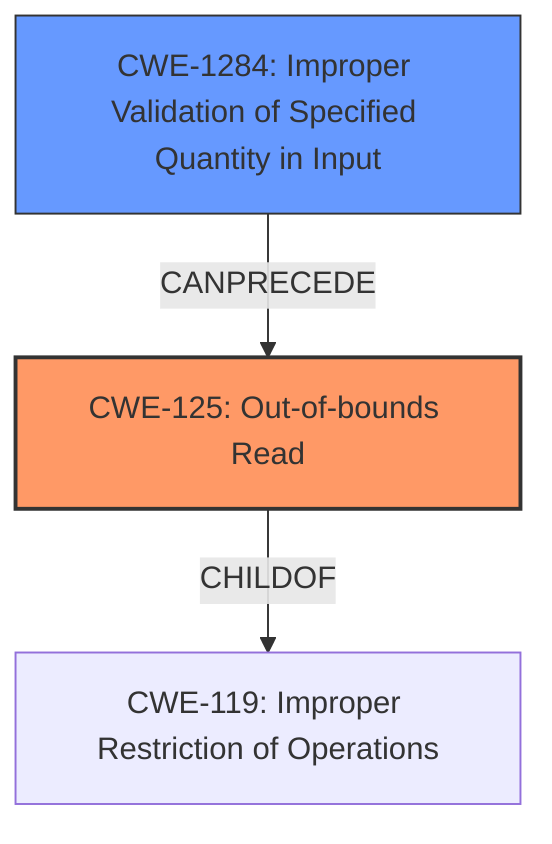

# Enhanced Analysis for CVE-2021-29583

# Summary
| CWE ID    | CWE Name                                                  | Confidence | CWE Abstraction Level | CWE Vulnerability Mapping Label | CWE-Vulnerability Mapping Notes |
| :-------- | :-------------------------------------------------------- | :--------- | :-------------------- | :------------------------------ | :------------------------------ |
| CWE-125   | Out-of-bounds Read                                        | 1.0        | Base                  | Primary                         | Allowed                       |
| CWE-1284  | Improper Validation of Specified Quantity in Input        | 0.9        | Base                  | Secondary                       | Allowed                       |

## Evidence and Confidence

*   **Confidence Score:** 0.95
*   **Evidence Strength:** HIGH

## Relationship Analysis

The primary CWE is CWE-125, which is a base-level CWE indicating an out-of-bounds read. CWE-125 is child of CWE-119 (Improper Restriction of Operations within the Bounds of a Memory Buffer). CWE-1284 is related as it is the root cause that leads to the out-of-bounds read. The relationship between these CWEs illustrates a vulnerability chain. The abstraction levels are appropriate as we are mapping the specific error (out-of-bounds read) and its direct cause (improper input validation).



## Vulnerability Chain

The vulnerability chain starts with **CWE-1284 (Improper Validation of Specified Quantity in Input)**, where the code **fails to validate that `scale`, `offset`, `mean` and `variance` all have the same number of elements as the number of channels of `x`**. This leads to **CWE-125 (Out-of-bounds Read)**, as the code attempts to read data beyond the allocated buffer, resulting in a **heap out of bounds reads**.

## Summary of Analysis

The analysis identifies a clear vulnerability chain rooted in improper input validation leading to an out-of-bounds read. The primary weakness is **CWE-125 (Out-of-bounds Read)**, which directly describes the **heap out of bounds reads** caused by the vulnerability. The root cause is **CWE-1284 (Improper Validation of Specified Quantity in Input)**, as the code **fails to validate that `scale`, `offset`, `mean` and `variance` all have the same number of elements as the number of channels of `x`**.

The selection of CWE-125 is based on the explicit mention of **heap out of bounds reads** in the vulnerability description and the CVE Reference Links Content Summary, which states, "When the `scale`, `offset`, `mean`, or `variance` tensors have fewer elements than the number of channels in input tensor `x`, the code attempts to access memory out of bounds during tensor indexing, leading to a heap buffer overflow." This clearly indicates an out-of-bounds read.

CWE-1284 is selected because the vulnerability description states, "fails to validate that `scale`, `offset`, `mean` and `variance` all have the same number of elements as the number of channels of `x`." This lack of validation is the direct cause of the out-of-bounds read.

The chosen CWEs are at the base level of abstraction, providing a detailed and accurate representation of the vulnerability and its root cause.

Other CWEs Considered:

*   CWE-824 (Access of Uninitialized Pointer): Considered but not used because the primary issue is not an uninitialized pointer, but rather accessing memory outside the bounds of an allocated buffer.
*   CWE-122 (Heap-based Buffer Overflow): Considered but not used as the description specifies an out-of-bounds read, not necessarily a write (overflow). Although a heap buffer overflow is mentioned in the CVE Reference Links Content Summary, the primary weakness described is the out-of-bounds read.
*   CWE-476 (NULL Pointer Dereference): Considered but not used because while the report mentions that null pointer dereferences can happen, the report is primarily about heap overflows.

Relevant CWE Information:

# Enhanced Context (25 CWEs)
The following CWEs were identified as potentially relevant to this vulnerability:

## CWE-415: Double Free
**Abstraction Level**: Variant
**Similarity Score**: 0.78
**Source**: dense

**Description**:
The product calls free() twice on the same memory address, potentially leading to modification of unexpected memory locations.

**Mapping Guidance**:
- Usage: Allowed
- Rationale: This CWE entry is at the Variant level of abstraction, which is a preferred level of abstraction for mapping to the root causes of vulnerabilities.


## CWE-824: Access of Uninitialized Pointer
**Abstraction Level**: Base
**Similarity Score**: 0.78
**Source**: dense

**Description**:
The product accesses or uses a pointer that has not been initialized.

**Mapping Guidance**:
- Usage: Allowed
- Rationale: This CWE entry is at the Base level of abstraction, which is a preferred level of abstraction for mapping to the root causes of vulnerabilities.


## CWE-476: NULL Pointer Dereference
**Abstraction Level**: Base
**Similarity Score**: 0.77
**Source**: dense

**Description**:
The product dereferences a pointer that it expects to be valid but is NULL.

**Mapping Guidance**:
- Usage: Allowed
- Rationale: This CWE entry is at the Base level of abstraction, which is a preferred level of abstraction for mapping to the root causes of vulnerabilities.


## CWE-131: Incorrect Calculation of Buffer Size
**Abstraction Level**: Base
**Similarity Score**: 0.77
**Source**: dense

**Description**:
The product does not correctly calculate the size to be used when allocating a buffer, which could lead to a buffer overflow.

**Mapping Guidance**:
- Usage: Allowed
- Rationale: This CWE entry is at the Base level of abstraction, which is a preferred level of abstraction for mapping to the root causes of vulnerabilities.


## CWE-191: Integer Underflow (Wrap or Wraparound)
**Abstraction Level**: Base
**Similarity Score**: 0.77
**Source**: dense

**Description**:
The product subtracts one value from another, such that the result is less than the minimum allowable integer value, which produces a value that is not equal to the correct result.

**Mapping Guidance**:
- Usage: Allowed
- Rationale: This CWE entry is at the Base level of abstraction, which is a preferred level of abstraction for mapping to the root causes of vulnerabilities.


## CWE-125: Out-of-bounds Read
**Abstraction Level**: Base
**Similarity Score**: 0.76
**Source**: dense

**Description**:
The product reads data past the end, or before the beginning, of the intended buffer.

**Mapping Guidance**:
- Usage: Allowed
- Rationale: This CWE entry is at the Base level of abstraction, which is a preferred level of abstraction for mapping to the root causes of vulnerabilities.


## CWE-226: Sensitive Information in Resource Not Removed Before Reuse
**Abstraction Level**: Base
**Similarity Score**: 0.76
**Source**: dense

**Description**:
The product releases a resource such as memory or a file so that it can be made available for reuse, but it does not clear or "zeroize" the information contained in the resource before the product performs a critical state transition or makes the resource available for reuse by other entities.

**Mapping Guidance**:
- Usage: Allowed
- Rationale: This CWE entry is at the Base level of abstraction, which is a preferred level of abstraction for mapping to the root causes of vulnerabilities.


## CWE-193: Off-by-one Error
**Abstraction Level**: Base
**Similarity Score**: 0.76
**Source**: dense

**Description**:
A product calculates or uses an incorrect maximum or minimum value that is 1 more, or 1 less, than the correct value.

**Mapping Guidance**:
- Usage: Allowed
- Rationale: This CWE entry is at the Base level of abstraction, which is a preferred level of abstraction for mapping to the root causes of vulnerabilities.


## CWE-681: Incorrect Conversion between Numeric Types
**Abstraction Level**: Base
**Similarity Score**: 0.75
**Source**: dense

**Description**:
When converting from one data type to another, such as long to integer, data can be omitted or translated in a way that produces unexpected values. If the resulting values are used in a sensitive context, then dangerous behaviors may occur.

**Mapping Guidance**:
- Usage: Allowed
- Rationale: This CWE entry is at the Base level


## CWE Relationship Analysis

Current CWEs represent these abstraction levels: .


### Vulnerability Chain Analysis

**Chain starting from CWE-476:**
- 476 (NULL Pointer Dereference) - ROOT


**Chain starting from CWE-415:**
- 415 (Double Free) - ROOT


### CWE Relationship Diagram

```mermaid
graph TD
    classDef primary fill:#f96,stroke:#333,stroke-width:2px
    classDef secondary fill:#69f,stroke:#333
    classDef tertiary fill:#9e9,stroke:#333
```