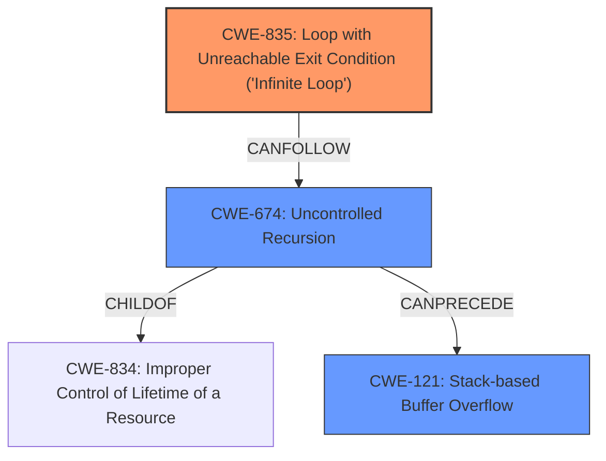

# Analysis for CVE-2021-29591

# Summary
| CWE ID  | CWE Name                                                 | Confidence | CWE Abstraction Level | CWE Vulnerability Mapping Label | CWE-Vulnerability Mapping Notes |
| :-------- | :------------------------------------------------------- | :--------- | :---------------------- | :------------------------------ | :------------------------------ |
| CWE-835 | Loop with Unreachable Exit Condition ('Infinite Loop') | 0.9       | Base                    | Primary                          | Allowed                       |
| CWE-674 | Uncontrolled Recursion                                  | 0.7       | Class                    | Secondary                        | Allowed-with-Review           |
| CWE-121 | Stack-based Buffer Overflow                             | 0.6       | Variant                  | Secondary                        | Allowed                       |

## Evidence and Confidence

*   **Confidence Score:** 0.8
*   **Evidence Strength:** HIGH

## Relationship Analysis
The primary weakness is the **loop between nodes** in the TFLite graphs leading to an infinite loop during evaluation. This can also manifest as a **stack overflow** due to excessive recursive calls.

- CWE-835 (Loop with Unreachable Exit Condition) is the primary cause, as the program enters an infinite loop due to the lack of loop detection.
- CWE-674 (Uncontrolled Recursion) becomes relevant when the infinite loop manifests as excessive recursive calls exhausting the stack.
- CWE-121 (Stack-based Buffer Overflow) can be a consequence of uncontrolled recursion, where the stack overflows due to too many function calls.

## Vulnerability Chain
The vulnerability chain starts with the **missing check for loops between nodes**, leading to either an infinite loop or stack overflow.

1.  **Missing Loop Detection:** The TFLite graph evaluation lacks a check for loops between nodes.
2.  **Infinite Loop:** The absence of loop detection causes the program to enter an infinite loop (CWE-835).
3.  **Uncontrolled Recursion:** In some cases, the infinite loop results in uncontrolled recursion (CWE-674) as the body and loop subgraphs call each other.
4.  **Stack Overflow:** The uncontrolled recursion exhausts the stack space, leading to a stack overflow (CWE-121).

## Summary of Analysis
Initially, the primary concern was identifying the root cause of the vulnerability. The description explicitly mentions "**loops between nodes**" leading to "**stack overflow**". The retriever results pointed to CWE-835 (Loop with Unreachable Exit Condition) and CWE-674 (Uncontrolled Recursion).

The analysis focused on the root cause: the absence of loop detection in TFLite graphs. The vulnerability description states: "TFlite graphs must not have **loops between nodes**. However, this condition was not checked...". This **missing check** leads to an infinite loop (CWE-835). In certain cases, the infinite loop becomes uncontrolled recursion (CWE-674), exhausting stack space and leading to a stack overflow (CWE-121).

The evidence to support CWE-835 as the primary weakness comes from the vulnerability description itself and the CVE Reference Links Content Summary, which explicitly mentions the **missing loop detection**.

Other considered CWEs:

- CWE-190 (Integer Overflow or Wraparound): While integer overflows can lead to issues, they are not directly related to the described vulnerability.
- CWE-1284 (Improper Validation of Specified Quantity in Input): This CWE is not applicable as the vulnerability is not related to the validation of input quantities.

The selected CWEs are at the optimal level of specificity. CWE-835 is a Base level weakness and accurately describes the infinite loop condition. CWE-674 is a Class level weakness and represents the uncontrolled recursion. CWE-121 is a Variant level weakness and describes the stack overflow. These CWEs provide a comprehensive understanding of the vulnerability.

Relevant CWE Information:

# Enhanced Context (25 CWEs)

## CWE-191: Integer Underflow (Wrap or Wraparound)
**Abstraction Level**: Base
**Similarity Score**: 0.78
**Source**: dense

**Description**:
The product subtracts one value from another, such that the result is less than the minimum allowable integer value, which produces a value that is not equal to the correct result.

**Mapping Guidance**:
- Usage: Allowed
- Rationale: This CWE entry is at the Base level of abstraction, which is a preferred level of abstraction for mapping to the root causes of vulnerabilities.

## CWE-131: Incorrect Calculation of Buffer Size
**Abstraction Level**: Base
**Similarity Score**: 0.77
**Source**: dense

**Description**:
The product does not correctly calculate the size to be used when allocating a buffer, which could lead to a buffer overflow.

**Mapping Guidance**:
- Usage: Allowed
- Rationale: This CWE entry is at the Base level of abstraction, which is a preferred level of abstraction for mapping to the root causes of vulnerabilities.

## CWE-193: Off-by-one Error
**Abstraction Level**: Base
**Similarity Score**: 0.77
**Source**: dense

**Description**:
A product calculates or uses an incorrect maximum or minimum value that is 1 more, or 1 less, than the correct value.

**Mapping Guidance**:
- Usage: Allowed
- Rationale: This CWE entry is at the Base level of abstraction, which is a preferred level of abstraction for mapping to the root causes of vulnerabilities.

## CWE-681: Incorrect Conversion between Numeric Types
**Abstraction Level**: Base
**Similarity Score**: 0.76
**Source**: dense

**Description**:
When converting from one data type to another, such as long to integer, data can be omitted or translated in a way that produces unexpected values. If the resulting values are used in a sensitive context, then dangerous behaviors may occur.

**Mapping Guidance**:
- Usage: Allowed
- Rationale: This CWE entry is at the Base level of abstraction, which is a preferred level of abstraction for mapping to the root causes of vulnerabilities.

## CWE-197: Numeric Truncation Error
**Abstraction Level**: Base
**Similarity Score**: 0.76
**Source**: dense

**Description**:
Truncation errors occur when a primitive is cast to a primitive of a smaller size and data is lost in the conversion.

**Mapping Guidance**:
- Usage: Allowed
- Rationale: This CWE entry is at the Base level of abstraction, which is a preferred level of abstraction for mapping to the root causes of vulnerabilities.

## CWE-824: Access of Uninitialized Pointer
**Abstraction Level**: Base
**Similarity Score**: 0.76
**Source**: dense

**Description**:
The product accesses or uses a pointer that has not been initialized.

**Mapping Guidance**:
- Usage: Allowed
- Rationale: This CWE entry is at the Base level of abstraction, which is a preferred level of abstraction for mapping to the root causes of vulnerabilities.

## CWE-125: Out-of-bounds Read
**Abstraction Level**: Base
**Similarity Score**: 0.75
**Source**: dense

**Description**:
The product reads data past the end, or before the beginning, of the intended buffer.

**Mapping Guidance**:
- Usage: Allowed
- Rationale: This CWE entry is at the Base level of abstraction, which is a preferred level of abstraction for mapping to the root causes of vulnerabilities.

## CWE-805: Buffer Access with Incorrect Length Value
**Abstraction Level**: Base
**Similarity Score**: 0.75
**Source**: dense

**Description**:
The product uses a sequential operation to read or write a buffer, but it uses an incorrect length value that causes it to access memory that is outside of the bounds of the buffer.

**Mapping Guidance**:
- Usage: Allowed
- Rationale: This CWE entry is at the Base level of abstraction, which is a preferred level of abstraction for mapping to the root causes of vulnerabilities.

## CWE-190: Integer Overflow or Wraparound
**Abstraction Level**: Base
**Similarity Score**: 0.75
**Source**: dense

**Description**:
The product performs a calculation that can
         produce an integer overflow or wraparound when the logic
         assumes that the resulting value will always be larger than
         the original value. This occurs when an integer value is
         incremented to a value that is too large to store in the
         associated representation. When