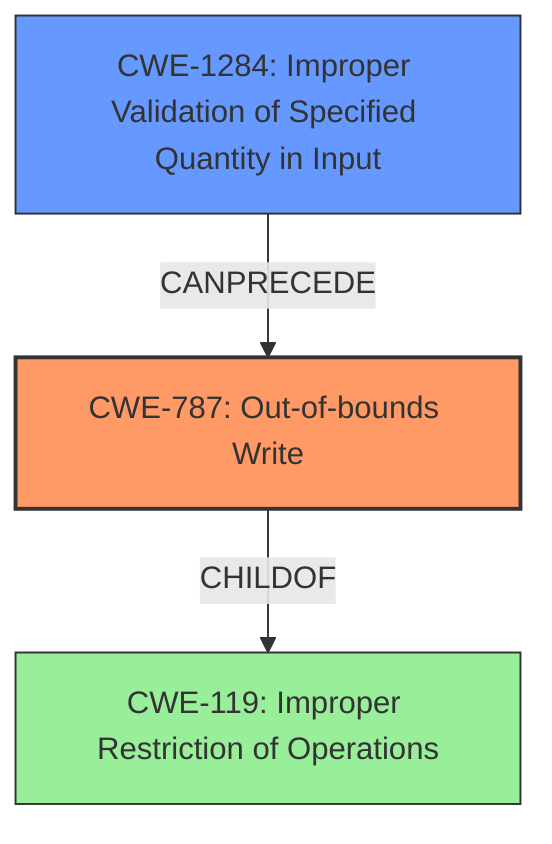

# Analysis Report for CVE-2021-29612

# Vulnerability Analysis Report: CVE-2021-29612

## Description


## Analysis (with Relationship Data)

# Summary
| CWE ID | CWE Name | Confidence | CWE Abstraction Level | CWE Vulnerability Mapping Label | CWE-Vulnerability Mapping Notes |
|---|---|---|---|---|---|
| CWE-787 | Out-of-bounds Write | 0.9 | Base | Allowed | Primary CWE: The vulnerability leads to a heap buffer overflow due to the lack of proper validation of the input tensors being empty. |
| CWE-1284 | Improper Validation of Specified Quantity in Input | 0.7 | Base | Allowed | Secondary CWE: The `ValidateInputTensors` function checks for the minimum dimensions of input tensors but doesn't validate that they are not empty |

## Evidence and Confidence

*   **Confidence Score:** 0.8
*   **Evidence Strength:** HIGH

## Relationship Analysis
The primary relationship influencing the selection is the ChildOf relationship between CWE-787 and CWE-119. CWE-787, Out-of-bounds Write, is a child of CWE-119, Improper Restriction of Operations within the Bounds of a Memory Buffer. Given the specific nature of the **heap buffer overflow**, CWE-787 is a more precise and appropriate choice than its parent.

CWE-1284 (Improper Validation of Specified Quantity in Input) can precede CWE-787 (Out-of-bounds Write) because the lack of input validation can lead to out-of-bounds writes.



## Vulnerability Chain
The vulnerability chain starts with **improper validation** (CWE-1284), leading to a **heap buffer overflow** (CWE-787).
  - **Root Cause:** **Improper validation** of input tensors (`ValidateInputTensors` function does not validate that the tensors are not empty)
  - **Weakness:** Heap buffer overflow
  - **Impact:** An attacker can trigger a heap buffer overflow, potentially leading to a crash or other undefined behavior.

## Summary of Analysis
The analysis concludes that CWE-787 (Out-of-bounds Write) is the primary CWE, and CWE-1284 (Improper Validation of Specified Quantity in Input) is the secondary CWE because the vulnerability is a direct result of the **heap buffer overflow**, which stems from the lack of input validation.

The vulnerability description states: "An attacker can trigger a **heap buffer overflow** in Eigen implementation of `tf.raw_ops.BandedTriangularSolve`." This statement directly supports the selection of CWE-787.

The description also indicates: "The implementation calls `ValidateInputTensors` for input validation but fails to validate that the two tensors are not empty." This provides strong evidence for the selection of CWE-1284 because the quantity (size/length) of the tensors is not properly validated.

The CWE relationships reinforce this decision. CWE-787 is a more specific type of buffer overflow and is thus preferred over the more general CWE-119. The retriever results also list CWE-787. The retriever also lists CWE-1284 which is a base level abstraction.

The selection of CWE-787 and CWE-1284 is based on the evidence provided in the vulnerability description and supported by the CWE relationships and retriever results. These CWEs are at the optimal level of specificity, accurately representing the **root cause** and the resulting vulnerability.

Relevant CWE Information:
CWE-787, CWE-1284


## CWE Relationship Analysis

Current CWEs represent these abstraction levels: .


### Vulnerability Chain Analysis

**Chain starting from CWE-787:**
- 787 (Out-of-bounds Write) - ROOT


**Chain starting from CWE-119:**
- 119 (Improper Restriction of Operations within the Bounds of a Memory Buffer) - ROOT


### CWE Relationship Diagram

```mermaid
graph TD
    classDef primary fill:#f96,stroke:#333,stroke-width:2px
    classDef secondary fill:#69f,stroke:#333
    classDef tertiary fill:#9e9,stroke:#333
```


*Report generated on 2025-04-01 19:53:11*
