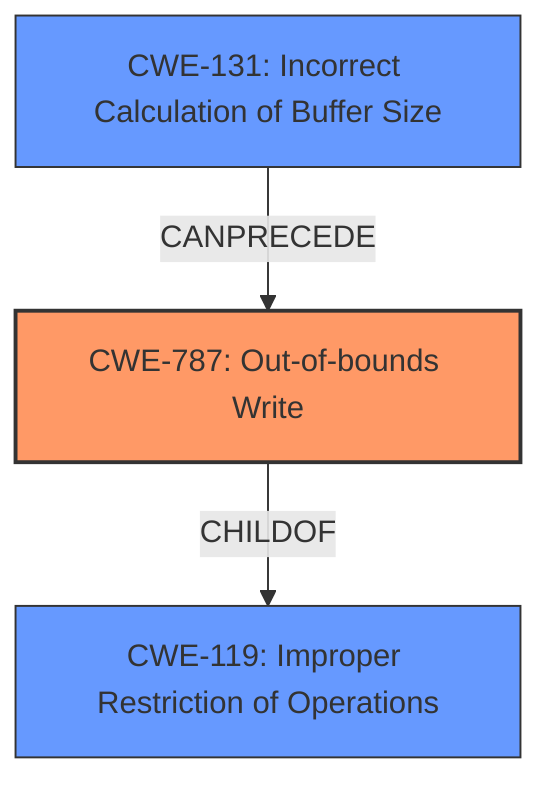

# Analysis for CVE-2021-29614

# Summary
| CWE ID  | CWE Name  | Confidence | CWE Abstraction Level | CWE Vulnerability Mapping Label | CWE-Vulnerability Mapping Notes |
| :------- | :------------------------------- | :--------- | :---------------------- | :-------------------------------- | :--------------------------------- |
| CWE-787 | Out-of-bounds Write | 1.0 | Base | Allowed  | Primary CWE |
| CWE-131 | Incorrect Calculation of Buffer Size | 0.7 | Base | Allowed | Secondary Candidate |

## Evidence and Confidence

*   **Confidence Score:** 0.9
*   **Evidence Strength:** HIGH

## Relationship Analysis
The primary CWE is CWE-787 (**Out-of-bounds Write**), which is a base-level CWE. This CWE accurately reflects the vulnerability where the software writes data beyond the allocated buffer. CWE-787 is a child of CWE-119 (**Improper Restriction of Operations within the Bounds of a Memory Buffer**), indicating that it's a specific type of memory boundary violation. CWE-131 (**Incorrect Calculation of Buffer Size**) is considered as a contributing factor because the vulnerability arises from pointer arithmetic issues related to calculating output buffer sizes.

## Vulnerability Chain
The vulnerability chain starts with **confusion about pointer arithmetic rules**, leading to an **incorrect calculation of the buffer size**. This results in the `out_data` pointer being incremented incorrectly, causing an **out-of-bounds write**. The final impact is an interpreter crash.

## Summary of Analysis
The primary vulnerability is an **out-of-bounds write (CWE-787)**, caused by **confusion about pointer arithmetic rules** and an **incorrect calculation of the buffer size (CWE-131)** when using `tf.io.decode_raw` in TensorFlow.

The vulnerability description explicitly states that the erroneous code moves the `out_data` pointer by `fixed_length * sizeof(T)` bytes, while only `fixed_length` bytes were copied from the input. This leads to data not being decoded and the pointer advancing far beyond the intended boundary, resulting in writing outside the bounds of the backing data. This aligns directly with the description of CWE-787, which involves writing data past the end of the intended buffer.

The "CVE Reference Links Content Summary" also confirms the **incorrect pointer arithmetic** and the **out-of-bounds write** as key weaknesses, supporting the selection of CWE-787.

The **rootcause** is **confusion about pointer arithmetic rules** which leads to **out-of-bounds write**.

CWE-131 is considered as a contributing factor, because the **incorrect calculation of the buffer size** when using `tf.io.decode_raw` in TensorFlow is part of the root cause of the vulnerability.

The retriever results also list CWE-787 as a relevant CWE.

The selected CWEs are at the base level of abstraction, providing sufficient specificity to describe the vulnerability without being overly granular.

Relevant CWE Information:

# Enhanced Context (25 CWEs)

## CWE-824: Access of Uninitialized Pointer
**Abstraction Level**: Base
**Similarity Score**: 0.78
**Source**: dense

**Description**:
The product accesses or uses a pointer that has not been initialized.

**Mapping Guidance**:
- Usage: Allowed
- Rationale: This CWE entry is at the Base level of abstraction, which is a preferred level of abstraction for mapping to the root causes of vulnerabilities.

**Why it was not selected:** This CWE is not appropriate because the vulnerability is not due to an uninitialized pointer, but rather an incorrect pointer arithmetic.

## CWE-131: Incorrect Calculation of Buffer Size
**Abstraction Level**: Base
**Similarity Score**: 0.76
**Source**: dense

**Description**:
The product does not correctly calculate the size to be used when allocating a buffer, which could lead to a buffer overflow.

**Mapping Guidance**:
- Usage: Allowed
- Rationale: This CWE entry is at the Base level of abstraction, which is a preferred level of abstraction for mapping to the root causes of vulnerabilities.

**Why it was selected:** This CWE is considered as a contributing factor, because the **incorrect calculation of the buffer size** when using `tf.io.decode_raw` in TensorFlow is part of the root cause of the vulnerability.

## CWE-476: NULL Pointer Dereference
**Abstraction Level**: Base
**Similarity Score**: 0.76
**Source**: dense

**Description**:
The product dereferences a pointer that it expects to be valid but is NULL.

**Mapping Guidance**:
- Usage: Allowed
- Rationale: This CWE entry is at the Base level of abstraction, which is a preferred level of abstraction for mapping to the root causes of vulnerabilities.

**Why it was not selected:** This CWE is not appropriate because the vulnerability is not due to a NULL pointer dereference, but rather an incorrect pointer arithmetic.

## CWE-191: Integer Underflow (Wrap or Wraparound)
**Abstraction Level**: Base
**Similarity Score**: 0.76
**Source**: dense

**Description**:
The product subtracts one value from another, such that the result is less than the minimum allowable integer value, which produces a value that is not equal to the correct result.

**Mapping Guidance**:
- Usage: Allowed
- Rationale: This CWE entry is at the Base level of abstraction, which is a preferred level of abstraction for mapping to the root causes of vulnerabilities.

**Why it was not selected:** This CWE is not relevant because the vulnerability does not involve integer underflow.

## CWE-125: Out-of-bounds Read
**Abstraction Level**: Base
**Similarity Score**: 0.76
**Source**: dense

**Description**:
The product reads data past the end, or before the beginning, of the intended buffer.

**Mapping Guidance**:
- Usage: Allowed
- Rationale: This CWE entry is at the Base level of abstraction, which is a preferred level of abstraction for mapping to the root causes of vulnerabilities.

**Why it was not selected:** The primary issue is an out-of-bounds write, not an out-of-bounds read.

## CWE-193: Off-by-one Error
**Abstraction Level**: Base
**Similarity Score**: 0.76
**Source**: dense

**Description**:
A product calculates or uses an incorrect maximum or minimum value that is 1 more, or 1 less, than the correct value.

**Mapping Guidance**:
- Usage: Allowed
- Rationale: This CWE entry is at the Base level of abstraction, which is a preferred level of abstraction for mapping to the root causes of vulnerabilities.

**Why it was not selected:** While an off-by-one error could contribute, the core issue is the general incorrect pointer arithmetic leading to an out-of-bounds write.

## CWE-415: Double Free
**Abstraction Level**: Variant
**Similarity Score**: 0.76
**Source**: dense

**Description**:
The product calls free() twice on the same memory address, potentially leading to modification of unexpected memory locations.

**Mapping Guidance**:
- Usage: Allowed
- Rationale: This CWE entry is at the Variant level of abstraction, which is a preferred level of abstraction for mapping to the root causes of vulnerabilities.

**Why it was not selected:** This vulnerability does not involve double freeing memory.

## CWE-681: Incorrect Conversion between Numeric Types
**Abstraction Level**: Base
**Similarity Score**: 0.75
**Source**: dense

**Description**:
When converting from one data type to another, such as long to integer, data can be omitted or translated in a way that produces unexpected values. If the resulting values are used in a sensitive context, then dangerous behaviors may occur.

**Mapping Guidance**:
- Usage: Allowed
- Rationale: This CWE entry is at the Base level of abstraction, which is a preferred level of abstraction for mapping to the root causes of vulnerabilities.

**Why it was not selected:** This vulnerability does not involve incorrect conversion between numeric types.

## CWE-667: Improper Locking
**Abstraction Level**: Class
**Similarity Score**: 0.75
**Source**: dense

**Description**:
The product does not properly acquire or release a lock on a resource, leading to unexpected resource state changes and behaviors.

**Mapping Guidance**:
- Usage: Allowed-with-Review
- Rationale: This CWE entry is a Class and might have Base-level children that would be more appropriate

**Why it was not selected:** This vulnerability does not involve improper locking.

## CWE-8