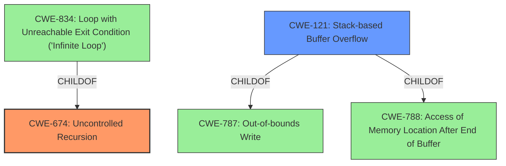

# Analysis for CVE-2021-29615

# Summary
| CWE ID | CWE Name | Confidence | CWE Abstraction Level | CWE Vulnerability Mapping Label | CWE-Vulnerability Mapping Notes |
|---|---|---|---|---|---|
| CWE-674 | Uncontrolled Recursion | 0.9 | Class | Allowed-with-Review | Primary CWE |
| CWE-121 | Stack-based Buffer Overflow | 0.7 | Variant | Allowed | Secondary Candidate |

## Evidence and Confidence

*   **Confidence Score:** 0.8
*   **Evidence Strength:** HIGH

## Relationship Analysis
The primary CWE identified is CWE-674 (Uncontrolled Recursion), which is a Class-level CWE. The vulnerability description mentions a stack overflow due to excessive recursion, directly aligning with CWE-674. CWE-674 is a parent of CWE-834, Loop with Unreachable Exit Condition ('Infinite Loop'). Also, CWE-121 (Stack-based Buffer Overflow) is considered as a secondary candidate as the stack overflow leads to the buffer being overwritten. CWE-121 is a child of CWE-787 (Out-of-bounds Write) and CWE-788.

## Vulnerability Chain
The vulnerability chain starts with a specially crafted input that causes uncontrolled recursion in the `ParseAttrValue` function. This uncontrolled recursion leads to a **stack overflow**, potentially resulting in a denial of service.
  - Root Cause: Specially crafted input
  - Weakness 1: Uncontrolled Recursion (CWE-674)
  - Weakness 2: Stack Overflow (CWE-121)
  - Impact: Denial of Service

## Summary of Analysis
The initial analysis strongly points to CWE-674 (Uncontrolled Recursion) as the primary weakness because the vulnerability description explicitly mentions **stack overflow** due to recursion. The **Vulnerability Description Key Phrases** also highlight "**stack overflow**". The CVE Reference Links Content Summary confirms that the `ParseAttrValue` function lacks proper checks on the depth of nested tensors, which causes excessive recursion and leads to the **stack overflow**.

The retriever results also support this, with CWE-674 having a high score. The description of CWE-674 "The product does not properly control the amount of recursion that takes place, consuming excessive resources, such as allocated memory or the program stack" accurately reflects the vulnerability.

CWE-121 (Stack-based Buffer Overflow) is considered a secondary candidate because the **stack overflow** can lead to overwriting the buffer allocated on the stack. While "stack overflow" can sometimes refer to stack exhaustion, the context here strongly suggests a buffer overflow on the stack, making CWE-121 a relevant, though secondary, consideration.

The decision to prioritize CWE-674 is based on the root cause evidence. The vulnerability is triggered by uncontrolled recursion, and the **stack overflow** is a consequence of this recursion. Therefore, CWE-674 is at the optimal level of specificity, representing the underlying flaw.

Relevant CWE Information:

# Enhanced Context (25 CWEs)
The following CWEs were identified as potentially relevant to this vulnerability:

## CWE-191: Integer Underflow (Wrap or Wraparound)
**Abstraction Level**: Base
**Similarity Score**: 0.79
**Source**: dense

**Description**:
The product subtracts one value from another, such that the result is less than the minimum allowable integer value, which produces a value that is not equal to the correct result.

**Mapping Guidance**:
- Usage: Allowed
- Rationale: This CWE entry is at the Base level of abstraction, which is a preferred level of abstraction for mapping to the root causes of vulnerabilities.

## CWE-193: Off-by-one Error
**Abstraction Level**: Base
**Similarity Score**: 0.78
**Source**: dense

**Description**:
A product calculates or uses an incorrect maximum or minimum value that is 1 more, or 1 less, than the correct value.

**Mapping Guidance**:
- Usage: Allowed
- Rationale: This CWE entry is at the Base level of abstraction, which is a preferred level of abstraction for mapping to the root causes of vulnerabilities.

## CWE-131: Incorrect Calculation of Buffer Size
**Abstraction Level**: Base
**Similarity Score**: 0.78
**Source**: dense

**Description**:
The product does not correctly calculate the size to be used when allocating a buffer, which could lead to a buffer overflow.

**Mapping Guidance**:
- Usage: Allowed
- Rationale: This CWE entry is at the Base level of abstraction, which is a preferred level of abstraction for mapping to the root causes of vulnerabilities.

## CWE-681: Incorrect Conversion between Numeric Types
**Abstraction Level**: Base
**Similarity Score**: 0.77
**Source**: dense

**Description**:
When converting from one data type to another, such as long to integer, data can be omitted or translated in a way that produces unexpected values. If the resulting values are used in a sensitive context, then dangerous behaviors may occur.

**Mapping Guidance**:
- Usage: Allowed
- Rationale: This CWE entry is at the Base level of abstraction, which is a preferred level of abstraction for mapping to the root causes of vulnerabilities.

## CWE-197: Numeric Truncation Error
**Abstraction Level**: Base
**Similarity Score**: 0.77
**Source**: dense

**Description**:
Truncation errors occur when a primitive is cast to a primitive of a smaller size and data is lost in the conversion.

**Mapping Guidance**:
- Usage: Allowed
- Rationale: This CWE entry is at the Base level of abstraction, which is a preferred level of abstraction for mapping to the root causes of vulnerabilities.

## CWE-805: Buffer Access with Incorrect Length Value
**Abstraction Level**: Base
**Similarity Score**: 0.76
**Source**: dense

**Description**:
The product uses a sequential operation to read or write a buffer, but it uses an incorrect length value that causes it to access memory that is outside of the bounds of the buffer.

**Mapping Guidance**:
- Usage: Allowed
- Rationale: This CWE entry is at the Base level of abstraction, which is a preferred level of abstraction for mapping to the root causes of vulnerabilities.

## CWE-824: Access of Uninitialized Pointer
**Abstraction Level**: Base
**Similarity Score**: 0.76
**Source**: dense

**Description**:
The product accesses or uses a pointer that has not been initialized.

**Mapping Guidance**:
- Usage: Allowed
- Rationale: This CWE entry is at the Base level of abstraction, which is a preferred level of abstraction for mapping to the root causes of vulnerabilities.

## CWE-125: Out-of-bounds Read
**Abstraction Level**: Base
**Similarity Score**: 0.76
**Source**: dense

**Description**:
The product reads data past the end, or before the beginning, of the intended buffer.

**Mapping Guidance**:
- Usage: Allowed
- Rationale: This CWE entry is at the Base level of abstraction, which is a preferred level of abstraction for mapping to the root causes of vulnerabilities.

## CWE-190: Integer Overflow or Wraparound
**Abstraction Level**: Base
**Similarity Score**: 0.75
**Source**: dense

**Description**:
The product performs a calculation that can
         produce an integer overflow or wraparound when the logic
         assumes that the resulting value will always be larger than
         the original value. This occurs when an integer value is
         incremented to a value that is too large to store in the
         associated representation. When this occurs, the value may
         become a very small or negative number.

**Mapping Guidance**:
- Usage: Allowed
- Rationale: This CWE entry is at the Base level of abstraction, which is a preferred level of abstraction for mapping to the root causes of vulnerabilities.

## CWE-129: Improper Validation of Array Index
**Abstraction Level**: Variant
**Similarity Score**: 0.75
**Source**: dense

**Description**:
The product uses untrusted input when calculating or using an array index, but the product does not validate or incorrectly validates the index to ensure