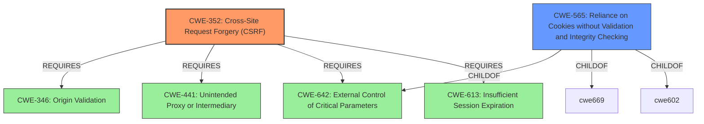

# Analysis Report for CVE-2021-29624

# Vulnerability Analysis Report: CVE-2021-29624

## Description


## Analysis (with Relationship Data)

# Summary
| CWE ID | CWE Name | Confidence | CWE Abstraction Level | CWE Vulnerability Mapping Label | CWE-Vulnerability Mapping Notes |
|---|---|---|---|---|---|
| CWE-352 | Cross-Site Request Forgery (CSRF) | 0.9 | Compound | Allowed | Primary CWE |
| CWE-565 | Reliance on Cookies without Validation and Integrity Checking | 0.7 | Base | Allowed | Secondary Candidate |

## Evidence and Confidence

*   **Confidence Score:** 0.8
*   **Evidence Strength:** HIGH

## Relationship Analysis
The primary relationship influencing the CWE selection is the hierarchical structure where CWE-352 (Cross-Site Request Forgery) is a compound weakness that encompasses multiple underlying issues. CWE-565 (Reliance on Cookies without Validation and Integrity Checking) is a base weakness that represents one aspect of how CSRF vulnerabilities can arise, especially concerning cookie-based implementations. The analysis also considered that CWE-352 requires CWE-346, CWE-441, CWE-642, and CWE-613 which highlights the compound nature of the vulnerability.



## Vulnerability Chain
The vulnerability chain starts with the **improper implementation of the "double submit cookie" mechanism** in `fastify-csrf`. This **weakness** leads to **insufficient CSRF protection**, making the application susceptible to "cookie tossing" attacks. The impact is that an attacker can perform unauthorized actions on behalf of a victim user, potentially leading to data integrity loss and account takeover risks.

## Summary of Analysis
Initially, the analysis focused on the **root cause** described as a "**double submit mechanism using cookies**" that was vulnerable to cookie tossing attacks. This pointed towards a failure in the CSRF protection mechanism. The CVE Reference Links Content Summary solidified this by explicitly stating "**Insufficient CSRF Protection**" and "**Lack of Domain Binding**" as key weaknesses.

The selection of CWE-352 (Cross-Site Request Forgery) as the primary CWE is based on the vulnerability's description and the CVE reference summary, which clearly indicate a failure in CSRF protection. The retriever results also list CWE-352 as the top candidate. CWE-352 is a compound weakness, representing a combination of factors that lead to a CSRF vulnerability.

CWE-565 (Reliance on Cookies without Validation and Integrity Checking) was considered as a secondary CWE because the vulnerability specifically involves the **improper use of cookies** for CSRF protection. The CVE summary mentions the **vulnerability** stems from a lack of protection against "cookie tossing" attacks, indicating that the application relies on cookies without properly validating their integrity across subdomains. This highlights a specific aspect of the CSRF vulnerability related to cookie handling.

CWE-79 (Improper Neutralization of Input During Web Page Generation ('Cross-site Scripting')) was also considered, given the potential for XSS to be related to CSRF, but it was determined not to be directly applicable as the primary **root cause** of this vulnerability is in the CSRF protection mechanism itself, not in the handling of user inputs for web page generation.

The final decision to map to CWE-352 as the primary CWE and CWE-565 as a secondary CWE is based on the evidence pointing to a CSRF vulnerability caused by the **improper use of cookies** without proper validation and domain binding. This combination provides a more complete and accurate representation of the vulnerability.

Relevant CWE Information:

## CWE-1289: Improper Validation of Unsafe Equivalence in Input
**Abstraction Level**: Base
**Similarity Score**: 0.77
**Source**: dense
- This CWE was not selected because the vulnerability's **root cause** is more directly related to CSRF protection mechanisms and cookie handling, rather than a general issue of validating equivalence in input.

## CWE-434: Unrestricted Upload of File with Dangerous Type
**Abstraction Level**: Base
**Similarity Score**: 0.77
**Source**: dense
- This CWE was not selected because it is specific to file uploads, which is not relevant to the described CSRF vulnerability.

## CWE-184: Incomplete List of Disallowed Inputs
**Abstraction Level**: Base
**Similarity Score**: 0.77
**Source**: dense
- This CWE was not selected because the vulnerability is not directly related to an incomplete list of disallowed inputs.

## CWE-212: Improper Removal of Sensitive Information Before Storage or Transfer
**Abstraction Level**: Base
**Similarity Score**: 0.76
**Source**: dense
- This CWE was not selected because the vulnerability does not primarily involve the **improper removal of sensitive information**.

## CWE-807: Reliance on Untrusted Inputs in a Security Decision
**Abstraction Level**: Base
**Similarity Score**: 0.76
**Source**: dense
- This CWE was not selected because while the application relies on cookies (which can be considered inputs), the core issue is the lack of validation and integrity checking for those cookies in the context of CSRF protection, rather than a general reliance on untrusted inputs.

## CWE-552: Files or Directories Accessible to External Parties
**Abstraction Level**: Base
**Similarity Score**: 0.76
**Source**: dense
- This CWE was not selected because the vulnerability does not involve files or directories being accessible to external parties.

## CWE-41: Improper Resolution of Path Equivalence
**Abstraction Level**: Base
**Similarity Score**: 0.76
**Source**: dense
- This CWE was not selected because the vulnerability does not involve path equivalence issues.

## CWE-538: Insertion of Sensitive Information into Externally-Accessible File or Directory
**Abstraction Level**: Base
**Similarity Score**: 0.75
**Source**: dense
- This CWE was not selected because the vulnerability does not involve inserting sensitive information into externally-accessible files or directories.

## CWE-668: Exposure of Resource to Wrong Sphere
**Abstraction Level**: Class
**Similarity Score**: 0.75
**Source**: dense
- This CWE was not selected because it is a high-level class and less specific than CWE-352 and CWE-565, which directly address the CSRF vulnerability and cookie handling issues.

## CWE-74: Improper Neutralization of Special Elements in Output Used by a Downstream Component ('Injection')
**Abstraction Level**: Class
**Similarity Score**: 0.75
**Source**: dense
- This CWE was not selected because the vulnerability does not primarily involve injection vulnerabilities.

## CWE-79: Improper Neutralization of Input During Web Page Generation ('Cross-site Scripting')
**Abstraction Level**: Base
**Similarity Score**: 8569.68
**Source**: sparse
- This CWE was not selected because while XSS can be related to CSRF, the **root cause** of this specific vulnerability is in the CSRF protection mechanism itself, not in the handling of user inputs for web page generation.

## CWE-116: Improper Encoding or Escaping of Output
**Abstraction Level**: Class
**Similarity Score**: 8359.20
**Source**: sparse
- This CWE was not selected because the vulnerability does not primarily involve encoding or escaping issues.

## CWE-863: Incorrect Authorization
**Abstraction Level**: Class
**Similarity Score**: 7804.53
**Source**: sparse
- This CWE was not selected because while CSRF can lead to unauthorized actions, the **root cause** is the lack of proper CSRF protection, rather than a general authorization failure.

## CWE-201: Insertion of Sensitive Information Into Sent Data
**Abstraction Level**: base
**Similarity Score**: 5.03
**Source**: graph
- This CWE was not selected because, while cookies can contain sensitive information, the core issue is the


## CWE Relationship Analysis

Current CWEs represent these abstraction levels: .


### Vulnerability Chain Analysis

**Chain starting from CWE-116:**
- 116 (Improper Encoding or Escaping of Output) - ROOT


**Chain starting from CWE-434:**
- 434 (Unrestricted Upload of File with Dangerous Type) - ROOT


### CWE Relationship Diagram

```mermaid
graph TD
    classDef primary fill:#f96,stroke:#333,stroke-width:2px
    classDef secondary fill:#69f,stroke:#333
    classDef tertiary fill:#9e9,stroke:#333
```


*Report generated on 2025-04-02 11:28:48*
