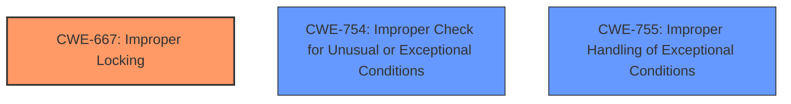

# Enhanced Analysis for CVE-2021-29628

# Summary
| CWE ID | CWE Name | Confidence | CWE Abstraction Level | CWE Vulnerability Mapping Label | CWE-Vulnerability Mapping Notes |
|---|---|---|---|---|---|
| CWE-667 | Improper Locking | 0.75 | Class | Primary | Allowed-with-Review |
| CWE-754 | Improper Check for Unusual or Exceptional Conditions | 0.6 | Class | Secondary | Allowed-with-Review |
| CWE-755 | Improper Handling of Exceptional Conditions | 0.5 | Class | Secondary | Discouraged |

## Evidence and Confidence

*   **Confidence Score:** 0.7
*   **Evidence Strength:** MEDIUM

## Relationship Analysis
The primary relationship influencing the CWE selection is the hierarchical structure. CWE-667 is a Class level CWE which has children at a more base level which could be more appropriate. CWE-754 and CWE-755 are both Class level CWEs which are children of Pillar level CWEs which have children that could be more appropriate. These influenced the decision to favor CWE-667 due to the **weakness** being related to **disabling SMAP protections** during a fault. The other two CWEs refer to more general cases of improper handling and checking of exceptional conditions which is not the case in this particular vulnerability.



## Vulnerability Chain
The vulnerability chain involves a system call triggering a fault, leading to SMAP protections being disabled.
  - **Root Cause:** Improper Locking (CWE-667) due to **disabling SMAP protections** for the duration of the system call upon fault.
  - **Weakness:** **SMAP Bypass**.
  - **Impact:** Allows attackers to craft exploits, potentially leading to privilege escalation and data modification.

## Summary of Analysis
The initial assessment considered multiple CWEs, particularly those related to resource management and error handling. However, after reviewing the vulnerability description and the provided evidence, CWE-667 (Improper Locking) was identified as the most appropriate primary CWE. This determination is based on the fact that the **weakness** stems from the kernel failing to re-enable SMAP protections after a page fault, effectively creating a locking issue.

The evidence supporting this decision comes from the "CVE Reference Links Content Summary," which states, "When a page fault occurs during a copyin() or copyout() operation (which disables SMAP temporarily), and the fault is deemed invalid, the kernel's page fault handler incorrectly leaves SMAP disabled until the thread returns to user mode."

While CWE-754 (Improper Check for Unusual or Exceptional Conditions) and CWE-755 (Improper Handling of Exceptional Conditions) were also considered due to the exceptional condition of a page fault, they were deemed less specific than CWE-667. The core issue is not merely the handling of an exception but the specific failure to re-enable a security mechanism (SMAP) after a fault, which aligns more closely with improper locking.

The final selection of CWE-667 is at the Class level of specificity, but it accurately reflects the **root cause** of the vulnerability within the constraints of the available information.

Relevant CWE Information:

# Enhanced Context (25 CWEs)
The following CWEs were identified as potentially relevant to this vulnerability:

## CWE-667: Improper Locking
**Abstraction Level**: Class
**Similarity Score**: 0.78
**Source**: dense

**Description**:
The product does not properly acquire or release a lock on a resource, leading to unexpected resource state changes and behaviors.

**Mapping Guidance**:
- Usage: Allowed-with-Review
- Rationale: This CWE entry is a Class and might have Base-level children that would be more appropriate

Technical Explanation:
The vulnerability occurs because SMAP protections are not re-enabled after a fault. This can be viewed as a failure to properly "release" a security lock, which allows unintended memory access.
Security Implications: This can lead to privilege escalation and data modification.
Relationships: This is a Class-level CWE.
Mapping Guidance: Allowed-with-Review. This is a Class level CWE and the rationale states there may be more Base-level children that would be more appropriate.

## CWE-754: Improper Check for Unusual or Exceptional Conditions
**Abstraction Level**: Class
**Similarity Score**: 0.77
**Source**: dense

**Description**:
The product does not check or incorrectly checks for unusual or exceptional conditions that are not expected to occur frequently during day to day operation of the product.

**Mapping Guidance**:
- Usage: Allowed-with-Review
- Rationale: This CWE entry is a Class and might have Base-level children that would be more appropriate

Technical Explanation:
The vulnerability involves not properly checking or handling the exceptional condition of a page fault, leading to SMAP not being re-enabled.
Security Implications: This can be combined with other bugs to craft an exploit.
Relationships: This is a Class-level CWE, child of CWE-703.
Mapping Guidance: Allowed-with-Review, but lower-level children might be more appropriate.

## CWE-755: Improper Handling of Exceptional Conditions
**Abstraction Level**: Class
**Similarity Score**: 0.77
**Source**: dense

**Description**:
The product does not handle or incorrectly handles an exceptional condition.

**Mapping Guidance**:
- Usage: Discouraged
- Rationale: This CWE entry is a level-1 Class (i.e., a child of a Pillar). It might have lower-level children that would be more appropriate

Technical Explanation:
The vulnerability involves incorrectly handling the exceptional condition of a page fault, leading to SMAP not being re-enabled.
Security Implications: This can be combined with other bugs to craft an exploit.
Relationships: This is a Class-level CWE, child of CWE-703.
Mapping Guidance: Discouraged, as lower-level children might be more appropriate.


## CWE Relationship Analysis

Current CWEs represent these abstraction levels: .


### Vulnerability Chain Analysis

**Chain starting from CWE-667:**
- 667 (Improper Locking) - ROOT


**Chain starting from CWE-754:**
- 754 (Improper Check for Unusual or Exceptional Conditions) - ROOT


### CWE Relationship Diagram

```mermaid
graph TD
    classDef primary fill:#f96,stroke:#333,stroke-width:2px
    classDef secondary fill:#69f,stroke:#333
    classDef tertiary fill:#9e9,stroke:#333
```