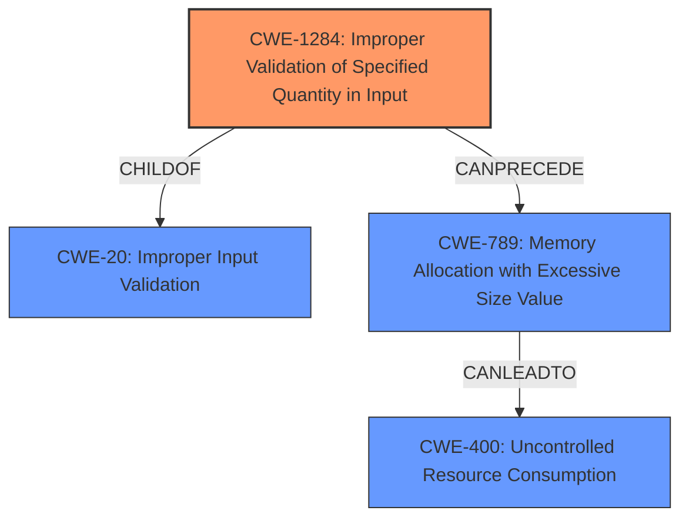

# Enhanced Analysis for CVE-2021-29629

# Summary
| CWE ID    | CWE Name                                                        | Confidence | CWE Abstraction Level | CWE Vulnerability Mapping Label | CWE-Vulnerability Mapping Notes |
| :--------- | :-------------------------------------------------------------- | :--------- | :-------------------- | :------------------------------ | :------------------------------ |
| CWE-1284  | Improper Validation of Specified Quantity in Input            | 0.9        | Base                  | Primary                         | Allowed                       |
| CWE-400 |Uncontrolled Resource Consumption ('Resource Exhaustion') | 0.7        | Class                  | Secondary                         | Allowed                       |

## Evidence and Confidence

*   **Confidence Score:** 0.8
*   **Evidence Strength:** HIGH

## Relationship Analysis
The primary CWE selected is CWE-1284, which represents the **improper validation** of a specified quantity in input. This weakness can lead to other issues such as resource exhaustion. CWE-1284 is a child of CWE-20 (Improper Input Validation) and is linked to CWE-789 (Memory Allocation with Excessive Size Value).



## Vulnerability Chain
The vulnerability chain starts with the **missing message validation** (CWE-1284), specifically the attribute length. This **missing validation** can lead to an infinite loop or excessive resource consumption, culminating in a denial-of-service (DoS) (CWE-400).

## Summary of Analysis
The analysis is based on the provided vulnerability description and the CVE Reference Links Content Summary. The root cause is identified as **missing message validation** in the `libradius` library, which aligns with CWE-1284 (Improper Validation of Specified Quantity in Input). The CVE summary details that the `rad_get_attr(3)` function fails to verify the attribute length, which could lead to a bogus length. The vulnerability is triggered by malicious clients or servers sending crafted messages.

The selection of CWE-1284 is further supported by the retriever results, which list it as a top candidate. The extended description of CWE-1284 mentions that when a quantity is not properly validated, attackers can specify malicious quantities to cause excessive resource allocation, trigger unexpected failures, etc. The observed examples for CWE-1284 include CVE-2008-1440, which also involves a lack of validation of length field leading to an infinite loop.

CWE-400 (Uncontrolled Resource Consumption) is included as a secondary CWE because the ultimate impact of the vulnerability is a denial-of-service, which is caused by resource exhaustion.

CWE-476 (NULL Pointer Dereference) and CWE-822 (Untrusted Pointer Dereference) were considered but not selected because the primary issue is the **lack of validation** of the input, not the dereferencing of a pointer. Similarly, CWE-908 (Use of Uninitialized Resource) and CWE-909 (Missing Initialization of Resource) were not selected because the issue is not related to uninitialized resources.

The selected CWEs are at the optimal level of specificity because CWE-1284 is a Base-level CWE that directly addresses the **root cause** of the vulnerability.
The evidence includes "missing message validation" from the "Vulnerability Description Key Phrases", and "The vulnerability stems from a lack of proper message validation" from the "CVE Reference Links Content Summary".


## CWE Relationship Analysis

Current CWEs represent these abstraction levels: .


### Vulnerability Chain Analysis

**Chain starting from CWE-476:**
- 476 (NULL Pointer Dereference) - ROOT


**Chain starting from CWE-909:**
- 909 (Missing Initialization of Resource) - ROOT


### CWE Relationship Diagram

```mermaid
graph TD
    classDef primary fill:#f96,stroke:#333,stroke-width:2px
    classDef secondary fill:#69f,stroke:#333
    classDef tertiary fill:#9e9,stroke:#333
```