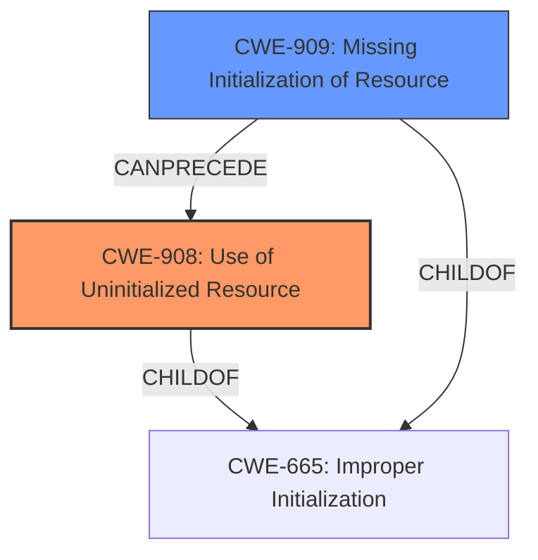

# Enhanced Analysis for CVE-2021-29631

# Summary
| CWE ID | CWE Name | Confidence | CWE Abstraction Level | CWE Vulnerability Mapping Label | CWE-Vulnerability Mapping Notes |
|---|---|---|---|---|---|
| CWE-908 | Use of Uninitialized Resource | 0.9 | Base | Allowed | Primary CWE |
| CWE-909 | Missing Initialization of Resource | 0.7 | Class | Allowed-with-Review | Secondary Candidate |

## Evidence and Confidence

*   **Confidence Score:** 0.8
*   **Evidence Strength:** HIGH

## Relationship Analysis
The primary CWE is CWE-908, a base-level CWE describing the use of an uninitialized resource. CWE-909 is a class-level CWE about missing initialization of a resource, and is a child of CWE-665 (Improper Initialization). CWE-909 can precede CWE-908, indicating a potential chain. The decision to prioritize CWE-908 is based on the explicit mention of "**uninitialized I/O vectors**" in the vulnerability description, which directly corresponds to the description of CWE-908.



## Vulnerability Chain
The vulnerability chain starts with the **missing initialization** of I/O vectors (potentially CWE-909), leading to the **use of these uninitialized resources** (CWE-908). This can then cause memory corruption, crashing of the bhyve process, and possibly arbitrary code execution.

## Summary of Analysis
The primary assessment is based on the explicit evidence from the vulnerability description and CVE reference. The description states that "certain VirtIO-based device models in bhyve failed to handle errors when fetching I/O descriptors. A malicious guest may cause the device model to operate on **uninitialized I/O vectors** leading to memory corruption, crashing of the bhyve process, and possibly arbitrary code execution in the bhyve process."

The "CVE Reference Links Content Summary" corroborates this by stating: "The vulnerability lies in certain VirtIO-based device models that do not handle errors when fetching I/O descriptors, leading to potential operation on **uninitialized I/O vectors**."

Given the direct reference to "**uninitialized I/O vectors**," CWE-908 (Use of Uninitialized Resource) is the most appropriate primary mapping. CWE-909 (Missing Initialization of Resource) is considered a secondary candidate as it represents the likely root cause that precedes the use of the uninitialized resource, but the description focuses on the 'use' aspect. The selection of CWE-908 is at the base level of specificity, which is the preferred level.

Relevant CWE Information:
**CWE-908: Use of Uninitialized Resource**
The product uses or accesses a resource that has not been initialized.

**CWE-909: Missing Initialization of Resource**
The product does not initialize a critical resource.

**CWE-665: Improper Initialization**
The product does not initialize or incorrectly initializes a resource, which might leave the resource in an unexpected state when it is accessed or used.

**CWE-1284: Improper Validation of Specified Quantity in Input**
The product receives input that is expected to specify a quantity (such as size or length), but it does not validate or incorrectly validates that the quantity has the required properties.

**CWE-476: NULL Pointer Dereference**
The product dereferences a pointer that it expects to be valid but is NULL.

**CWE-1285: Improper Validation of Specified Index, Position, or Offset in Input**
The product receives input that is expected to specify an index, position, or offset into an indexable resource such as a buffer or file, but it does not validate or incorrectly validates that the specified index/position/offset has the required properties.

**CWE-1325: Improperly Controlled Sequential Memory Allocation**
The product manages a group of objects or resources and performs a separate memory allocation for each object, but it does not properly limit the total amount of memory that is consumed by all of the combined objects.

**CWE-755: Improper Handling of Exceptional Conditions**
The product does not handle or incorrectly handles an exceptional condition.

**CWE-362: Concurrent Execution using Shared Resource with Improper Synchronization ('Race Condition')**
The product contains a concurrent code sequence that requires temporary, exclusive access to a shared resource, but a timing window exists in which the shared resource can be modified by another code sequence operating concurrently.

**CWE-243: Creation of chroot Jail Without Changing Working Directory**
The product uses the chroot() system call to create a jail, but does not change the working directory afterward. This does not prevent access to files outside of the jail.


## CWE Relationship Analysis

Current CWEs represent these abstraction levels: .


### Vulnerability Chain Analysis

**Chain starting from CWE-476:**
- 476 (NULL Pointer Dereference) - ROOT


**Chain starting from CWE-362:**
- 362 (Concurrent Execution using Shared Resource with Improper Synchronization ('Race Condition')) - ROOT


### CWE Relationship Diagram

```mermaid
graph TD
    classDef primary fill:#f96,stroke:#333,stroke-width:2px
    classDef secondary fill:#69f,stroke:#333
    classDef tertiary fill:#9e9,stroke:#333
```