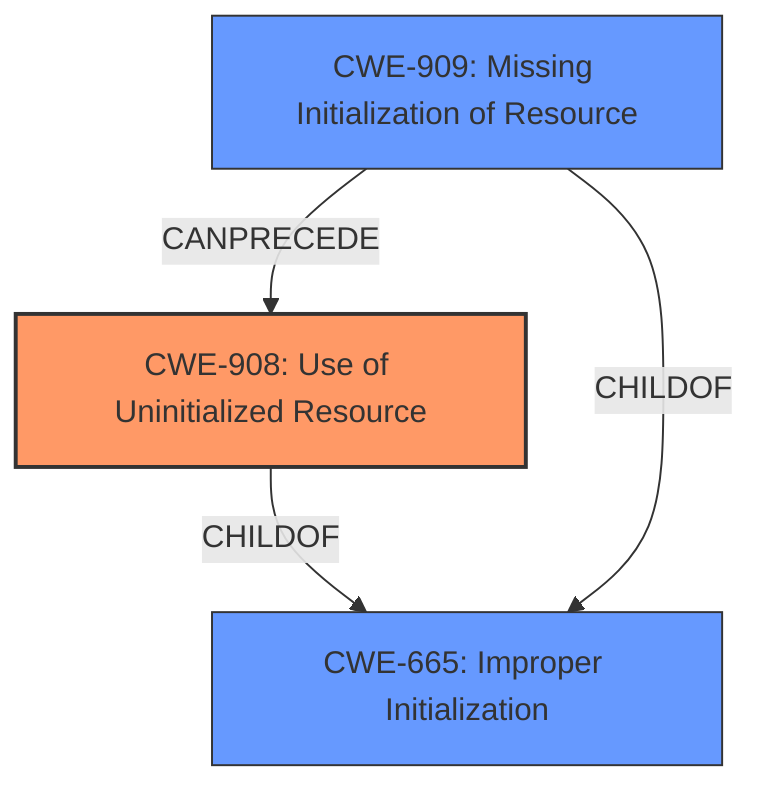

# Analysis for CVE-2021-29647

# Summary
| CWE ID | CWE Name | Confidence | CWE Abstraction Level | CWE Vulnerability Mapping Label | CWE-Vulnerability Mapping Notes |
|---|---|---|---|---|---|
| CWE-908 | Use of Uninitialized Resource | 0.9 | Base | Allowed | Primary CWE |
| CWE-909 | Missing Initialization of Resource | 0.7 | Class | Allowed-with-Review | Secondary Candidate |
| CWE-665 | Improper Initialization | 0.6 | Class | Discouraged | Secondary Candidate |

## Evidence and Confidence

*   **Confidence Score:** 0.8
*   **Evidence Strength:** HIGH

## Relationship Analysis
The primary CWE selected is CWE-908, which represents the **use of an uninitialized resource**. This is a Base-level CWE, making it a good fit for the root cause of the vulnerability. CWE-908 is a child of CWE-665, **Improper Initialization**, which is a broader Class-level CWE. The relationship indicates that the specific issue is the use of the resource rather than just the fact that it was not properly initialized. CWE-909, **Missing Initialization of Resource**, is a peer of CWE-665 and also a parent of CWE-908 and represents the missing aspect of the initialization.

## Vulnerability Chain
The vulnerability chain starts with the **missing initialization** of the `sockaddr_qrtr` structure. This leads to the **use of an uninitialized resource** when data is copied to userspace, resulting in **information disclosure**.

## Summary of Analysis
The vulnerability description clearly states the root cause as a "**partially uninitialized data structure**" within the `qrtr_recvmsg` function, leading to potential information disclosure. The CVE Reference Links Content Summary confirms that the `sockaddr_qrtr` structure is not properly initialized, and uninitialized kernel memory is copied to user space.

Based on the evidence, CWE-908, **Use of Uninitialized Resource**, is the most appropriate primary CWE. It aligns directly with the root cause described in the vulnerability details. The **Retriever Results** also list CWE-908 as a potential candidate.

CWE-909, **Missing Initialization of Resource**, and CWE-665, **Improper Initialization**, were also considered since they relate to the initialization issue. However, the vulnerability description emphasizes the *use* of the uninitialized data, making CWE-908 the more accurate and specific choice. The graph relationships show these CWEs are related, however, the root cause is the uninitialized resource being used.

The chosen CWEs are at the optimal level of specificity because CWE-908 is a Base-level CWE, providing a detailed representation of the weakness. The other CWEs are Class-level, representing broader categories.

Relevant CWE Information:
- **Vulnerability Description Key Phrases:** "**partially uninitialized data structure**"
- **CVE Reference Links Content Summary:** "fails to properly initialize a `sockaddr_qrtr` structure before copying kernel data to userspace. This structure has a 2-byte hole which is not being cleared, potentially exposing uninitialized data in kernel memory to user-space processes."