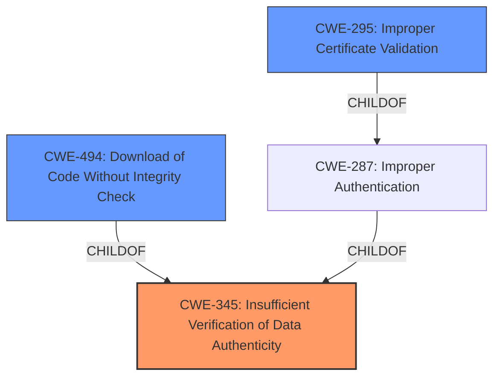

# Analysis for CVE-2021-29655

# Summary
| CWE ID | CWE Name | Confidence | CWE Abstraction Level | CWE Vulnerability Mapping Label | CWE-Vulnerability Mapping Notes |
|---|---|---|---|---|---|
| CWE-345 | Insufficient Verification of Data Authenticity | 0.8 | Class | Primary | Allowed-with-Review |
| CWE-494 | Download of Code Without Integrity Check | 0.6 | Base | Secondary | Allowed |
| CWE-295 | Improper Certificate Validation | 0.5 | Base | Secondary | Allowed |

## Evidence and Confidence

*   **Confidence Score:** 0.8
*   **Evidence Strength:** MEDIUM

## Relationship Analysis
The primary CWE selected is CWE-345, which is a Class-level CWE. The relationships between CWEs influenced the decision, particularly the parent-child relationships. CWE-345 is a parent of CWE-494 and has a relationship with CWE-287, parent of CWE-295. Given that the vulnerability description highlights an omission of authenticity checks, focusing on the general lack of verification (CWE-345) along with the possibility of downloading code without integrity check (CWE-494) and the failure of the software to validate certificates (CWE-295) seems appropriate.

## Vulnerability Chain
The vulnerability chain starts with the **omission of certain provisioning authenticity checks**. This leads to the acceptance of untrusted code, which can then be executed, resulting in a compromise of the system.

Root Cause: **omits certain provisioning authenticity checks**
Weakness: Insufficient Verification of Data Authenticity (CWE-345)
Impact: Execute untrusted code

## Summary of Analysis
The analysis is primarily based on the vulnerability description key phrases, specifically the **weakness** which is the **omission of certain provisioning authenticity checks**. The retriever results also point towards CWE-345 (Insufficient Verification of Data Authenticity) and CWE-295 (Improper Certificate Validation), providing additional support.

The selection of CWE-345 as the primary CWE is due to its alignment with the **omission of authenticity checks**. CWE-494 is included as a secondary CWE since the impact is execution of untrusted code. CWE-295 is also included since certificate validation is part of authenticity checks.

The chosen CWEs are at an appropriate level of specificity. While CWE-345 is a Class, it directly addresses the core issue of insufficient verification, and no more specific child CWE is a better fit given the available information. CWE-494 and CWE-295 are base level CWEs.

Relevant CWE Information:

# Enhanced Context (25 CWEs)
The following CWEs were identified as potentially relevant to this vulnerability:

## CWE-807: Reliance on Untrusted Inputs in a Security Decision
**Abstraction Level**: Base
**Similarity Score**: 0.77
**Source**: dense

**Description**:
The product uses a protection mechanism that relies on the existence or values of an input, but the input can be modified by an untrusted actor in a way that bypasses the protection mechanism.

**Mapping Guidance**:
- Usage: Allowed
- Rationale: This CWE entry is at the Base level of abstraction, which is a preferred level of abstraction for mapping to the root causes of vulnerabilities.

*This CWE was not selected since the description doesn't align directly. There is no evidence to show that the system relies on untrusted inputs for security decisions.*

## CWE-274: Improper Handling of Insufficient Privileges
**Abstraction Level**: Base
**Similarity Score**: 0.77
**Source**: dense

**Description**:
The product does not handle or incorrectly handles when it has insufficient privileges to perform an operation, leading to resultant weaknesses.

**Mapping Guidance**:
- Usage: Discouraged
- Rationale: This CWE entry could be deprecated in a future version of CWE.

*This CWE was not selected since there is no mention of privilege issues.*

## CWE-303: Incorrect Implementation of Authentication Algorithm
**Abstraction Level**: Base
**Similarity Score**: 0.76
**Source**: dense

**Description**:
The requirements for the product dictate the use of an established authentication algorithm, but the implementation of the algorithm is incorrect.

**Mapping Guidance**:
- Usage: Allowed
- Rationale: This CWE entry is at the Base level of abstraction, which is a preferred level of abstraction for mapping to the root causes of vulnerabilities.

*This CWE was not selected since there is no mention of authentication algorithm implementation issues.*

## CWE-280: Improper Handling of Insufficient Permissions or Privileges 
**Abstraction Level**: Base
**Similarity Score**: 0.76
**Source**: dense

**Description**:
The product does not handle or incorrectly handles when it has insufficient privileges to access resources or functionality as specified by their permissions. This may cause it to follow unexpected code paths that may leave the product in an invalid state.

**Mapping Guidance**:
- Usage: Allowed
- Rationale: This CWE entry is at the Base level of abstraction, which is a preferred level of abstraction for mapping to the root causes of vulnerabilities.

*This CWE was not selected since there is no mention of permissions or privileges.*

## CWE-1289: Improper Validation of Unsafe Equivalence in Input
**Abstraction Level**: Base
**Similarity Score**: 0.75
**Source**: dense

**Description**:
The product receives an input value that is used as a resource identifier or other type of reference, but it does not validate or incorrectly validates that the input is equivalent to a potentially-unsafe value.

**Mapping Guidance**:
- Usage: Allowed
- Rationale: This CWE entry is at the Base level of abstraction, which is a preferred level of abstraction for mapping to the root causes of vulnerabilities.

*This CWE was not selected since there is no mention of validating resource identifiers.*

## CWE-1390: Weak Authentication
**Abstraction Level**: Class
**Similarity Score**: 0.75
**Source**: dense

**Description**:
The product uses an authentication mechanism to restrict access to specific users or identities, but the mechanism does not sufficiently prove that the claimed identity is correct.

**Mapping Guidance**:
- Usage: Allowed-with-Review
- Rationale: This CWE entry is a Class and might have Base-level children that would be more appropriate

*This CWE was not selected since the description is about provisioning authenticity checks rather than user authentication.*

## CWE-345: Insufficient Verification of Data Authenticity
**Abstraction Level**: Class
**Similarity Score**: 0.75
**Source**: dense

**Description**:
The product does not sufficiently verify the origin or authenticity of data, in a way that causes it to accept invalid data.

**Mapping Guidance**:
- Usage: Discouraged
- Rationale: This CWE entry is a level-1 Class (i.e., a child of a Pillar). It might have lower-level children that would be more appropriate

*This CWE was selected as a primary candidate.*

## CWE-472: External Control of Assumed-Immutable Web Parameter
**Abstraction Level**: Base
**Similarity Score**: 0.74
**Source**: dense

**Description**:
The web application does not sufficiently verify inputs that are assumed to be immutable but are actually externally controllable, such as hidden form fields.

**Mapping Guidance**:
- Usage: Allowed
- Rationale: This CWE entry is at the Base level of abstraction, which is a preferred level of abstraction for mapping to the root causes of vulnerabilities.

*This CWE was not selected since there is no mention of immutable web parameters.*

## CWE-358: Improperly Implemented Security Check for Standard
**Abstraction Level**: Base
**Similarity Score**: 0.74
**Source**: dense

**Description**:
The product does not implement or incorrectly implements one or more security-relevant checks as specified by the design of a standardized algorithm, protocol, or technique.

**Mapping Guidance**:
- Usage: Allowed
- Rationale: This CWE entry is at the Base level of abstraction, which is a preferred level of abstraction for mapping to the root causes of vulnerabilities.

*This CWE was not selected since the vulnerability doesn't align with security checks for a standard.*

## CWE-639: Authorization Bypass Through User-Controlled Key
**Abstraction Level**: Base
**Similarity Score**: 0.74
**Source**: dense

**Description**:
The system'