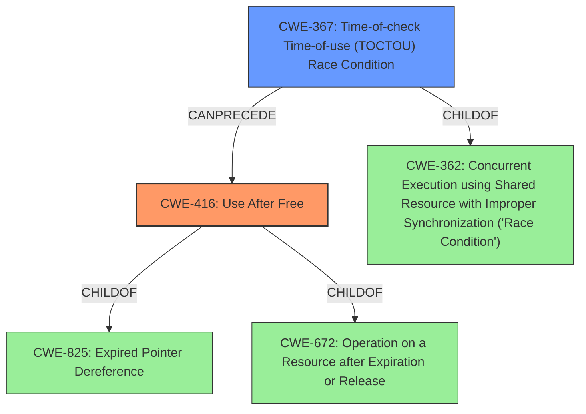

# Raw Analyzer Response for CVE-2021-29657

# Summary
| CWE ID | CWE Name | Confidence | CWE Abstraction Level | CWE Vulnerability Mapping Label | CWE-Vulnerability Mapping Notes |
|---|---|---|---|---|---|
| CWE-416 | Use After Free | 1.0 | Variant | Allowed | Primary CWE |
| CWE-367 | Time-of-check Time-of-use (TOCTOU) Race Condition | 0.9 | Base | Allowed | Secondary CWE |

## Evidence and Confidence

*   **Confidence Score:** 0.95
*   **Evidence Strength:** HIGH

## Relationship Analysis
The primary weakness is **CWE-416 (Use After Free)**, which occurs because memory is accessed after it has been freed. This is often preceded by a race condition, specifically a **CWE-367 (Time-of-check Time-of-use (TOCTOU) Race Condition)**, where the state of a resource is checked, but changes before it's used, invalidating the check. **CWE-416** is a variant of **CWE-825 (Expired Pointer Dereference)** and **CWE-672 (Operation on a Resource after Expiration or Release)**. **CWE-367** is a child of **CWE-362 (Concurrent Execution using Shared Resource with Improper Synchronization ('Race Condition'))**.

## Vulnerability Chain
The vulnerability chain starts with a **TOCTOU race condition** (**CWE-367**), where the state of VMCB controls is checked before being loaded. This leads to the controls being different at the time of use, resulting in a **use-after-free** (**CWE-416**). The impact is bypassing access control on host OS MSRs, allowing an AMD KVM guest to potentially influence the host kernel behavior.

## Summary of Analysis
The initial assessment, based on the vulnerability description which mentions a "**use-after-free** in which an AMD KVM guest can bypass access control on host OS MSRs when there are nested guests" and a "**TOCTOU race condition** associated with a VMCB12 double fetch in nested_svm_vmrun" in `arch/x86/kvm/svm/nested.c in the Linux kernel before 5.11.12`, points towards **CWE-416 (Use After Free)** as the primary weakness and **CWE-367 (Time-of-check Time-of-use (TOCTOU) Race Condition)** as a secondary weakness that precedes it.

The **CVE Reference Links Content Summary** confirms the **TOCTOU race condition** and the resulting **use-after-free**. It states, "The vulnerability stems from a TOCTOU race where the checks on VMCB controls happen before the controls are loaded, which can cause a discrepancy between what is checked and what is eventually used."

The graph relationships highlight the hierarchical connections, with **CWE-416** being a variant of **CWE-825** and **CWE-672**, and **CWE-367** being a child of **CWE-362**. This supports the selection of **CWE-416** as the most specific representation of the weakness, as it directly describes the use of memory after it has been freed. **CWE-367** is included because the race condition is a critical contributing factor.

The selected CWEs are at the optimal level of specificity because they accurately represent the root cause and the immediate consequence of the vulnerability. **CWE-416** describes the core problem of using freed memory, while **CWE-367** explains how the race condition enables this to occur.

**CWEs Considered But Not Used:**

*   **CWE-362 (Concurrent Execution using Shared Resource with Improper Synchronization ('Race Condition'))**: While the vulnerability involves a race condition, **CWE-367** is a more specific type of race condition (TOCTOU) and is therefore a better fit. **CWE-362** is a class-level CWE, and the guidance suggests exploring more specific child CWEs.
*   **CWE-667 (Improper Locking), CWE-662 (Improper Synchronization), CWE-833 (Deadlock)**: These CWEs relate to synchronization issues, but the core problem is not a lack of synchronization leading to a deadlock or corrupted state, but rather a race condition enabling use of freed memory.
*   **CWE-755 (Improper Handling of Exceptional Conditions)**: While the race condition could be considered an exceptional condition, the more direct cause is the TOCTOU leading to the use-after-free.
*   **CWE-909 (Missing Initialization of Resource) and CWE-665 (Improper Initialization)**: Although incorrect initialization can lead to vulnerabilities, the provided vulnerability description does not indicate missing or improper initialization.
*   **CWE-120 (Buffer Copy without Checking Size of Input ('Classic Buffer Overflow'))**: This CWE relates to buffer overflows. The vulnerability is not caused by an overflow, and therefore, it's not the right fit.
*   **CWE-476 (NULL Pointer Dereference)**: The vulnerability description does not state that a null pointer dereference occurs, so this CWE is not appropriate.
*   **CWE-123 (Write-what-where Condition), CWE-415 (Double Free), CWE-364 (Signal Handler Race Condition), CWE-825 (Expired Pointer Dereference), CWE-908 (Use of Uninitialized Resource)**: These CWEs are not directly related to the vulnerability description, which specifies a use-after-free caused by a TOCTOU race condition.
*   **CWE-1342 (Information Exposure through Microarchitectural State after Transient Execution)**: This CWE is related to transient execution vulnerabilities, which is not the case here.