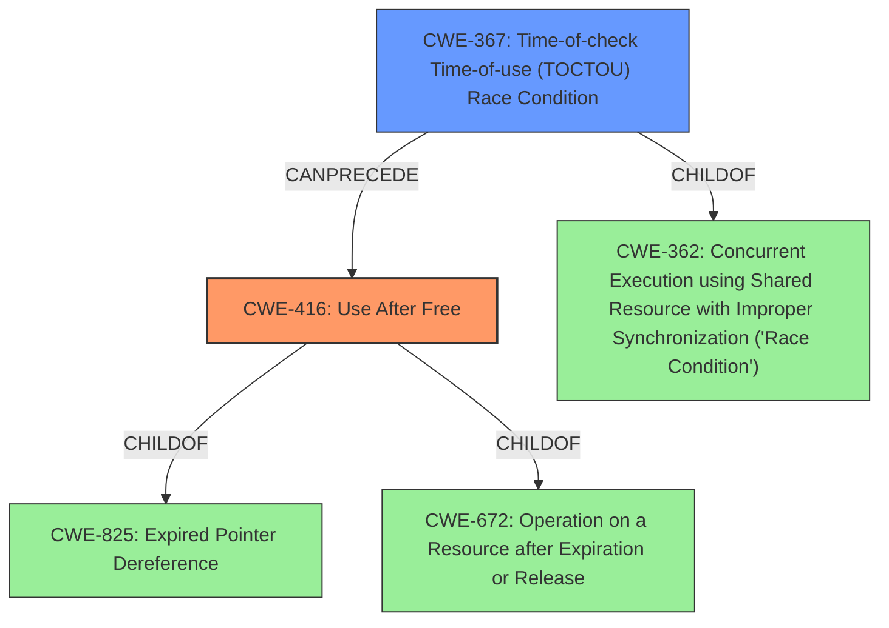

# Analysis for CVE-2021-29657

# Summary
| CWE ID | CWE Name | Confidence | CWE Abstraction Level | CWE Vulnerability Mapping Label | CWE-Vulnerability Mapping Notes |
|---|---|---|---|---|---|
| CWE-416 | Use After Free | 1.0 | Variant | Allowed | Primary CWE |
| CWE-367 | Time-of-check Time-of-use (TOCTOU) Race Condition | 0.9 | Base | Allowed | Secondary CWE |

## Evidence and Confidence

*   **Confidence Score:** 0.95
*   **Evidence Strength:** HIGH

## Relationship Analysis
The primary weakness is **CWE-416 (Use After Free)**, which occurs because memory is accessed after it has been freed. This is often preceded by a race condition, specifically a **CWE-367 (Time-of-check Time-of-use (TOCTOU) Race Condition)**, where the state of a resource is checked, but changes before it's used, invalidating the check. **CWE-416** is a variant of **CWE-825 (Expired Pointer Dereference)** and **CWE-672 (Operation on a Resource after Expiration or Release)**. **CWE-367** is a child of **CWE-362 (Concurrent Execution using Shared Resource with Improper Synchronization ('Race Condition'))**.

## Vulnerability Chain
The vulnerability chain starts with a **TOCTOU race condition** (**CWE-367**), where the state of VMCB controls is checked before being loaded. This leads to the controls being different at the time of use, resulting in a **use-after-free** (**CWE-416**). The impact is bypassing access control on host OS MSRs, allowing an AMD KVM guest to potentially influence the host kernel behavior.

## Summary of Analysis
The initial assessment, based on the vulnerability description which mentions a "**use-after-free** in which an AMD KVM guest can bypass access control on host OS MSRs when there are nested guests" and a "**TOCTOU race condition** associated with a VMCB12 double fetch in nested_svm_vmrun" in `arch/x86/kvm/svm/nested.c in the Linux kernel before 5.11.12`, points towards **CWE-416 (Use After Free)** as the primary weakness and **CWE-367 (Time-of-check Time-of-use (TOCTOU) Race Condition)** as a secondary weakness that precedes it.

The **CVE Reference Links Content Summary** confirms the **TOCTOU race condition** and the resulting **use-after-free**. It states, "The vulnerability stems from a TOCTOU race where the checks on VMCB controls happen before the controls are loaded, which can cause a discrepancy between what is checked and what is eventually used."

The graph relationships highlight the hierarchical connections, with **CWE-416** being a variant of **CWE-825** and **CWE-672**, and **CWE-367** being a child of **CWE-362**. This supports the selection of **CWE-416** as the most specific representation of the weakness, as it directly describes the use of memory after it has been freed. **CWE-367** is included because the race condition is a critical contributing factor.

The selected CWEs are at the optimal level of specificity because they accurately represent the root cause and the immediate consequence of the vulnerability. **CWE-416** describes the core problem of using freed memory, while **CWE-367** explains how the race condition enables this to occur.

**CWEs Considered But Not Used:**

*   **CWE-362 (Concurrent Execution using Shared Resource with Improper Synchronization ('Race Condition'))**: While the vulnerability involves a race condition, **CWE-367** is a more specific type of race condition (TOCTOU) and is therefore a better fit. **CWE-362** is a class-level CWE, and the guidance suggests exploring more specific child CWEs.
*   **CWE-667 (Improper Locking), CWE-662 (Improper Synchronization), CWE-833 (Deadlock)**: These CWEs relate to synchronization issues, but the core problem is not a lack of synchronization leading to a deadlock or corrupted state, but rather a race condition enabling use of freed memory.
*   **CWE-755 (Improper Handling of Exceptional Conditions)**: While the race condition could be considered an exceptional condition, the more direct cause is the TOCTOU leading to the use-after-free.
*   **CWE-909 (Missing Initialization of Resource) and CWE-665 (Improper Initialization)**: Although incorrect initialization can lead to vulnerabilities, the provided vulnerability description does not indicate missing or improper initialization.
*   **CWE-120 (Buffer Copy without Checking Size of Input ('Classic Buffer Overflow'))**: This CWE relates to buffer overflows. The vulnerability is not caused by an overflow, and therefore, it's not the right fit.
*   **CWE-476 (NULL Pointer Dereference)**: The vulnerability description does not state that a null pointer dereference occurs, so this CWE is not appropriate.
*   **CWE-123 (Write-what-where Condition), CWE-415 (Double Free), CWE-364 (Signal Handler Race Condition), CWE-825 (Expired Pointer Dereference), CWE-908 (Use of Uninitialized Resource)**: These CWEs are not directly related to the vulnerability description, which specifies a use-after-free caused by a TOCTOU race condition.
*   **CWE-1342 (Information Exposure through Microarchitectural State after Transient Execution)**: This CWE is related to transient execution vulnerabilities, which is not the case here.

# Enhanced Query for CVE-2021-29657

## Vulnerability Description
arch/x86/kvm/svm/nested.c in the Linux kernel before 5.11.12 has a **use-after-free** in which an AMD KVM guest can bypass access control on host OS MSRs when there are nested guests, aka CID-a58d9166a756. This occurs because of a **TOCTOU race condition** associated with a VMCB12 double fetch in nested_svm_vmrun.

### Vulnerability Description Key Phrases
- **rootcause:** **TOCTOU race condition**
- **weakness:** **use-after-free**
- **impact:** bypass access control on host OS MSRs
- **vector:** double fetch in nested_svm_vmrun
- **attacker:** AMD KVM guest
- **product:** Linux kernel
- **version:** before 5.11.12
- **component:** arch/x86/kvm/svm/nested.c

## CVE Reference Links Content Summary
Based on the provided information, here's a breakdown of the CVE-2021-29657 vulnerability:

**Root Cause of Vulnerability:**

*   The vulnerability lies in the Linux Kernel's KVM (Kernel-based Virtual Machine) implementation, specifically within the nSVM (nested Secure Virtual Machine) component.
*   The issue arises due to a race condition in how nested VMCB (Virtual Machine Control Block) controls are loaded and checked.
*   Specifically, the control fields were not loaded before they were checked, potentially leading to the hypervisor not properly intercepting VMRUN instructions, and the nested guest accessing MSR permission bitmap.

**Weaknesses/Vulnerabilities Present:**

*   **Time-of-check, time-of-use (TOCTOU) race condition:** The vulnerability stems from a TOCTOU race where the checks on VMCB controls happen before the controls are loaded, which can cause a discrepancy between what is checked and what is eventually used.

**Impact of Exploitation:**

*   **Privilege Escalation:** A malicious nested guest (virtual machine) could potentially influence the host kernel behavior.
*   **Unintended hypervisor behavior:** It can lead to a state where the VMRUN intercept is processed by the host instead of the nested hypervisor.

**Attack Vectors:**

*   **Nested Virtualization:** The vulnerability can be triggered by a malicious guest OS running inside a virtual machine that is itself running on a hypervisor with nested virtualization enabled (SVM).
*   **Host System:** The vulnerability resides in the host kernel. Exploitation can result in a compromised host.
*   **VMRUN instruction:** This instruction is specific to AMD's SVM technology and is related to executing code within a virtualized environment.

**Required Attacker Capabilities/Position:**

*   **Nested Guest Control:** The attacker must have control over a guest operating system running within a virtual machine on a vulnerable hypervisor.
*   **Nested Virtualization:** The hypervisor must have nested virtualization enabled.
*   **Exploitation Complexity:** Exploiting this vulnerability likely requires a deep understanding of the KVM, SVM and VMCB implementation in the Linux Kernel.

**Additional details from the provided content:**

*   **Affected NetApp Products:** Several NetApp products are listed as affected due to incorporating a vulnerable Linux Kernel, particularly in their Baseboard Management Controllers (BMCs). These include:
    *   NetApp Cloud Backup (formerly AltaVault)
    *   NetApp HCI Baseboard Management Controller (BMC) - H300S/H500S/H700S/H410S
    *   NetApp HCI Baseboard Management Controller (BMC) - H410C
    *    NetApp SolidFire Baseboard Management Controller (BMC)

*  **Products Not Affected:** A long list of NetApp products is mentioned as not affected, which include storage controllers, management tools, SDKs and other software.

*   **Remediation:** NetApp states that no patches are available for affected products and provides end-of-life (EOA) announcements for each. This implies that these products may not be supported or fixed.
*   **CVSS Score:** The vulnerability has a CVSS v3.1 score of 7.4 (HIGH) with a vector of CVSS:3.1/AV:L/AC:H/PR:N/UI:N/S:U/C:H/I:H/A:H, which means that it has a high impact on confidentiality, integrity and availability but requires a high attack complexity and does not need any user interaction nor privilege for exploitation.

*  **Kernel commit:** The Linux kernel commit that fixes the vulnerability is [a58d9166a756a0f4a6618e4f593232593d6df134](https://git.kernel.org/pub/scm/linux/kernel/git/torvalds/linux.git/commit/?id=a58d9166a756a0f4a6618e4f593232593d6df134) which is included in Linux Kernel version 5.11.12

* The provided content provides more detailed information about the affected products and their remediation status than the official CVE description.

## Retriever Results

### Top Combined Results

| Rank | CWE ID | Name | Abstraction | Usage  | Retrievers | Individual Scores |
|------|--------|------|-------------|-------|------------|-------------------|
| 1 | 362 | Concurrent Execution using Shared Resource with Improper Synchronization ('Race Condition') | Class | Allowed-with-Review | alternate_terms | 0.800 |
| 2 | 416 | Use After Free | Variant | Allowed | alternate_terms | 1.000 |
| 3 | 367 | Time-of-check Time-of-use (TOCTOU) Race Condition | Base | Allowed | sparse | 0.493 |
| 4 | 833 | Deadlock | Base | Allowed | sparse | 0.317 |
| 5 | 755 | Improper Handling of Exceptional Conditions | Class | Discouraged | sparse | 0.313 |
| 6 | 1342 | Information Exposure through Microarchitectural State after Transient Execution | Base | Allowed | dense | 0.599 |
| 7 | 609 | Double-Checked Locking | Base | Allowed | graph | 0.003 |
| 8 | 667 | Improper Locking | Class | Allowed-with-Review | sparse | 0.300 |
| 9 | 364 | Signal Handler Race Condition | Base | Allowed | sparse | 0.300 |
| 10 | 909 | Missing Initialization of Resource | Class | Allowed-with-Review | sparse | 0.292 |

# Complete CWE Specifications

## CWE-362: Concurrent Execution using Shared Resource with Improper Synchronization ('Race Condition')
**Abstraction:** Class
**Status:** Draft

### Description
The product contains a concurrent code sequence that requires temporary, exclusive access to a shared resource, but a timing window exists in which the shared resource can be modified by another code sequence operating concurrently.

### Extended Description

A race condition occurs within concurrent environments, and it is effectively a property of a code sequence. Depending on the context, a code sequence may be in the form of a function call, a small number of instructions, a series of program invocations, etc.

A race condition violates these properties, which are closely related:

  - Exclusivity - the code sequence is given exclusive access to the shared resource, i.e., no other code sequence can modify properties of the shared resource before the original sequence has completed execution.

  - Atomicity - the code sequence is behaviorally atomic, i.e., no other thread or process can concurrently execute the same sequence of instructions (or a subset) against the same resource.

A race condition exists when an "interfering code sequence" can still access the shared resource, violating exclusivity.

The interfering code sequence could be "trusted" or "untrusted." A trusted interfering code sequence occurs within the product; it cannot be modified by the attacker, and it can only be invoked indirectly. An untrusted interfering code sequence can be authored directly by the attacker, and typically it is external to the vulnerable product.

### Alternative Terms
Race Condition

### Relationships
ChildOf -> CWE-691
CanPrecede -> CWE-416
CanPrecede -> CWE-476

### Mapping Guidance
**Usage:** Allowed-with-Review
**Rationale:** This CWE entry is a Class and might have Base-level children that would be more appropriate
**Comments:** Examine children of this entry to see if there is a better fit
**Reasons:**
- Abstraction

### Additional Notes
**[Maintenance]** The relationship between race conditions and synchronization problems (CWE-662) needs to be further developed. They are not necessarily two perspectives of the same core concept, since synchronization is only one technique for avoiding race conditions, and synchronization can be used for other purposes besides race condition prevention.

**[Research Gap]** Race conditions in web applications are under-studied and probably under-reported. However, in 2008 there has been growing interest in this area.

**[Research Gap]** Much of the focus of race condition research has been in Time-of-check Time-of-use (TOCTOU) variants (CWE-367), but many race conditions are related to synchronization problems that do not necessarily require a time-of-check.

**[Research Gap]** From a classification/taxonomy perspective, the relationships between concurrency and program state need closer investigation and may be useful in organizing related issues.

### Observed Examples
- **CVE-2022-29527:** Go application for cloud management creates a world-writable sudoers file that allows local attackers to inject sudo rules and escalate privileges to root by winning a race condition.
- **CVE-2021-1782:** Chain: improper locking (CWE-667) leads to race condition (CWE-362), as exploited in the wild per CISA KEV.
- **CVE-2021-0920:** Chain: mobile platform race condition (CWE-362) leading to use-after-free (CWE-416), as exploited in the wild per CISA KEV.

## CWE-416: Use After Free
**Abstraction:** Variant
**Status:** Stable

### Description
The product reuses or references memory after it has been freed. At some point afterward, the memory may be allocated again and saved in another pointer, while the original pointer references a location somewhere within the new allocation. Any operations using the original pointer are no longer valid because the memory "belongs" to the code that operates on the new pointer.

### Extended Description
Not provided

### Alternative Terms
Dangling pointer: a pointer that no longer points to valid memory, often after it has been freed
UAF: commonly used acronym for Use After Free
Use-After-Free

### Relationships
ChildOf -> CWE-825
ChildOf -> CWE-672
ChildOf -> CWE-672
ChildOf -> CWE-672
CanPrecede -> CWE-120
CanPrecede -> CWE-123

### Mapping Guidance
**Usage:** Allowed
**Rationale:** This CWE entry is at the Variant level of abstraction, which is a preferred level of abstraction for mapping to the root causes of vulnerabilities.
**Comments:** Carefully read both the name and description to ensure that this mapping is an appropriate fit. Do not try to 'force' a mapping to a lower-level Base/Variant simply to comply with this preferred level of abstraction.
**Reasons:**
- Acceptable-Use

### Observed Examples
- **CVE-2022-20141:** Chain: an operating system kernel has insufficent resource locking (CWE-413) leading to a use after free (CWE-416).
- **CVE-2022-2621:** Chain: two threads in a web browser use the same resource (CWE-366), but one of those threads can destroy the resource before the other has completed (CWE-416).
- **CVE-2021-0920:** Chain: mobile platform race condition (CWE-362) leading to use-after-free (CWE-416), as exploited in the wild per CISA KEV.

## CWE-367: Time-of-check Time-of-use (TOCTOU) Race Condition
**Abstraction:** Base
**Status:** Incomplete

### Description
The product checks the state of a resource before using that resource, but the resource's state can change between the check and the use in a way that invalidates the results of the check. This can cause the product to perform invalid actions when the resource is in an unexpected state.

### Extended Description
This weakness can be security-relevant when an attacker can influence the state of the resource between check and use. This can happen with shared resources such as files, memory, or even variables in multithreaded programs.

### Alternative Terms
TOCTTOU: The TOCTTOU acronym expands to "Time Of Check To Time Of Use".
TOCCTOU: The TOCCTOU acronym is most likely a typo of TOCTTOU, but it has been used in some influential documents, so the typo is repeated fairly frequently.

### Relationships
ChildOf -> CWE-362
ChildOf -> CWE-362

### Mapping Guidance
**Usage:** Allowed
**Rationale:** This CWE entry is at the Base level of abstraction, which is a preferred level of abstraction for mapping to the root causes of vulnerabilities.
**Comments:** Carefully read both the name and description to ensure that this mapping is an appropriate fit. Do not try to 'force' a mapping to a lower-level Base/Variant simply to comply with this preferred level of abstraction.
**Reasons:**
- Acceptable-Use

### Additional Notes
**[Relationship]** TOCTOU issues do not always involve symlinks, and not every symlink issue is a TOCTOU problem.

**[Research Gap]** Non-symlink TOCTOU issues are not reported frequently, but they are likely to occur in code that attempts to be secure.

### Observed Examples
- **CVE-2015-1743:** TOCTOU in sandbox process allows installation of untrusted browser add-ons by replacing a file after it has been verified, but before it is executed
- **CVE-2003-0813:** A multi-threaded race condition allows remote attackers to cause a denial of service (crash or reboot) by causing two threads to process the same RPC request, which causes one thread to use memory after it has been freed.
- **CVE-2004-0594:** PHP flaw allows remote attackers to execute arbitrary code by aborting execution before the initialization of key data structures is complete.

## CWE-833: Deadlock
**Abstraction:** Base
**Status:** Incomplete

### Description
The product contains multiple threads or executable segments that are waiting for each other to release a necessary lock, resulting in deadlock.

### Extended Description
Not provided

### Alternative Terms
None

### Relationships
ChildOf -> CWE-667
ChildOf -> CWE-662

### Mapping Guidance
**Usage:** Allowed
**Rationale:** This CWE entry is at the Base level of abstraction, which is a preferred level of abstraction for mapping to the root causes of vulnerabilities.
**Comments:** Carefully read both the name and description to ensure that this mapping is an appropriate fit. Do not try to 'force' a mapping to a lower-level Base/Variant simply to comply with this preferred level of abstraction.
**Reasons:**
- Acceptable-Use

### Observed Examples
- **CVE-1999-1476:** A bug in some Intel Pentium processors allow DoS (hang) via an invalid "CMPXCHG8B" instruction, causing a deadlock
- **CVE-2009-2857:** OS deadlock
- **CVE-2009-1961:** OS deadlock involving 3 separate functions

## CWE-755: Improper Handling of Exceptional Conditions
**Abstraction:** Class
**Status:** Incomplete

### Description
The product does not handle or incorrectly handles an exceptional condition.

### Extended Description
Not provided

### Alternative Terms
None

### Relationships
ChildOf -> CWE-703

### Mapping Guidance
**Usage:** Discouraged
**Rationale:** This CWE entry is a level-1 Class (i.e., a child of a Pillar). It might have lower-level children that would be more appropriate
**Comments:** Examine children of this entry to see if there is a better fit
**Reasons:**
- Abstraction

### Observed Examples
- **CVE-2023-41151:** SDK for OPC Unified Architecture (OPC UA) server has uncaught exception when a socket is blocked for writing but the server tries to send an error
- **[REF-1374]:** Chain: JavaScript-based cryptocurrency library can fall back to the insecure Math.random() function instead of reporting a failure (CWE-392), thus reducing the entropy (CWE-332) and leading to generation of non-unique cryptographic keys for Bitcoin wallets (CWE-1391)
- **CVE-2021-3011:** virtual interrupt controller in a virtualization product allows crash of host by writing a certain invalid value to a register, which triggers a fatal error instead of returning an error code

## CWE-1342: Information Exposure through Microarchitectural State after Transient Execution
**Abstraction:** Base
**Status:** Incomplete

### Description
The processor does not properly clear microarchitectural state after incorrect microcode assists or speculative execution, resulting in transient execution.

### Extended Description

In many processor architectures an exception, mis-speculation, or microcode assist results in a flush operation to clear results that are no longer required. This action prevents these results from influencing architectural state that is intended to be visible from software. However, traces of this transient execution may remain in microarchitectural buffers, resulting in a change in microarchitectural state that can expose sensitive information to an attacker using side-channel analysis. For example, Load Value Injection (LVI) [REF-1202] can exploit direct injection of erroneous values into intermediate load and store buffers.

Several conditions may need to be fulfilled for a successful attack:

  1. incorrect transient execution that results in remanence of sensitive information;

  1. attacker has the ability to provoke microarchitectural exceptions;

  1. operations and structures in victim code that can be exploited must be identified.

### Alternative Terms
None

### Relationships
ChildOf -> CWE-226
ChildOf -> CWE-226

### Mapping Guidance
**Usage:** Allowed
**Rationale:** This CWE entry is at the Base level of abstraction, which is a preferred level of abstraction for mapping to the root causes of vulnerabilities.
**Comments:** Carefully read both the name and description to ensure that this mapping is an appropriate fit. Do not try to 'force' a mapping to a lower-level Base/Variant simply to comply with this preferred level of abstraction.
**Reasons:**
- Acceptable-Use

### Additional Notes
**[Relationship]** CWE-1342 differs from CWE-1303, which is related to misprediction and biasing microarchitectural components, while CWE-1342 addresses illegal data flows and retention. For example, Spectre is an instance of CWE-1303 biasing branch prediction to steer the transient execution indirectly.

**[Maintenance]** As of CWE 4.9, members of the CWE Hardware SIG are closely analyzing this entry and others to improve CWE's coverage of transient execution weaknesses, which include issues related to Spectre, Meltdown, and other attacks. Additional investigation may include other weaknesses related to microarchitectural state. As a result, this entry might change significantly in CWE 4.10.

### Observed Examples
- **CVE-2020-0551:** Load value injection in some processors utilizing speculative execution may allow an authenticated user to enable information disclosure via a side-channel with local access.

## CWE-609: Double-Checked Locking
**Abstraction:** Base
**Status:** Draft

### Description
The product uses double-checked locking to access a resource without the overhead of explicit synchronization, but the locking is insufficient.

### Extended Description
Double-checked locking refers to the situation where a programmer checks to see if a resource has been initialized, grabs a lock, checks again to see if the resource has been initialized, and then performs the initialization if it has not occurred yet. This should not be done, as it is not guaranteed to work in all languages and on all architectures. In summary, other threads may not be operating inside the synchronous block and are not guaranteed to see the operations execute in the same order as they would appear inside the synchronous block.

### Alternative Terms
None

### Relationships
ChildOf -> CWE-667
CanPrecede -> CWE-367

### Mapping Guidance
**Usage:** Allowed
**Rationale:** This CWE entry is at the Base level of abstraction, which is a preferred level of abstraction for mapping to the root causes of vulnerabilities.
**Comments:** Carefully read both the name and description to ensure that this mapping is an appropriate fit. Do not try to 'force' a mapping to a lower-level Base/Variant simply to comply with this preferred level of abstraction.
**Reasons:**
- Acceptable-Use

## CWE-667: Improper Locking
**Abstraction:** Class
**Status:** Draft

### Description
The product does not properly acquire or release a lock on a resource, leading to unexpected resource state changes and behaviors.

### Extended Description

Locking is a type of synchronization behavior that ensures that multiple independently-operating processes or threads do not interfere with each other when accessing the same resource. All processes/threads are expected to follow the same steps for locking. If these steps are not followed precisely - or if no locking is done at all - then another process/thread could modify the shared resource in a way that is not visible or predictable to the original process. This can lead to data or memory corruption, denial of service, etc.

### Alternative Terms
None

### Relationships
ChildOf -> CWE-662
ChildOf -> CWE-662
ChildOf -> CWE-662
ChildOf -> CWE-662

### Mapping Guidance
**Usage:** Allowed-with-Review
**Rationale:** This CWE entry is a Class and might have Base-level children that would be more appropriate
**Comments:** Examine children of this entry to see if there is a better fit
**Reasons:**
- Abstraction

### Additional Notes
**[Maintenance]** Deeper research is necessary for synchronization and related mechanisms, including locks, mutexes, semaphores, and other mechanisms. Multiple entries are dependent on this research, which includes relationships to concurrency, race conditions, reentrant functions, etc. CWE-662 and its children - including CWE-667, CWE-820, CWE-821, and others - may need to be modified significantly, along with their relationships.

### Observed Examples
- **CVE-2021-1782:** Chain: improper locking (CWE-667) leads to race condition (CWE-362), as exploited in the wild per CISA KEV.
- **CVE-2009-0935:** Attacker provides invalid address to a memory-reading function, causing a mutex to be unlocked twice
- **CVE-2010-4210:** function in OS kernel unlocks a mutex that was not previously locked, causing a panic or overwrite of arbitrary memory.

## CWE-364: Signal Handler Race Condition
**Abstraction:** Base
**Status:** Incomplete

### Description
The product uses a signal handler that introduces a race condition.

### Extended Description

Race conditions frequently occur in signal handlers, since signal handlers support asynchronous actions. These race conditions have a variety of root causes and symptoms. Attackers may be able to exploit a signal handler race condition to cause the product state to be corrupted, possibly leading to a denial of service or even code execution.

These issues occur when non-reentrant functions, or state-sensitive actions occur in the signal handler, where they may be called at any time. These behaviors can violate assumptions being made by the "regular" code that is interrupted, or by other signal handlers that may also be invoked. If these functions are called at an inopportune moment - such as while a non-reentrant function is already running - memory corruption could occur that may be exploitable for code execution. Another signal race condition commonly found occurs when free is called within a signal handler, resulting in a double free and therefore a write-what-where condition. Even if a given pointer is set to NULL after it has been freed, a race condition still exists between the time the memory was freed and the pointer was set to NULL. This is especially problematic if the same signal handler has been set for more than one signal -- since it means that the signal handler itself may be reentered.

There are several known behaviors related to signal handlers that have received the label of "signal handler race condition":

  - Shared state (e.g. global data or static variables) that are accessible to both a signal handler and "regular" code

  - Shared state between a signal handler and other signal handlers

  - Use of non-reentrant functionality within a signal handler - which generally implies that shared state is being used. For example, malloc() and free() are non-reentrant because they may use global or static data structures for managing memory, and they are indirectly used by innocent-seeming functions such as syslog(); these functions could be exploited for memory corruption and, possibly, code execution.

  - Association of the same signal handler function with multiple signals - which might imply shared state, since the same code and resources are accessed. For example, this can be a source of double-free and use-after-free weaknesses.

  - Use of setjmp and longjmp, or other mechanisms that prevent a signal handler from returning control back to the original functionality

  - While not technically a race condition, some signal handlers are designed to be called at most once, and being called more than once can introduce security problems, even when there are not any concurrent calls to the signal handler. This can be a source of double-free and use-after-free weaknesses.

Signal handler vulnerabilities are often classified based on the absence of a specific protection mechanism, although this style of classification is discouraged in CWE because programmers often have a choice of several different mechanisms for addressing the weakness. Such protection mechanisms may preserve exclusivity of access to the shared resource, and behavioral atomicity for the relevant code:

  - Avoiding shared state

  - Using synchronization in the signal handler

  - Using synchronization in the regular code

  - Disabling or masking other signals, which provides atomicity (which effectively ensures exclusivity)

### Alternative Terms
None

### Relationships
ChildOf -> CWE-362
CanPrecede -> CWE-415
CanPrecede -> CWE-416
CanPrecede -> CWE-123

### Mapping Guidance
**Usage:** Allowed
**Rationale:** This CWE entry is at the Base level of abstraction, which is a preferred level of abstraction for mapping to the root causes of vulnerabilities.
**Comments:** Carefully read both the name and description to ensure that this mapping is an appropriate fit. Do not try to 'force' a mapping to a lower-level Base/Variant simply to comply with this preferred level of abstraction.
**Reasons:**
- Acceptable-Use

### Observed Examples
- **CVE-1999-0035:** Signal handler does not disable other signal handlers, allowing it to be interrupted, causing other functionality to access files/etc. with raised privileges
- **CVE-2001-0905:** Attacker can send a signal while another signal handler is already running, leading to crash or execution with root privileges
- **CVE-2001-1349:** unsafe calls to library functions from signal handler

## CWE-909: Missing Initialization of Resource
**Abstraction:** Class
**Status:** Incomplete

### Description
The product does not initialize a critical resource.

### Extended Description
Many resources require initialization before they can be properly used. If a resource is not initialized, it could contain unpredictable or expired data, or it could be initialized to defaults that are invalid. This can have security implications when the resource is expected to have certain properties or values.

### Alternative Terms
None

### Relationships
ChildOf -> CWE-665
ChildOf -> CWE-665
CanPrecede -> CWE-908

### Mapping Guidance
**Usage:** Allowed-with-Review
**Rationale:** This CWE entry is a Class and might have Base-level children that would be more appropriate
**Comments:** Examine children of this entry to see if there is a better fit
**Reasons:**
- Abstraction

### Observed Examples
- **CVE-2020-20739:** A variable that has its value set in a conditional statement is sometimes used when the conditional fails, sometimes causing data leakage
- **CVE-2005-1036:** Chain: Bypass of access restrictions due to improper authorization (CWE-862) of a user results from an improperly initialized (CWE-909) I/O permission bitmap

