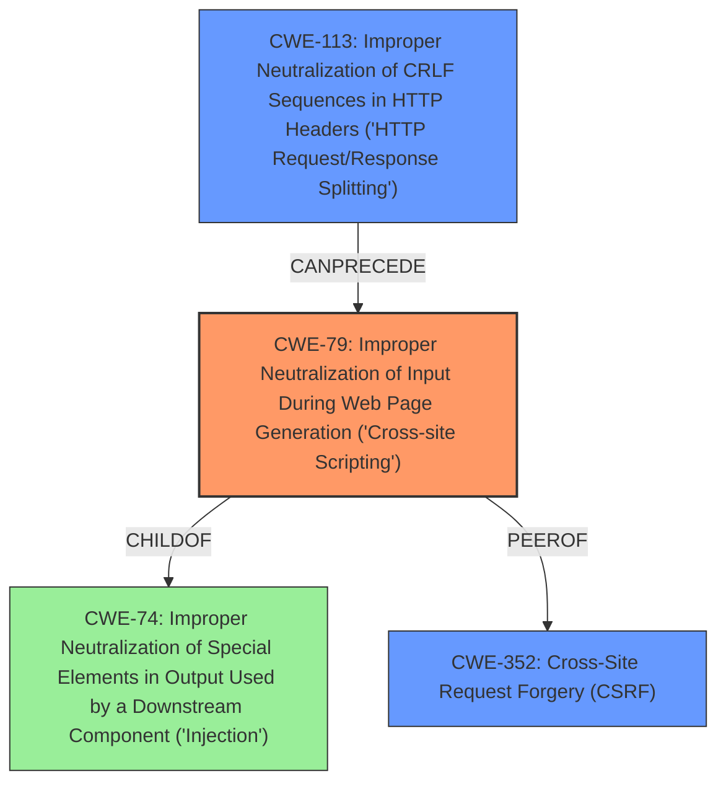

# Analysis for CVE-2021-29676

# Summary
| CWE ID | CWE Name | Confidence | CWE Abstraction Level | CWE Vulnerability Mapping Label | CWE-Vulnerability Mapping Notes |
|---|---|---|---|---|---|
| CWE-79 | Improper Neutralization of Input During Web Page Generation ('Cross-site Scripting') | 0.9 | Base | Allowed | Primary CWE |
| CWE-113 | Improper Neutralization of CRLF Sequences in HTTP Headers ('HTTP Request/Response Splitting') | 0.7 | Variant | Allowed | Secondary Candidate |
| CWE-352 | Cross-Site Request Forgery (CSRF) | 0.6 | Compound | Allowed | Secondary Candidate |

## Evidence and Confidence

*   **Confidence Score:** 0.8
*   **Evidence Strength:** MEDIUM

## Relationship Analysis
The primary CWE is CWE-79, which represents the **improper neutralization** of input leading to cross-site scripting. CWE-79 is a base-level CWE, providing a good balance of specificity and generality. CWE-113 (CRLF Injection) and CWE-352 (CSRF) are considered as potential related weaknesses due to the "link injection" vector. CWE-113 can lead to XSS. The description mentions that the attack could lead to cross-site scripting, cache poisoning or session hijacking, which is addressed by CWE-352.

## Vulnerability Chain
The vulnerability chain starts with a **link injection** weakness, where a specially crafted URL is used to inject malicious content. This leads to **improper neutralization** of input and the potential for Cross-Site Scripting (XSS), Cache Poisoning, or Session Hijacking. The chain includes:

1.  **Link Injection** (Initial Flaw)
2.  **Improper Neutralization of Input** (CWE-79)
3.  **Cross-Site Scripting, Cache Poisoning, Session Hijacking** (Impact)

## Summary of Analysis
The initial assessment identified CWE-79 as the primary weakness due to the description of **link injection** leading to Cross-Site Scripting. The evidence from the "Vulnerability Description" section supports this, stating that a specially-crafted URL link could be exploited to conduct cross-site scripting attacks. The description states "IBM Security Verify (IBM Security Verify Privilege Vault 10.9.66) is vulnerable to **link injection**. By persuading a victim to click on a specially-crafted URL link, a remote attacker could exploit this vulnerability to conduct various attacks against the vulnerable system, including cross-site scripting, cache poisoning or session hijacking".

CWE-113 is considered because **link injection** can potentially lead to CRLF injection, especially if the injected link manipulates HTTP headers.

CWE-352 is considered because the vulnerability description mentions session hijacking as a potential impact, and CSRF can be a mechanism for achieving session hijacking.

The chosen CWEs are at the optimal level of specificity, with CWE-79 at the Base level and CWE-113 at the Variant level. This provides a detailed yet accurate representation of the vulnerability.

Relevant CWE Information:

# Enhanced Context (25 CWEs)

## CWE-1021: Improper Restriction of Rendered UI Layers or Frames
**Abstraction Level**: Base
**Similarity Score**: 0.75
**Source**: dense

**Description**:
The web application does not restrict or incorrectly restricts frame objects or UI layers that belong to another application or domain, which can lead to user confusion about which interface the user is interacting with.

**Mapping Guidance**:
- Usage: Allowed
- Rationale: This CWE entry is at the Base level of abstraction, which is a preferred level of abstraction for mapping to the root causes of vulnerabilities.

*Not Used*: While clickjacking is a type of attack that involves tricking users, this isn't the primary mechanism described in the vulnerability description.

## CWE-451: User Interface (UI) Misrepresentation of Critical Information
**Abstraction Level**: Class
**Similarity Score**: 0.73
**Source**: dense

**Description**:
The user interface (UI) does not properly represent critical information to the user, allowing the information - or its source - to be obscured or spoofed. This is often a component in phishing attacks.

**Mapping Guidance**:
- Usage: Allowed-with-Review
- Rationale: This CWE entry is a Class and might have Base-level children that would be more appropriate

*Not Used*: While UI misrepresentation could be a factor, the primary weakness is the injection of malicious content via the link.

## CWE-1289: Improper Validation of Unsafe Equivalence in Input
**Abstraction Level**: Base
**Similarity Score**: 0.73
**Source**: dense

**Description**:
The product receives an input value that is used as a resource identifier or other type of reference, but it does not validate or incorrectly validates that the input is equivalent to a potentially-unsafe value.

**Mapping Guidance**:
- Usage: Allowed
- Rationale: This CWE entry is at the Base level of abstraction, which is a preferred level of abstraction for mapping to the root causes of vulnerabilities.

*Not Used*: While validation is likely missing, the focus is on **link injection** and the resulting XSS.

## CWE-807: Reliance on Untrusted Inputs in a Security Decision
**Abstraction Level**: Base
**Similarity Score**: 0.72
**Source**: dense

**Description**:
The product uses a protection mechanism that relies on the existence or values of an input, but the input can be modified by an untrusted actor in a way that bypasses the protection mechanism.

**Mapping Guidance**:
- Usage: Allowed
- Rationale: This CWE entry is at the Base level of abstraction, which is a preferred level of abstraction for mapping to the root causes of vulnerabilities.

*Not Used*: This is not the primary weakness.

## CWE-653: Improper Isolation or Compartmentalization
**Abstraction Level**: Class
**Similarity Score**: 0.72
**Source**: dense

**Description**:
The product does not properly compartmentalize or isolate functionality, processes, or resources that require different privilege levels, rights, or permissions.

**Mapping Guidance**:
- Usage: Allowed
- Rationale: This CWE entry is at the Base level of abstraction, which is a preferred level of abstraction for mapping to the root causes of vulnerabilities.

*Not Used*: Not relevant to the described vulnerability.

## CWE-184: Incomplete List of Disallowed Inputs
**Abstraction Level**: Base
**Similarity Score**: 0.72
**Source**: dense

**Description**:
The product implements a protection mechanism that relies on a list of inputs (or properties of inputs) that are not allowed by policy or otherwise require other action to neutralize before additional processing takes place, but the list is incomplete.

**Mapping Guidance**:
- Usage: Allowed
- Rationale: This CWE entry is at the Base level of abstraction, which is a preferred level of abstraction for mapping to the root causes of vulnerabilities.

*Not Used*: The vulnerability description doesn't indicate an incomplete list of disallowed inputs.

## CWE-80: Improper Neutralization of Script-Related HTML Tags in a Web Page (Basic XSS)
**Abstraction Level**: Variant
**Similarity Score**: 0.72
**Source**: dense

**Description**:
The product receives input from an upstream component, but it does not neutralize or incorrectly neutralizes special characters such as "<", ">", and "&" that could be interpreted as web-scripting elements when they are sent to a downstream component that processes web pages.

**Mapping Guidance**:
- Usage: Allowed
- Rationale: This CWE entry is at the Variant level of abstraction, which is a preferred level of abstraction for mapping to the root causes of vulnerabilities.

*Not Used*: While related to CWE-79, the description doesn't specify that the XSS is specifically related to HTML tags.

## CWE-113: Improper Neutralization of CRLF Sequences in HTTP Headers ('HTTP Request/Response Splitting')
**Abstraction Level**: Variant
**Similarity Score**: 0.72
**Source**: dense

**Description**:
The product receives data from an HTTP agent/component (e.g., web server, proxy, browser, etc.), but