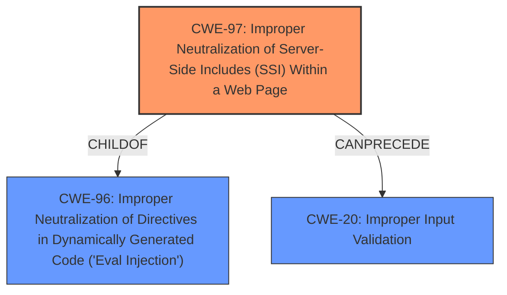

# Raw Analyzer Response for CVE-2021-29679

# Summary
| CWE ID | CWE Name | Confidence | CWE Abstraction Level | CWE Vulnerability Mapping Label | CWE-Vulnerability Mapping Notes |
|---|---|---|---|---|---|
| CWE-97 | Improper Neutralization of Server-Side Includes (SSI) Within a Web Page | 0.9 | Variant | Allowed | Primary CWE: Best match for the **incorrectly neutralizaing user-contrlled input** that leads to server-side include execution. |
| CWE-20 | Improper Input Validation | 0.6 | Class | Discouraged | Secondary Candidate: A broader category that applies since input is not properly validated, leading to the SSI injection. However, CWE-97 is more specific. |

## Evidence and Confidence

*   **Confidence Score:** 0.9
*   **Evidence Strength:** HIGH

## Relationship Analysis
The primary relationship that influenced the selection was the ChildOf relationship between CWE-97 and CWE-96. CWE-97 is a Variant of CWE-96 (Improper Neutralization of Server-Side Includes (SSI)), making it a more specific and appropriate choice than its parent. CWE-20 was considered but deemed too general.

## Vulnerability Chain
The vulnerability chain starts with the **incorrect neutralization of user-controlled input**. This leads to the interpretation of the input as a server-side include (SSI) directive, which allows for remote code execution.

## Summary of Analysis
The initial analysis focused on identifying the root cause of the vulnerability. The description clearly states that the issue is due to **incorrectly neutralizaing user-controlled input** that could be interpreted as a server-side include (SSI) directive. This strongly suggests CWE-97 as the primary weakness. The "CVE Reference Links Content Summary" confirms the root cause is related to weaknesses within the Cognos Analytics software related to input handling.

CWE-97 (Improper Neutralization of Server-Side Includes (SSI) Within a Web Page) directly addresses the specific vulnerability described. The description of CWE-97 aligns perfectly with the vulnerability, stating: "The product generates a web page, but does not neutralize or incorrectly neutralizes user-controllable input that could be interpreted as a server-side include (SSI) directive."

CWE-20 (Improper Input Validation) was considered but ultimately deemed too broad. While the vulnerability does involve improper input handling, CWE-97 provides a more precise classification that reflects the specific nature of the SSI injection.

The selection of CWE-97 is based on the direct match between the vulnerability description and the CWE's characteristics, as well as the MITRE mapping guidance that recommends using the most specific variant available.

Relevant CWE Information:

# Enhanced Context (25 CWEs)

## CWE-807: Reliance on Untrusted Inputs in a Security Decision
**Abstraction Level**: Base
**Similarity Score**: 0.78
**Source**: dense

**Description**:
The product uses a protection mechanism that relies on the existence or values of an input, but the input can be modified by an untrusted actor in a way that bypasses the protection mechanism.
**Reason Not Used:** This CWE describes a vulnerability where a protection mechanism relies on untrusted input. While the described vulnerability involves untrusted input, it doesn't focus on a protection mechanism being bypassed, but rather on the **incorrect neutralization** of that input.

## CWE-1289: Improper Validation of Unsafe Equivalence in Input
**Abstraction Level**: Base
**Similarity Score**: 0.78
**Source**: dense

**Description**:
The product receives an input value that is used as a resource identifier or other type of reference, but it does not validate or incorrectly validates that the input is equivalent to a potentially-unsafe value.
**Reason Not Used:** This CWE focuses on the validation of equivalence to unsafe values. The vulnerability at hand is more directly related to the **incorrect neutralization** of SSI directives within the input, rather than validating its equivalence to something unsafe.

## CWE-1240: Use of a Cryptographic Primitive with a Risky Implementation
**Abstraction Level**: Base
**Similarity Score**: 0.78
**Source**: dense

**Description**:
To fulfill the need for a cryptographic primitive, the product implements a cryptographic algorithm using a non-standard, unproven, or disallowed/non-compliant cryptographic implementation.
**Reason Not Used:** This CWE involves cryptographic algorithms, which are not relevant to this vulnerability.

## CWE-328: Use of Weak Hash
**Abstraction Level**: Base
**Similarity Score**: 0.77
**Source**: dense

**Description**:
The product uses an algorithm that produces a digest (output value) that does not meet security expectations for a hash function that allows an adversary to reasonably determine the original input (preimage attack), find another input that can produce the same hash (2nd preimage attack), or find multiple inputs that evaluate to the same hash (birthday attack).
**Reason Not Used:** This CWE focuses on weak hashing algorithms, which are not relevant to this vulnerability.

## CWE-345: Insufficient Verification of Data Authenticity
**Abstraction Level**: Class
**Similarity Score**: 0.77
**Source**: dense

**Description**:
The product does not sufficiently verify the origin or authenticity of data, in a way that causes it to accept invalid data.
**Reason Not Used:** While data authenticity might be a concern in a broader context, the specific vulnerability is directly related to the **incorrect neutralization** of user-controlled input as SSI directives, not the verification of data origin.

## CWE-1391: Use of Weak Credentials
**Abstraction Level**: Class
**Similarity Score**: 0.77
**Source**: dense

**Description**:
The product uses weak credentials (such as a default key or hard-coded password) that can be calculated, derived, reused, or guessed by an attacker.
**Reason Not Used:** This vulnerability is not related to the use of weak credentials.

## CWE-74: Improper Neutralization of Special Elements in Output Used by a Downstream Component ('Injection')
**Abstraction Level**: Class
**Similarity Score**: 0.77
**Source**: dense

**Description**:
The product constructs all or part of a command, data structure, or record using externally-influenced input from an upstream component, but it does not neutralize or incorrectly neutralizes special elements that could modify how it is parsed or interpreted when it is sent to a downstream component.
**Reason Not Used:** While this CWE is related to injection vulnerabilities, it is a more general case. CWE-97 is a more specific variant that deals directly with SSI injection.

## CWE-330: Use of Insufficiently Random Values
**Abstraction Level**: Class
**Similarity Score**: 0.77
**Source**: dense

**Description**:
The product uses insufficiently random numbers or values in a security context that depends on unpredictable numbers.
**Reason Not Used:** Random number generation is not relevant to this vulnerability.

## CWE-319: Cleartext Transmission of Sensitive Information
**Abstraction Level**: Base
**Similarity Score**: 0.77
**Source**: dense

**Description**:
The product transmits sensitive or security-critical data in cleartext in a communication channel that can be sniffed by unauthorized actors.
**Reason Not Used:** This vulnerability is not related to cleartext transmission of sensitive information.

## CWE-303: Incorrect Implementation of Authentication Algorithm
**Abstraction Level**: Base
**Similarity Score**: 0.77
**Source**: dense

**Description**:
The requirements for the product dictate the use of an established authentication algorithm, but the implementation of the algorithm is incorrect.
**Reason Not Used:** The vulnerability is not related to authentication algorithms.

## CWE-1236: Improper Neutralization of Formula Elements in a CSV File
**Abstraction Level**: Base
**Similarity Score**: 5741.52
**Source**: sparse

**Description**:
The product saves user-provided information into a Comma-Separated Value (CSV) file, but it does not neutralize or incorrectly neutralizes special elements that could be interpreted as a command when the file is opened by a spreadsheet product.
**Reason Not Used:** This CWE is specific to CSV files and formula injection, which is not the case in this vulnerability.

## CWE-116: Improper Encoding or Escaping of Output
**Abstraction Level**: Class
**Similarity Score**: 5676.08
**Source**: sparse

**Description**:
The product prepares a structured message for communication with another component, but encoding or escaping of the data is either missing or done incorrectly. As a result, the intended structure of the message is not preserved.
**Reason Not Used:** While encoding or escaping might be