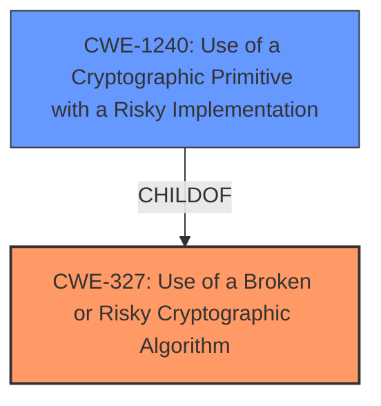

# Raw Analyzer Response for CVE-2021-29694

# Summary
| CWE ID | CWE Name | Confidence | CWE Abstraction Level | CWE Vulnerability Mapping Label | CWE-Vulnerability Mapping Notes |
|---|---|---|---|---|---|
| CWE-327 | Use of a Broken or Risky Cryptographic Algorithm | 1.0 | Class | Primary | Allowed-with-Review |
| CWE-1240 | Use of a Cryptographic Primitive with a Risky Implementation | 0.9 | Base | Secondary | Allowed |

## Evidence and Confidence

*   **Confidence Score:** 0.95
*   **Evidence Strength:** HIGH

## Relationship Analysis
The primary CWE is CWE-327, which is a Class-level CWE. CWE-1240 is a child of CWE-327, representing a more specific case of using risky cryptographic implementations. The vulnerability clearly states the use of **weaker than expected cryptographic algorithms**, suggesting a problem at the cryptographic algorithm level (CWE-327). However, since the root cause identified in the CVE Reference Links Content Summary is the use of weak algorithms like 3DES, CWE-1240 provides a more specific description of the risky cryptographic implementation. Therefore, I selected CWE-327 as the primary and CWE-1240 as a secondary CWE.

## Vulnerability Chain
The vulnerability chain begins with the use of **weaker than expected cryptographic algorithms** (CWE-327 & CWE-1240). The consequence is the potential ability for an attacker to decrypt highly sensitive information.

## Summary of Analysis
Initially, the primary focus was on the use of **weaker than expected cryptographic algorithms**, leading to the consideration of CWE-327 (Use of a Broken or Risky Cryptographic Algorithm). The "CVE Reference Links Content Summary" section indicated the use of weak cryptographic algorithms such as 3DES.

The relationship graph showed that CWE-1240 (Use of a Cryptographic Primitive with a Risky Implementation) is a child of CWE-327. This relationship helped refine the assessment to include CWE-1240 as a secondary CWE, providing a more specific description of the risky cryptographic implementation.

The final decision was based on the provided evidence, especially the "CVE Reference Links Content Summary" section. The selection of CWE-327 and CWE-1240 provides the optimal level of specificity, as it identifies both the general class of the vulnerability (risky cryptographic algorithms) and the more specific implementation issue (using weak algorithms like 3DES).

Relevant CWE Information:

# Enhanced Context (25 CWEs)
The following CWEs were identified as potentially relevant to this vulnerability:

## CWE-1240: Use of a Cryptographic Primitive with a Risky Implementation
**Abstraction Level**: Base
**Similarity Score**: 0.77
**Source**: dense

**Description**:
To fulfill the need for a cryptographic primitive, the product implements a cryptographic algorithm using a non-standard, unproven, or disallowed/non-compliant cryptographic implementation.

**Mapping Guidance**:
- Usage: Allowed
- Rationale: This CWE entry is at the Base level of abstraction, which is a preferred level of abstraction for mapping to the root causes of vulnerabilities.

## CWE-327: Use of a Broken or Risky Cryptographic Algorithm
**Abstraction:** Class
**Similarity Score**: 6471.77
**Source**: sparse

**Description**:
The product uses a broken or risky cryptographic algorithm or protocol.

**Mapping Guidance**:
- Usage: Allowed-with-Review
- Rationale: This CWE entry is a Class and might have Base-level children that would be more appropriate

### CWE-327: Use of a Broken or Risky Cryptographic Algorithm
**Technical Explanation:**
The vulnerability description explicitly states that the software uses **weaker than expected cryptographic algorithms**. This aligns directly with the description of CWE-327, which covers the use of broken or risky cryptographic algorithms.
**Security Implications:**
The use of weak cryptographic algorithms can allow attackers to decrypt sensitive information, leading to potential data breaches and unauthorized access.
**Relationship Explanation:**
CWE-327 is a Class-level CWE, and it has child CWEs that provide more specific details about the type of cryptographic weakness. CWE-1240 (Use of a Cryptographic Primitive with a Risky Implementation) is a child of CWE-327 and is considered as a related weakness.
**Mapping Guidance Influence:**
The MITRE mapping guidance for CWE-327 suggests examining child entries for a better fit. Since the description specifically mentions the use of weak algorithms, CWE-1240 provides a more granular description of this issue.

### CWE-1240: Use of a Cryptographic Primitive with a Risky Implementation
**Technical Explanation:**
The "CVE Reference Links Content Summary" section identifies the use of weak cryptographic algorithms such as 3DES. CWE-1240 describes the use of non-standard, unproven, or disallowed/non-compliant cryptographic implementations, which aligns with the use of 3DES, an outdated and weaker algorithm.
**Security Implications:**
The use of a risky cryptographic implementation like 3DES makes the system vulnerable to cryptanalysis attacks, potentially exposing sensitive information.
**Relationship Explanation:**
CWE-1240 is a Base-level CWE and a child of CWE-327. It provides a more specific description of the issue, focusing on the implementation of cryptographic primitives.
**Mapping Guidance Influence:**
The MITRE mapping guidance for CWE-1240 allows its use as a Base-level CWE when it appropriately fits the vulnerability description, which it does in this case due to the use of specific weak algorithms.

### Considered but Not Used:
CWE-326 (Inadequate Encryption Strength): Considered but not used because the root cause is the algorithm itself (CWE-327 and CWE-1240), not just the key length or overall encryption strength.
CWE-311 (Missing Encryption of Sensitive Data): Considered but not used because the vulnerability involves the use of encryption, but with weak algorithms, rather than a complete lack of encryption.
CWE-338 (Use of Cryptographically Weak Pseudo-Random Number Generator (PRNG)): This CWE relates to the use of weak PRNGs. There is no mention of PRNGs in this vulnerability description.
CWE-916 (Use of Password Hash With Insufficient Computational Effort): This CWE relates to password hashing. There is no mention of password hashing in this vulnerability description.
CWE-307 (Improper Restriction of Excessive Authentication Attempts): This CWE relates to authentication attempts. There is no mention of authentication in this vulnerability description.