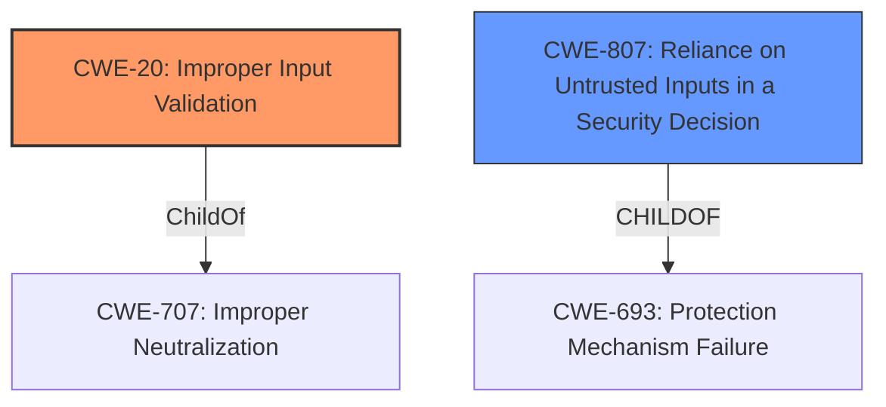

# Enhanced Analysis for CVE-2021-29770

# Summary
| CWE ID | CWE Name | Confidence | CWE Abstraction Level | CWE Vulnerability Mapping Label | CWE-Vulnerability Mapping Notes |
|---|---|---|---|---|---|
| CWE-20 (Primary) | Improper Input Validation | 0.8 | Class | Discouraged | Consider lower-level children or more specific properties of input. |
| CWE-807 (Secondary) | Reliance on Untrusted Inputs in a Security Decision | 0.6 | Base | Allowed | The product uses a protection mechanism that relies on the existence or values of an input, but the input can be modified by an untrusted actor in a way that bypasses the protection mechanism. |

## Evidence and Confidence

*   **Confidence Score:** 0.7
*   **Evidence Strength:** MEDIUM

## Relationship Analysis
The primary relationship considered was the parent-child relationship between CWE-20 **Improper Input Validation** and its potential children. While the description mentions "hazardous input validation," it lacks specifics on the type of input or the exact validation failure. Therefore, while a more specific child CWE might be ideal, the evidence only strongly supports the general **Improper Input Validation** (CWE-20). CWE-807 was also considered because the vulnerability arises from an authenticated user being able to perform unauthorized actions. This suggests that security decisions might be based on untrusted inputs.



## Vulnerability Chain
The chain of events starts with **hazardous input validation** (CWE-20), which leads to the ability for an authenticated user to perform unauthorized actions. The specifics of the unauthorized actions are not detailed.

## Summary of Analysis
The initial assessment identified **hazardous input validation** as the root cause. The Retriever Results and Complete CWE Specifications were used to determine the most appropriate CWE.

The final decision to assign CWE-20 is based on the following:

*   The vulnerability description explicitly mentions "**hazardous input validation**" as the root cause.
*   CWE-20 directly addresses "**Improper Input Validation**," which aligns with the vulnerability description.
*   The CVE Reference Links Content Summary corroborates this by stating the root cause is malicious hyperlinks in data fields, an input validation issue.
*   CWE-20 is a Class-level CWE, but the lack of more specific information prevents assigning a more detailed Base or Variant CWE.
*   The MITRE mapping guidance discourages the use of CWE-20 due to its generality, suggesting the consideration of lower-level children. However, the available evidence does not strongly support a more specific CWE.
*   CWE-807 is a possible secondary CWE due to the fact an authenticated user is able to perform unauthorized actions suggesting the application relies on untrusted inputs.
*   The assessment is primarily based on the provided evidence, specifically the "**hazardous input validation**" phrase in the vulnerability description and the root cause information from the CVE Reference Links Content Summary.

The selected CWE is at the optimal level of specificity given the available information. While a more specific CWE would be preferred, the lack of details regarding the type of input and the specific validation failure prevents a more precise classification.

Relevant CWE Information:

# Enhanced Context (25 CWEs)
The following CWEs were identified as potentially relevant to this vulnerability:

## CWE-807: Reliance on Untrusted Inputs in a Security Decision
**Abstraction Level**: Base
**Similarity Score**: 0.77
**Source**: dense

**Description**:
The product uses a protection mechanism that relies on the existence or values of an input, but the input can be modified by an untrusted actor in a way that bypasses the protection mechanism.

**Mapping Guidance**:
- Usage: Allowed
- Rationale: This CWE entry is at the Base level of abstraction, which is a preferred level of abstraction for mapping to the root causes of vulnerabilities.


## CWE Relationship Analysis

Current CWEs represent these abstraction levels: .


### Vulnerability Chain Analysis

**Chain starting from CWE-707:**
- 707 (Improper Neutralization) - ROOT


**Chain starting from CWE-807:**
- 807 (Reliance on Untrusted Inputs in a Security Decision) - ROOT


### CWE Relationship Diagram

```mermaid
graph TD
    classDef primary fill:#f96,stroke:#333,stroke-width:2px
    classDef secondary fill:#69f,stroke:#333
    classDef tertiary fill:#9e9,stroke:#333
```