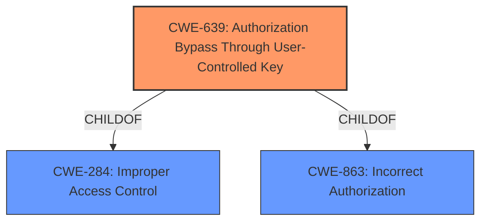

# Analysis Report for CVE-2021-29773

# Vulnerability Analysis Report: CVE-2021-29773

## Description


## Analysis (with Relationship Data)

# Summary
| CWE ID | CWE Name | Confidence | CWE Abstraction Level | CWE Vulnerability Mapping Label | CWE-Vulnerability Mapping Notes |
|---|---|---|---|---|---|
| CWE-639 | Authorization Bypass Through User-Controlled Key | 0.9 | Base | Allowed | Primary CWE. The vulnerability involves an **insecure direct object vulnerability** (IDOR), where an attacker can modify a key value to access another user's data. This aligns with CWE-639, which describes authorization bypass through user-controlled keys. |
| CWE-284 | Improper Access Control | 0.6 | Class | Allowed | Secondary CWE. CWE-284 is a parent of CWE-639, representing a broader class of access control issues. It applies because the **insecure direct object vulnerability** allows unauthorized access to resources. |

## Evidence and Confidence

*   **Confidence Score:** 0.9
*   **Evidence Strength:** MEDIUM

## Relationship Analysis
The primary CWE is CWE-639, which is a Base level CWE. It is a child of CWE-284 (Improper Access Control) and CWE-863 (Incorrect Authorization). This hierarchical relationship indicates that CWE-639 is a specific type of access control issue.



## Vulnerability Chain
The chain of events is as follows:

1.  **Root Cause:** **Insecure direct object vulnerability** (IDOR), specifically the system's authorization **fails to prevent** one user from accessing another user's data by modifying a key value.
2.  **Weakness:** Authorization Bypass.
3.  **Impact:** Obtain sensitive information or modify user details.

## Summary of Analysis
The primary selection of CWE-639 is based on the description of the vulnerability as an **insecure direct object vulnerability** (IDOR). The description explicitly states that a remote authenticated attacker can obtain sensitive information or modify user details. This is a direct match for CWE-639, where the authorization functionality **fails to prevent** one user from gaining access to another user's data by modifying the key value identifying the data. CWE-284 is included as a secondary CWE because it represents the broader category of access control issues, and CWE-639 is a specific instance of this.

The provided evidence supports this classification. The vulnerability description key phrases highlight the **insecure direct object vulnerability** as the root cause. The CVE reference links content summary indicates that IBM Security Guardium is affected by this vulnerability.

CWE-425 (Direct Request ('Forced Browsing')) was considered but not selected as the primary CWE. Although related to authorization issues, CWE-425 focuses on inadequate enforcement of authorization on URLs, scripts, or files, whereas the described vulnerability specifically involves modifying a key value to access another user's data. CWE-639 aligns more closely with the specific mechanism of the vulnerability. Other CWEs like CWE-319 (Cleartext Transmission of Sensitive Information) and CWE-209 (Generation of Error Message Containing Sensitive Information) were also considered but deemed less relevant as they focus on different aspects of security vulnerabilities.

The selected CWEs are at the optimal level of specificity. CWE-639 is a Base level CWE, which provides a detailed description of the **insecure direct object vulnerability**. While CWE-284 is a Class level CWE, it serves as a broader categorization of the access control issue.
The confidence in this assessment is high (0.9) due to the direct match between the vulnerability description and CWE-639.

Relevant CWE Information:

# Enhanced Context (25 CWEs)

## CWE-312: Cleartext Storage of Sensitive Information
**Abstraction Level**: Base
**Similarity Score**: 0.78
**Source**: dense

**Description**:
The product stores sensitive information in cleartext within a resource that might be accessible to another control sphere.

**Mapping Guidance**:
- Usage: Allowed
- Rationale: This CWE entry is at the Base level of abstraction, which is a preferred level of abstraction for mapping to the root causes of vulnerabilities.

## CWE-311: Missing Encryption of Sensitive Data
**Abstraction Level**: Class
**Similarity Score**: 0.77
**Source**: dense

**Description**:
The product does not encrypt sensitive or critical information before storage or transmission.

**Mapping Guidance**:
- Usage: Discouraged
- Rationale: CWE-311 is high-level with more precise children available. It is a level-1 Class (i.e., a child of a Pillar).

## CWE-1391: Use of Weak Credentials
**Abstraction Level**: Class
**Similarity Score**: 0.77
**Source**: dense

**Description**:
The product uses weak credentials (such as a default key or hard-coded password) that can be calculated, derived, reused, or guessed by an attacker.

**Mapping Guidance**:
- Usage: Allowed-with-Review
- Rationale: This CWE entry is a Class and might have Base-level children that would be more appropriate

## CWE-319: Cleartext Transmission of Sensitive Information
**Abstraction Level**: Base
**Similarity Score**: 0.77
**Source**: dense

**Description**:
The product transmits sensitive or security-critical data in cleartext in a communication channel that can be sniffed by unauthorized actors.

**Mapping Guidance**:
- Usage: Allowed
- Rationale: This CWE entry is at the Base level of abstraction, which is a preferred level of abstraction for mapping to the root causes of vulnerabilities.

## CWE-345: Insufficient Verification of Data Authenticity
**Abstraction Level**: Class
**Similarity Score**: 0.76
**Source**: dense

**Description**:
The product does not sufficiently verify the origin or authenticity of data, in a way that causes it to accept invalid data.

**Mapping Guidance**:
- Usage: Discouraged
- Rationale: This CWE entry is a level-1 Class (i.e., a child of a Pillar). It might have lower-level children that would be more appropriate

## CWE-203: Observable Discrepancy
**Abstraction Level**: Base
**Similarity Score**: 0.75
**Source**: dense

**Description**:
The product behaves differently or sends different responses under different circumstances in a way that is observable to an unauthorized actor, which exposes security-relevant information about the state of the product, such as whether a particular operation was successful or not.

**Mapping Guidance**:
- Usage: Allowed
- Rationale: This CWE entry is at the Base level of abstraction, which is a preferred level of abstraction for mapping to the root causes of vulnerabilities.

## CWE-538: Insertion of Sensitive Information into Externally-Accessible File or Directory
**Abstraction Level**: Base
**Similarity Score**: 0.75
**Source**: dense

**Description**:
The product places sensitive information into files or directories that are accessible to actors who are allowed to have access to the files, but not to the sensitive information.

**Mapping Guidance**:
- Usage: Allowed
- Rationale: This CWE entry is at the Base level of abstraction, which is a preferred level of abstraction for mapping to the root causes of vulnerabilities.

## CWE-807: Reliance on Untrusted Inputs in a Security Decision
**Abstraction Level**: Base
**Similarity Score**: 0.75
**Source**: dense

**Description**:
The product uses a protection mechanism that relies on the existence or values of an input, but the input can be modified by an untrusted actor in a way that bypasses the protection mechanism.

**Mapping Guidance**:
- Usage: Allowed
- Rationale: This CWE entry is at the Base level of abstraction, which is a preferred level of abstraction for mapping to the root causes of vulnerabilities.

## CWE-657: Violation of Secure Design Principles
**Abstraction Level**: Class
**Similarity Score**: 0.75
**Source**: dense

**Description**:
The product violates well-established principles for secure design.

**Mapping Guidance**:
- Usage: Discouraged
- Rationale: This CWE entry is a level-1 Class (i.e., a child of a Pillar). It might have lower-level children that would be more appropriate

## CWE-656: Reliance on Security Through Obscurity
**Abstraction Level**: Class
**Similarity Score**: 0.75
**Source**: dense

**Description**:
The product uses a protection mechanism whose strength depends heavily on its obscurity, such that knowledge of its algorithms or key data is sufficient to defeat the mechanism.

**Mapping Guidance**:
- Usage: Allowed-with-Review
- Rationale: This CWE entry is a Class and might have Base-


## CWE Relationship Analysis

Current CWEs represent these abstraction levels: .


### Vulnerability Chain Analysis

**Chain starting from CWE-657:**
- 657 (Violation of Secure Design Principles) - ROOT


**Chain starting from CWE-284:**
- 284 (Improper Access Control) - ROOT


### CWE Relationship Diagram

```mermaid
graph TD
    classDef primary fill:#f96,stroke:#333,stroke-width:2px
    classDef secondary fill:#69f,stroke:#333
    classDef tertiary fill:#9e9,stroke:#333
```


*Report generated on 2025-04-02 07:02:50*
