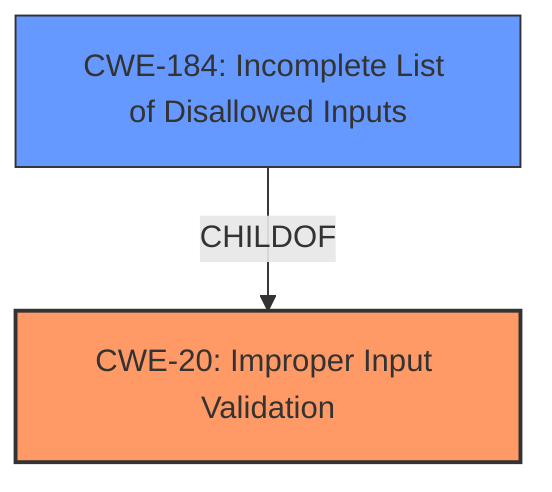

# Enhanced Analysis for CVE-2021-29780

# Summary
| CWE ID | CWE Name | Confidence | CWE Abstraction Level | CWE Vulnerability Mapping Label | CWE-Vulnerability Mapping Notes |
|---|---|---|---|---|---|
| CWE-20 | Improper Input Validation | 0.9 | Class | Primary | Discouraged |
| CWE-184 | Incomplete List of Disallowed Inputs | 0.7 | Base | Secondary | Allowed |

## Evidence and Confidence

*   **Confidence Score:** 0.9
*   **Evidence Strength:** HIGH

## Relationship Analysis
The primary CWE selected is CWE-20 **Improper Input Validation**, which is a Class-level CWE. While it is discouraged to map to Class-level CWEs when more specific Base-level CWEs exist, the vulnerability description and summary of the CVE reference links directly point to this **improper input validation**. The secondary CWE is CWE-184 **Incomplete List of Disallowed Inputs**.



## Vulnerability Chain
The vulnerability chain starts with a privileged user attempting to import non-approved Python2 modules. The **improper input validation** (CWE-20) allows the unrestricted import of these modules (CWE-184), leading to the potential creation of malicious scripts and unauthorized actions.

## Summary of Analysis
The initial assessment focused on identifying the root cause of the vulnerability based on the provided information. The vulnerability description explicitly mentions **improper input validation**, making CWE-20 a strong candidate.

The evidence supporting CWE-20 is the "**improper input validation**" phrase in the vulnerability description. Additionally, the CVE Reference Links Content Summary mentions "A privileged user could import non-approved Python2 modules" which implies a lack of proper checks on the input (modules being imported).

CWE-20 is a Class-level CWE, and the mapping guidance discourages its use when more specific CWEs are available. However, in this case, the provided evidence primarily points to a general lack of input validation, and it is difficult to pinpoint a more specific Base-level CWE without additional context.

Several other CWEs were considered but ultimately not selected as primary:

*   CWE-807 (**Reliance on Untrusted Inputs in a Security Decision**): While relevant, this CWE focuses on relying on untrusted inputs for security decisions, which is not the primary issue here. The main problem is the lack of proper validation of the input itself, regardless of whether it's trusted or not.
*   CWE-22 (**Improper Limitation of a Pathname to a Restricted Directory**): This CWE relates to path traversal vulnerabilities, which is not the core issue described.
*   CWE-307 (**Improper Restriction of Excessive Authentication Attempts**), CWE-327 (**Use of a Broken or Risky Cryptographic Algorithm**), CWE-90 (**Improper Neutralization of Special Elements used in an LDAP Query**), CWE-1236 (**Improper Neutralization of Formula Elements in a CSV File**), CWE-522 (**Insufficiently Protected Credentials**), CWE-311 (**Missing Encryption of Sensitive Data**), CWE-287 (**Improper Authentication**): All of these CWEs address specific types of vulnerabilities that do not align with the general **improper input validation** described in the vulnerability.
*   CWE-184 (**Incomplete List of Disallowed Inputs**)
    *   CWE-184 is selected as a secondary CWE because it describes a specific instance of the **improper input validation**, where the list of disallowed modules is incomplete, allowing for the import of non-approved Python2 modules.

The final selection of CWE-20 as the primary CWE and CWE-184 as a secondary CWE is based on the available evidence and the understanding that the **improper input validation** is the overarching weakness, while the **incomplete list of disallowed inputs** represents a specific manifestation of this weakness.

Relevant CWE Information:

# Enhanced Context (25 CWEs)

## CWE-807: Reliance on Untrusted Inputs in a Security Decision
**Abstraction Level**: Base
**Similarity Score**: 0.78
**Source**: dense

**Description**:
The product uses a protection mechanism that relies on the existence or values of an input, but the input can be modified by an untrusted actor in a way that bypasses the protection mechanism.

**Mapping Guidance**:
- Usage: Allowed
- Rationale: This CWE entry is at the Base level of abstraction, which is a preferred level of abstraction for mapping to the root causes of vulnerabilities.

## CWE-1289: Improper Validation of Unsafe Equivalence in Input
**Abstraction Level**: Base
**Similarity Score**: 0.77
**Source**: dense

**Description**:
The product receives an input value that is used as a resource identifier or other type of reference, but it does not validate or incorrectly validates that the input is equivalent to a potentially-unsafe value.

**Mapping Guidance**:
- Usage: Allowed
- Rationale: This CWE entry is at the Base level of abstraction, which is a preferred level of abstraction for mapping to the root causes of vulnerabilities.

## CWE-303: Incorrect Implementation of Authentication Algorithm
**Abstraction Level**: Base
**Similarity Score**: 0.76
**Source**: dense

**Description**:
The requirements for the product dictate the use of an established authentication algorithm, but the implementation of the algorithm is incorrect.

**Mapping Guidance**:
- Usage: Allowed
- Rationale: This CWE entry is at the Base level of abstraction, which is a preferred level of abstraction for mapping to the root causes of vulnerabilities.

## CWE-1391: Use of Weak Credentials
**Abstraction Level**: Class
**Similarity Score**: 0.76
**Source**: dense

**Description**:
The product uses weak credentials (such as a default key or hard-coded password) that can be calculated, derived, reused, or guessed by an attacker.

**Mapping Guidance**:
- Usage: Allowed-with-Review
- Rationale: This CWE entry is a Class and might have Base-level children that would be more appropriate

## CWE-345: Insufficient Verification of Data Authenticity
**Abstraction Level**: Class
**Similarity Score**: 0.75
**Source**: dense

**Description**:
The product does not sufficiently verify the origin or authenticity of data, in a way that causes it to accept invalid data.

**Mapping Guidance**:
- Usage: Discouraged
- Rationale: This CWE entry is a level-1 Class (i.e., a child of a Pillar). It might have lower-level children that would be more appropriate

## CWE-1390: Weak Authentication
**Abstraction Level**: Class
**Similarity Score**: 0.75
**Source**: dense

**Description**:
The product uses an authentication mechanism to restrict access to specific users or identities, but the mechanism does not sufficiently prove that the claimed identity is correct.

**Mapping Guidance**:
- Usage: Allowed-with-Review
- Rationale: This CWE entry is a Class and might have Base-level children that would be more appropriate

## CWE-319: Cleartext Transmission of Sensitive Information
**Abstraction Level**: Base
**Similarity Score**: 0.75
**Source**: dense

**Description**:
The product transmits sensitive or security-critical data in cleartext in a communication channel that can be sniffed by unauthorized actors.

**Mapping Guidance**:
- Usage: Allowed
- Rationale: This CWE entry is at the Base level of abstraction, which is a preferred level of abstraction for mapping to the root causes of vulnerabilities.

## CWE-184: Incomplete List of Disallowed Inputs
**Abstraction Level**: Base
**Similarity Score**: 0.75
**Source**: dense

**Description**:
The product implements a protection mechanism that relies on a list of inputs (or properties of inputs) that are not allowed by policy or otherwise require other action to neutralize before additional processing takes place, but the list is incomplete.

**Mapping Guidance**:
- Usage: Allowed
- Rationale: This CWE entry is at the Base level of abstraction, which is a preferred level of abstraction for mapping to the root causes of vulnerabilities.

## CWE-74: Improper Neutralization of Special Elements in Output Used by a Downstream Component ('Injection')
**Abstraction Level**: Class
**Similarity Score**: 0.74
**Source**: dense

**Description**:
The product constructs all or part of a command, data structure, or record using externally-influenced input from an upstream component, but it does not neutralize or incorrectly neutralizes special elements that could modify how it is parsed or interpreted when it is sent to a downstream component.

**Mapping Guidance**:
- Usage: Discouraged
- Rationale: CWE-74 is high-level and often misused when lower-level weaknesses are more appropriate.

## CWE-639: Authorization Bypass Through User-Controlled Key
**Abstraction Level**: Base
**Similarity Score**: 0.74


## CWE Relationship Analysis

Current CWEs represent these abstraction levels: .


### Vulnerability Chain Analysis

**Chain starting from CWE-311:**
- 311 (Missing Encryption of Sensitive Data) - ROOT


**Chain starting from CWE-90:**
- 90 (Improper Neutralization of Special Elements used in an LDAP Query ('LDAP Injection')) - ROOT


### CWE Relationship Diagram

```mermaid
graph TD
    classDef primary fill:#f96,stroke:#333,stroke-width:2px
    classDef secondary fill:#69f,stroke:#333
    classDef tertiary fill:#9e9,stroke:#333
```