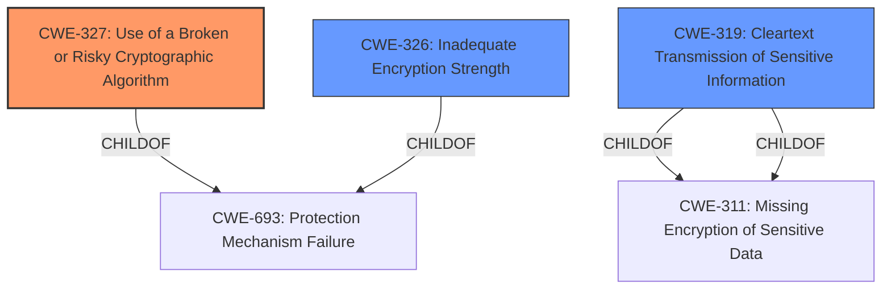

# Raw Analyzer Response for CVE-2021-29794

# Summary
| CWE ID  | CWE Name                                                        | Confidence | CWE Abstraction Level | CWE Vulnerability Mapping Label | CWE-Vulnerability Mapping Notes |
| :-------- | :-------------------------------------------------------------- | :--------- | :-------------------- | :------------------------------ | :------------------------------ |
| CWE-327 | Use of a Broken or Risky Cryptographic Algorithm            | 0.95       | Class                 | Primary                         | Allowed-with-Review             |
| CWE-326 | Inadequate Encryption Strength                                 | 0.80       | Class                 | Secondary                       | Allowed-with-Review             |
| CWE-319 | Cleartext Transmission of Sensitive Information               | 0.60       | Base                  | Secondary                       | Allowed                         |

## Evidence and Confidence

*   **Confidence Score:** 0.85
*   **Evidence Strength:** HIGH

## Relationship Analysis
The primary relationship that impacted the decision was the hierarchical structure, with CWE-327 being a Class that could have more specific Base-level children. However, in this case, CWE-327 accurately captures the **use of weak cryptographic algorithms**, even if the specific algorithm isn't mentioned, making it a relevant classification. CWE-326 is a Peer that addresses a similar weakness: **Inadequate Encryption Strength**, but not quite as specific. CWE-319 addresses **Cleartext Transmission of Sensitive Information**, which is a possible implication of using weak crypto.

## Vulnerability Chain
The vulnerability chain starts with an **insecure SSH server configuration** leading to the **use of weak cryptographic algorithms**, which may result in the ability to decrypt sensitive information.

## Summary of Analysis
The initial assessment identified CWE-327 as the primary candidate due to the **use of weak cryptographic algorithms**, as highlighted in both the vulnerability description and the CVE reference summary: "*The SSH server configuration shipped with IBM Tivoli Netcool/Impact 7.1.0.20 and 7.1.0.21 uses weaker than expected cryptographic algorithms.*"

CWE-327 is a Class-level CWE, and the mapping guidance suggests reviewing its children for a better fit. However, without specific information about the broken or risky algorithm, CWE-327 is the most appropriate choice.

CWE-326 (**Inadequate Encryption Strength**) was also considered because **weak cryptographic algorithms** imply inadequate encryption strength, but is less descriptive of the root cause. CWE-319 (**Cleartext Transmission of Sensitive Information**) was considered because **weak cryptographic algorithms** could lead to sensitive information being transmitted in a way that it can be easily intercepted and decrypted.

Relevant CWE Information:

# Enhanced Context (25 CWEs)

## CWE-327: Use of a Broken or Risky Cryptographic Algorithm
**Abstraction Level**: Class
**Similarity Score**: 5791.67
**Source**: sparse

**Description**:
The product uses a broken or risky cryptographic algorithm or protocol.

**Mapping Guidance**:
- Usage: Allowed-with-Review
- Rationale: This CWE entry is a Class and might have Base-level children that would be more appropriate

## CWE-326: Inadequate Encryption Strength
**Abstraction Level**: Class
**Similarity Score**: 0.78
**Source**: dense

**Description**:
The product stores or transmits sensitive data using an encryption scheme that is theoretically sound, but is not strong enough for the level of protection required.

**Mapping Guidance**:
- Usage: Allowed-with-Review
- Rationale: This CWE entry is a Class and might have Base-level children that would be more appropriate

## CWE-319: Cleartext Transmission of Sensitive Information
**Abstraction Level**: Base
**Similarity Score**: 0.80
**Source**: dense

**Description**:
The product transmits sensitive or security-critical data in cleartext in a communication channel that can be sniffed by unauthorized actors.

**Mapping Guidance**:
- Usage: Allowed
- Rationale: This CWE entry is at the Base level of abstraction, which is a preferred level of abstraction for mapping to the root causes of vulnerabilities.