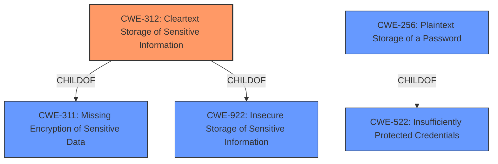

# Enhanced Analysis for CVE-2021-29811

# Summary
| CWE ID | CWE Name | Confidence | CWE Abstraction Level | CWE Vulnerability Mapping Label | CWE-Vulnerability Mapping Notes |
|---|---|---|---|---|---|
| CWE-312 | Cleartext Storage of Sensitive Information | 1.0 | Base | Allowed | Primary CWE |
| CWE-522 | Insufficiently Protected Credentials | 0.7 | Class | Allowed-with-Review | Secondary Candidate |
| CWE-256 | Plaintext Storage of a Password | 0.6 | Base | Allowed | Secondary Candidate |

## Evidence and Confidence

*   **Confidence Score:** 0.9
*   **Evidence Strength:** HIGH

## Relationship Analysis
The primary CWE selected is CWE-312 (**Cleartext Storage of Sensitive Information**), which is a Base level CWE. This is preferred because the vulnerability description explicitly states the credentials are stored in plain clear text.

CWE-312 is a child of CWE-311 (**Missing Encryption of Sensitive Data**) and CWE-922 (**Insecure Storage of Sensitive Information**). While CWE-311 broadly covers the absence of encryption, CWE-312 pinpoints the specific issue of storing sensitive data without encryption.

CWE-522 (**Insufficiently Protected Credentials**) is a Class level CWE and a parent of CWE-256 (**Plaintext Storage of a Password**). While relevant, these are less specific than CWE-312.



## Vulnerability Chain
The vulnerability chain is straightforward:

1.  **Root Cause:** CWE-312 (**Cleartext Storage of Sensitive Information**) - The software stores user credentials in plain clear text.
2.  **Impact:** An authenticated admin user can read the credentials, potentially leading to unauthorized access or privilege escalation.

## Summary of Analysis
The primary assessment is based on the explicit statement in the vulnerability description: "IBM Jazz for Service Management and IBM Tivoli Netcool/OMNIbus_GUI 8.1.0 **stores user credentials in plain clear text** which can be read by an authenticated admin user."

This directly corresponds to the definition of CWE-312 (**Cleartext Storage of Sensitive Information**), which states, "The product stores sensitive information in cleartext within a resource that might be accessible to another control sphere."

The graph relationships confirm that CWE-312 is a more specific and appropriate choice than its parent, CWE-311 (**Missing Encryption of Sensitive Data**). While encryption is missing, the core issue is the storage of data in an unencrypted format.

CWE-522 (**Insufficiently Protected Credentials**) is a more general Class that can apply to various credential protection failures, but CWE-312 more precisely describes the vulnerability. CWE-256 (**Plaintext Storage of a Password**) is very similar, but the description is oriented just for Passwords and does not include the broader credentials weakness described in the vulnerability description.

Therefore, CWE-312 is the most accurate and specific representation of the vulnerability.

Relevant CWE Information:

# Enhanced Context (25 CWEs)

## CWE-312: Cleartext Storage of Sensitive Information
**Abstraction Level**: Base
**Similarity Score**: 0.82
**Source**: dense

**Description**:
The product **stores sensitive information in cleartext** within a resource that might be accessible to another control sphere.

**Mapping Guidance**:
- Usage: Allowed
- Rationale: This CWE entry is at the Base level of abstraction, which is a preferred level of abstraction for mapping to the root causes of vulnerabilities.

**Why this CWE was selected:** This CWE directly matches the vulnerability description indicating credentials are stored in cleartext. The 'Usage: Allowed' mapping guidance supports this choice.

## CWE-522: Insufficiently Protected Credentials
**Abstraction Level**: Class
**Similarity Score**: 0.74
**Source**: dense

**Description**:
The product transmits or stores authentication credentials, but it uses an insecure method that is susceptible to unauthorized interception and/or retrieval.

**Mapping Guidance**:
- Usage: Allowed-with-Review
- Rationale: This CWE entry is a Class and might have Base-level children that would be more appropriate

**Why this CWE was considered:** This CWE is relevant as it broadly covers the insecure storage of credentials. However, CWE-312 provides a more specific classification since the credentials are in 'cleartext'.

## CWE-256: Plaintext Storage of a Password
**Abstraction Level**: Base
**Similarity Score**: 0.321
**Source**: sparse

**Description**:
Storing a password in plaintext may result in a system compromise.

**Mapping Guidance**:
- Usage: Allowed
- Rationale: This CWE entry is at the Base level of abstraction, which is a preferred level of abstraction for mapping to the root causes of vulnerabilities.

**Why this CWE was considered:** Password management issues occur when a password is stored in plaintext in an application's properties, configuration file, or memory. Storing a plaintext password in a configuration file allows anyone who can read the file access to the password-protected resource. In some contexts, even storage of a plaintext password in memory is considered a security risk if the password is not cleared immediately after it is used.

## CWE-319: Cleartext Transmission of Sensitive Information
**Abstraction Level**: Base
**Similarity Score**: 0.77
**Source**: dense

**Description**:
The product transmits sensitive or security-critical data in cleartext in a communication channel that can be sniffed by unauthorized actors.

**Mapping Guidance**:
- Usage: Allowed
- Rationale: This CWE entry is at the Base level of abstraction, which is a preferred level of abstraction for mapping to the root causes of vulnerabilities.

**Why this CWE was NOT selected:** The vulnerability description mentions storage, not transmission.

## CWE-209: Generation of Error Message Containing Sensitive Information
**Abstraction Level**: Base
**Similarity Score**: 0.77
**Source**: sparse

**Description**:
The product generates an error message that includes sensitive information about its environment, users, or associated data.

**Mapping Guidance**:
- Usage: Allowed
- Rationale: This CWE entry is at the Base level of abstraction, which is a preferred level of abstraction for mapping to the root causes of vulnerabilities.

**Why this CWE was NOT selected:** This vulnerability is focused on storage, and there is no mention of error messages.


## CWE Relationship Analysis

Current CWEs represent these abstraction levels: .


### Vulnerability Chain Analysis

**Chain starting from CWE-312:**
- 312 (Cleartext Storage of Sensitive Information) - ROOT


**Chain starting from CWE-311:**
- 311 (Missing Encryption of Sensitive Data) - ROOT


### CWE Relationship Diagram

```mermaid
graph TD
    classDef primary fill:#f96,stroke:#333,stroke-width:2px
    classDef secondary fill:#69f,stroke:#333
    classDef tertiary fill:#9e9,stroke:#333
```