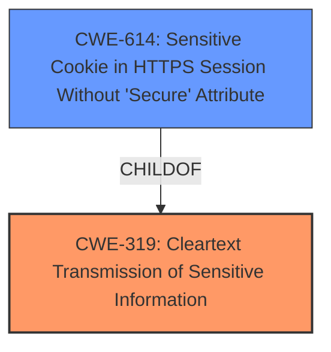

# Raw Analyzer Response for CVE-2021-29838

# Summary
| CWE ID | CWE Name | Confidence | CWE Abstraction Level | CWE Vulnerability Mapping Label | CWE-Vulnerability Mapping Notes |
|---|---|---|---|---|---|
| CWE-319 | Cleartext Transmission of Sensitive Information | 1 | Base | Allowed | Primary CWE |
| CWE-614 | Sensitive Cookie in HTTPS Session Without 'Secure' Attribute | 0.7 | Variant | Allowed | Secondary Candidate |

## Evidence and Confidence

*   **Confidence Score:** 0.9
*   **Evidence Strength:** HIGH

## Relationship Analysis
The primary relationship that influenced the decision was the ChildOf relationship between CWE-614 and CWE-319. While CWE-614 is more specific, the vulnerability description does not provide enough information to definitively state that the issue is related to cookies. Therefore, CWE-319 is selected as the primary CWE. The selection of CWE-319 over other candidates was based on its direct applicability to the **failure to properly enable HTTP Strict Transport Security**, which inherently leads to the possibility of **cleartext transmission of sensitive information**.

## Vulnerability Chain
The vulnerability chain starts with the **failure to properly enable HTTP Strict Transport Security**. This leads directly to the potential for **cleartext transmission of sensitive information**, which can then be exploited by a remote attacker using man-in-the-middle techniques to obtain sensitive information.

## Summary of Analysis
The initial analysis focused on identifying the root cause of the vulnerability, which is the **failure to properly enable HTTP Strict Transport Security**. The description states that this could allow a remote attacker to obtain sensitive information using man in the middle techniques.

The retriever results indicated CWE-319 (Cleartext Transmission of Sensitive Information) as a strong candidate. This aligns well with the vulnerability description, as the **failure to properly enable HTTP Strict Transport Security** directly leads to the risk of sensitive information being transmitted in cleartext. The next highest was CWE-614 (Sensitive Cookie in HTTPS Session Without 'Secure' Attribute).

The graph relationships show that CWE-614 is a child of CWE-319. While CWE-614 is more specific, the description focuses on the general **failure to properly enable HTTP Strict Transport Security**, not specifically cookies. Therefore, CWE-319 is the more appropriate choice.

The decision is based on the provided evidence, specifically the vulnerability description key phrase "**failure to properly enable HTTP Strict Transport Security**" and the impact of potentially transmitting data in cleartext.

CWE-319 is selected as the primary CWE because it directly addresses the root cause and impact described in the vulnerability. It is at the Base level of abstraction, which is preferred, and the mapping guidance allows its usage.

CWE-614 was considered but not used as the primary CWE because the description doesn't explicitly mention cookies, and choosing it would be speculative.
Relevant CWE Information:

# Enhanced Context (25 CWEs)

## CWE-319: Cleartext Transmission of Sensitive Information
**Abstraction Level**: Base
**Similarity Score**: 0.77
**Source**: dense

**Description**:
The product transmits sensitive or security-critical data in cleartext in a communication channel that can be sniffed by unauthorized actors.

**Mapping Guidance**:
- Usage: Allowed
- Rationale: This CWE entry is at the Base level of abstraction, which is a preferred level of abstraction for mapping to the root causes of vulnerabilities.

## CWE-614: Sensitive Cookie in HTTPS Session Without 'Secure' Attribute
**Abstraction Level**: Variant
**Similarity Score**: 4328.64
**Source**: sparse

**Description**:
The Secure attribute for sensitive cookies in HTTPS sessions is not set, which could cause the user agent to send those cookies in plaintext over an HTTP session.

**Mapping Guidance**:
- Usage: Allowed
- Rationale: This CWE entry is at the Variant level of abstraction, which is a preferred level of abstraction for mapping to the root causes of vulnerabilities.