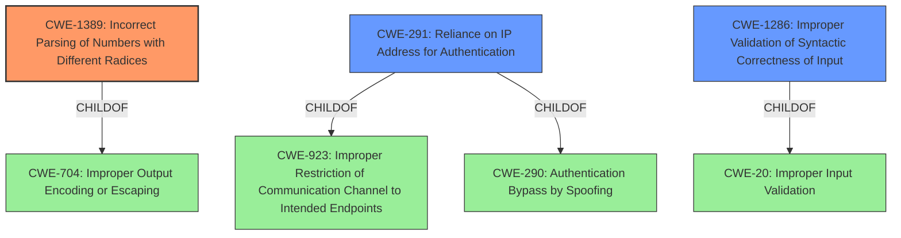

# Analysis for CVE-2021-29921

# Summary
| CWE ID    | CWE Name                                                              | Confidence | CWE Abstraction Level | CWE Vulnerability Mapping Label | CWE-Vulnerability Mapping Notes |
| :-------- | :-------------------------------------------------------------------- | :--------- | :-------------------- | :------------------------------ | :------------------------------ |
| CWE-1389  | Incorrect Parsing of Numbers with Different Radices                 | 0.9        | Base                  | Primary                         | Allowed                       |
| CWE-291   | Reliance on IP Address for Authentication                           | 0.7        | Variant               | Secondary                       | Allowed                       |
| CWE-1286 | Improper Validation of Syntactic Correctness of Input | 0.6 | Base | Secondary | Allowed |

## Evidence and Confidence

*   **Confidence Score:** 0.8
*   **Evidence Strength:** HIGH

## Relationship Analysis
The primary CWE identified is CWE-1389 (**Incorrect Parsing of Numbers with Different Radices**), which is a Base level CWE. It's related to CWE-704 (Improper Output Encoding or Escaping) via a ChildOf relationship. CWE-291 (**Reliance on IP Address for Authentication**) is a Variant of CWE-923 (**Improper Restriction of Communication Channel to Intended Endpoints**) and CWE-290 (**Authentication Bypass by Spoofing**). CWE-1286 (**Improper Validation of Syntactic Correctness of Input**) is a child of CWE-20 (**Improper Input Validation**). Given the specificity of the **mishandling of leading zeros**, CWE-1389 is the most accurate.



## Vulnerability Chain
The vulnerability chain starts with the **improper handling of leading zero characters** (CWE-1389), which leads to potential bypass of access control mechanisms. In some contexts, reliance on IP addresses for authentication (CWE-291) can be directly bypassed due to this mishandling, thus the sequence can be seen as CWE-1389 -> CWE-291. There is also an element of improper input validation that needs to be considered (CWE-1286), in that there is **incorrect validation of the intended decimal-based IP address format.**

## Summary of Analysis
The initial assessment identified that the core issue is the **mishandling of leading zero characters** in IP address strings by the `ipaddress` library, which can lead to bypassing access control. The CVE reference links confirm this and provide more detail, such as the vulnerability allowing for SSRF, RFI and LFI attacks. The primary CWE, CWE-1389, directly addresses this.

The selection is primarily based on the "Vulnerability Description Key Phrases" which highlights the **weakness** is the **mishandling of leading zero characters**. This combined with the CVE reference links providing the root_cause as the `ipaddress` module improperly validates IPv4 octets, specifically, it strips leading zeros instead of evaluating them as valid IP addresses makes CWE-1389 the most specific and appropriate.

CWE-1389 is at the optimal level of specificity because it clearly describes the **root cause** of the vulnerability. It is a base level CWE, which is preferred.

CWE-291 (**Reliance on IP Address for Authentication**) is included as a secondary CWE because the vulnerability ultimately leads to a bypass of access control mechanisms relying on IP addresses.

CWE-1286 (**Improper Validation of Syntactic Correctness of Input**) is also included, as the input validation is not correctly handling the different bases.

Relevant CWE Information:

# Enhanced Context (25 CWEs)
The following CWEs were identified as potentially relevant to this vulnerability:

## CWE-1289: Improper Validation of Unsafe Equivalence in Input
**Abstraction Level**: Base
**Similarity Score**: 0.75
**Source**: dense

**Description**:
The product receives an input value that is used as a resource identifier or other type of reference, but it does not validate or incorrectly validates that the input is equivalent to a potentially-unsafe value.

**Mapping Guidance**:
- Usage: Allowed
- Rationale: This CWE entry is at the Base level of abstraction, which is a preferred level of abstraction for mapping to the root causes of vulnerabilities.

*This CWE was not selected because it focuses on the validation of input against potentially unsafe values, whereas the described vulnerability is about the incorrect parsing of numerical inputs with different radices. The vulnerability is more about a parsing error rather than validating against unsafe values.*

## CWE-330: Use of Insufficiently Random Values
**Abstraction Level**: Class
**Similarity Score**: 0.75
**Source**: dense

**Description**:
The product uses insufficiently random numbers or values in a security context that depends on unpredictable numbers.

**Mapping Guidance**:
- Usage: Discouraged
- Rationale: This CWE entry is a level-1 Class (i.e., a child of a Pillar). It might have lower-level children that would be more appropriate

*This CWE was not selected because the vulnerability is not related to the use of random numbers or values.*

## CWE-754: Improper Check for Unusual or Exceptional Conditions
**Abstraction Level**: Class
**Similarity Score**: 0.74
**Source**: dense

**Description**:
The product does not check or incorrectly checks for unusual or exceptional conditions that are not expected to occur frequently during day to day operation of the product.

**Mapping Guidance**:
- Usage: Allowed-with-Review
- Rationale: This CWE entry is a Class and might have Base-level children that would be more appropriate

*This CWE was not selected because the core issue is not about failing to check for unusual conditions, but about incorrectly parsing numerical inputs.*

## CWE-807: Reliance on Untrusted Inputs in a Security Decision
**Abstraction Level**: Base
**Similarity Score**: 0.74
**Source**: dense

**Description**:
The product uses a protection mechanism that relies on the existence or values of an input, but the input can be modified by an untrusted actor in a way that bypasses the protection mechanism.

**Mapping Guidance**:
- Usage: Allowed
- Rationale: This CWE entry is at the Base level of abstraction, which is a preferred level of abstraction for mapping to the root causes of vulnerabilities.

*This CWE is too general and doesn't capture the specifics of the incorrect parsing of numbers with different radices.*

## CWE-41: Improper Resolution of Path Equivalence
**Abstraction Level**: Base
**Similarity Score**: 0.73
**Source**: dense

**Description**:
The product is vulnerable to file system contents disclosure through path equivalence. Path equivalence involves the use of special characters in file and directory names. The associated manipulations are intended to generate multiple names for the same object.

**Mapping Guidance**:
- Usage: Allowed
- Rationale: This CWE entry is at the Base level of abstraction, which is a preferred level of abstraction for mapping to the root causes of vulnerabilities.

*This CWE is not related to the described vulnerability, which involves numerical parsing and IP address handling, not file system path manipulation.*

## CWE-667: Improper Locking
**Abstraction Level**: Class
**Similarity Score**: 0.73
**Source**: dense

**Description**:
The product does not properly acquire or release a lock on a resource, leading to unexpected resource state changes and behaviors.

**Mapping Guidance**:
- Usage: Allowed-with-Review
- Rationale: This CWE entry is a Class and might have Base-level children that would be more appropriate

*This CWE is not relevant as it pertains to improper locking mechanisms, not numerical parsing errors.*

## CWE-252: Unchecked Return Value
**Abstraction Level**: Base
**Similarity Score**: 0.73
**Source**: dense

**Description**:
The product does not check the return value from

# Enhanced Query for CVE-2021-29921

## Vulnerability Description
In Python before 3,9,5, the ipaddress library mishandles leading zero characters in the octets of an IP address string. This (in some situations) allows attackers to bypass access control that is based on IP addresses.

### Vulnerability Description Key Phrases
- **weakness:** **mishandle leading zero characters**
- **impact:** bypass access control
- **attacker:** attackers
- **product:** Python
- **version:** before 3.9.5
- **component:** ipaddress library

## CVE Reference Links Content Summary
```json
{
  "guidelines": [
    "1. First verify if the content relates to the CVE specified based on the official description",
    "2. If the content does not relate to this CVE, respond with \"UNRELATED\"",
    "3. If no useful vulnerability information is found, respond with \"NOINFO\"",
    "4. For relevant content, extract:",
    "   - Root cause of vulnerability",
    "   - Weaknesses/vulnerabilities present",
    "   - Impact of exploitation",
    "   - Attack vectors",
    "   - Required attacker capabilities/position",
    "Additional instructions:",
    "- Preserve original technical details and descriptions",
    "- Remove unrelated content",
    "- Translate non-English content to English",
    "- Note if the content provides more detail than the official CVE description"
  ],
  "response": {
    "CVE-2021-29921": [
      {
        "content": "Merged\n\n[miss-islington](/miss-islington)\nmerged 1 commit into\n[python:3.10](/python/cpython/tree/3.10 \"python/cpython:3.10\")\nfrom\n[miss-islington:backport-0fd66e4-3.10](/miss-islington/cpython/tree/backport-0fd66e4-3.10 \"miss-islington/cpython:backport-0fd66e4-3.10\")\n\nAug 19, 2021\n\nMerged\n\n# [[3.10] bpo-36384: [doc] Mention CVE-2021-29921 fix in 3.8.12 (GH-27824)](#top) #27826\n\n[miss-islington](/miss-islington)\nmerged 1 commit into\n[python:3.10](/python/cpython/tree/3.10 \"python/cpython:3.10\")\nfrom\n[miss-islington:backport-0fd66e4-3.10](/miss-islington/cpython/tree/backport-0fd66e4-3.10 \"miss-islington/cpython:backport-0fd66e4-3.10\")\n\nAug 19, 2021",
        "root_cause": "The issue is related to the `ipaddress` module in Python accepting IPv4 address strings with leading zeros, which could be interpreted as octal numbers by some libraries, leading to potential discrepancies and security vulnerabilities.",
        "vulnerabilities": [
          "Improper Input Validation"
        ],
        "impact": "The vulnerability could allow for circumvention of IP address-based access controls or denial-of-service by providing IP addresses with leading zeros.",
        "attack_vectors": [
          "By providing an IPv4 address string with leading zeros as input."
        ],
        "required_capabilities": "An attacker would need the ability to supply a string with leading zero octets which are then parsed by vulnerable code."
      },
      {
        "content": "## Commit\n\n[Permalink](/python/cpython/commit/6ebfe8da6331bfcf54057f6e22a6f353a5621d35)\n\nThis commit does not belong to any branch on this repository, and may belong to a fork outside of the repository.\n\n[3.8] [bpo-36384](https://bugs.python.org/issue?@action=redirect&bpo=36384): [doc] Correct typos in [CVE-2021-29921](https://github.com/advisories/GHSA-cxqv-r2cc-r9c9 \"CVE-2021-29921\") fix description (",
        "root_cause": "The root cause is that the `ipaddress` module was tolerating leading zeros in IPv4 address strings, which some libraries and system tools might interpret as octal notation rather than decimal.",
          "vulnerabilities": [
            "Improper input validation."
          ],
        "impact": "The vulnerability allows for a bypass of IP-based access controls, and can cause issues due to inconsistent interpretation of the same IP address.",
        "attack_vectors": [
          "By providing an IPv4 address string with leading zeros as input."
        ],
        "required_capabilities": "An attacker needs the ability to provide input strings with leading zeros to the `ipaddress` module."
      },
      {
        "content": "Multiple vulnerabilities have been found in Python and PyPy, the worst of which could result in arbitrary code execution.\n\n### Affected packages\n\n| Package | **dev-lang/python** on all architectures |\n| --- | --- |\n| Affected versions | < **3.8.15_p3**< **3.9.15_p3**< **3.10.8_p3**< **3.11.0_p2**< **3.12.0_alpha1_p2** |\n| Unaffected versions | >= **3.8.15_p3**>= **3.9.15_p3**>= **3.10.8_p3**>= **3.11.0_p2**>= **3.12.0_alpha1_p2** |\n\n| Package | **dev-python/pypy3** on all architectures |\n| --- | --- |\n| Affected versions | < **7.3.9_p9** |\n| Unaffected versions | >= **7.3.9_p9** |",
        "root_cause": "The root cause is the presence of multiple vulnerabilities in Python and PyPy3",
          "vulnerabilities": [
            "Multiple vulnerabilities"
          ],
          "impact": "The worst of these could lead to arbitrary code execution.",
        "attack_vectors": "The advisory mentions multiple vulnerabilities, so the specific attack vectors depend on each one.",
        "required_capabilities": "The advisory doesn't provide details of required capabilities. Review the referenced CVE identifiers for details."
      },
       {
        "content": "Merged\n\n[ncoghlan](/ncoghlan)\nmerged 3 commits into\n[python:master](/python/cpython/tree/master \"python/cpython:master\")\nfrom\n[TV4Fun:fix-issue-36384](/TV4Fun/cpython/tree/fix-issue-36384 \"TV4Fun/cpython:fix-issue-36384\")\n\nMar 30, 2019",
           "root_cause": "The `ipaddress` module in Python was rejecting IPv4 octets that had leading zeros, interpreting them as potentially octal rather than decimal, but this behavior was not standard and caused interoperability problems.",
           "vulnerabilities": [
           "Improper Input Validation"
          ],
           "impact": "The impact was that valid IP addresses with leading zeros were rejected, causing errors and making the module difficult to use in real-world scenarios.",
         "attack_vectors": [
          "Inputting an IPv4 address string with leading zero octets which were then incorrectly rejected"
        ],
        "required_capabilities": "No specific capabilities are required, the vulnerability resides in the modules's function itself."
      },
        {
        "content": "# `ipaddress` — IPv4/IPv6 manipulation library[¶](#module-ipaddress \"Link to this heading\")\n\n**Source code:** [Lib/ipaddress.py](https://github.com/python/cpython/tree/3.13/Lib/ipaddress.py)\n\n---\n\n[`ipaddress`](#module-ipaddress \"ipaddress: IPv4/IPv6 manipulation library.\") provides the capabilities to create, manipulate and\noperate on IPv4 and IPv6 addresses and networks.\n\nThe functions and classes in this module make it straightforward to handle\nvarious tasks related to IP addresses, including checking whether or not two\nhosts are on the same subnet, iterating over all hosts in a particular\nsubnet, checking whether or not a string represents a valid IP address or\nnetwork definition, and so on.\n\nThis is the full module API reference—for an overview and introduction, see\n[An introduction to the ipaddress module](../howto/ipaddress.html#ipaddress-howto).\n\nAdded in version 3.3.",
        "root_cause": "The `ipaddress` module in Python allows to create, manipulate and operate on IPv4 and IPv6 addresses and networks, making it straightforward to handle various tasks related to IP addresses.",
           "vulnerabilities": [
            "Improper Input Validation"
          ],
        "impact": "The `ipaddress` module is designed for IP address handling, and this documentation defines its valid forms for addresses which when not handled correctly can lead to security vulnerabilities.",
        "attack_vectors": "Not mentioned.",
        "required_capabilities": "Not mentioned."
      },
      {
          "content": "### Title\n\npython stdlib “ipaddress” – Improper Input Validation of octal literals in python 3.8.0 thru v3.10 results in indeterminate SSRF & RFI vulnerabilities. — “ipaddress leading zeros in IPv4 address”\n\n### CVE ID\n\nCVE-2021-29921\n\n### CVSS Score\n\n9.8 CRITICAL\n\nCVSS:3.1/AV:N/AC:L/PR:N/UI:N/S:U/C:H/I:H/A:H\n\n### Internal ID\n\nSICK-2021-014\n\n### Vendor\n\npython\n\n### Product\n\nipaddress stdlib\n\n### Product Versions\n\n3.8.0 thru v3.10\n\n### Vulnerability Details\n\nImproper input validation of octal strings in Python 3.8.0 thru v3.10 stdlib ipaddress allows unauthenticated remote attackers to perform indeterminate SSRF, RFI, and LFI attacks on many programs that rely on Python stdlib ipaddress. IP address octects are left stripped instead of evaluated as valid IP addresses. For example, an attacker submitting an IP address to a web application that relies on stdlib ipaddress, could cause SSRF via inputting octal input data; An attacker can submit exploitable IP addresses if the octet is 3 digits, with the minimum exploitable octect being 08 (Denial of Service) and the maximum exploitable octet is 099. For example, an attacker can submit 010.8.8.8, which is 8.8.8.8, yet Python ipaddress builtin will evaluate this as 10.8.8.8.\n",
          "root_cause": "The `ipaddress` module improperly validates IPv4 octets, specifically, it strips leading zeros instead of evaluating them as valid IP addresses. This is caused by not treating leading zeros as invalid input, as many tools such as `socket.inet_pton()` do.",
          "vulnerabilities": [
            "Improper Input Validation"
          ],
        "impact": "This vulnerability can allow for indeterminate SSRF (Server-Side Request Forgery), RFI (Remote File Inclusion), and LFI (Local File Inclusion) attacks.",
          "attack_vectors": [
            "By sending a crafted IP address string containing leading zeros through a Python-based application using the affected library."
          ],
        "required_capabilities": "An unauthenticated remote attacker needs to send a crafted IPv4 address string as input through a vulnerable application."
      },
        {
        "content": "## Oracle Critical Patch Update Advisory - October 2021\n\n### Description\n\nA Critical Patch Update is a collection of patches for multiple security vulnerabilities.  These patches address vulnerabilities in Oracle code and in third-party components included in Oracle products.  These patches are usually cumulative, but each advisory describes only the security patches added since the previous Critical Patch Update Advisory. Thus, prior Critical Patch Update advisories should be reviewed for information regarding earlier published security patches.  Refer to [“Critical Patch Updates, Security Alerts and Bulletins”](https://www.oracle.com/security-alerts/) for information about Oracle Security advisories.\n\n**Oracle continues to periodically receive reports of attempts to maliciously exploit vulnerabilities for which Oracle has already released security patches. In some instances, it has been reported that attackers have been successful because targeted customers had failed to apply available Oracle patches. Oracle therefore strongly recommends that customers remain on actively-supported versions and apply Critical Patch Update security patches without delay.**\n\nThis Critical Patch Update contains 419 new security patches across the product families listed below. Please note that an MOS note summarizing the content of this Critical Patch Update and other Oracle Software Security Assurance activities is located at  [October 2021 Critical Patch Update: Executive Summary and Analysis](https://support.oracle.com/rs?type=doc&id=2809080.1).\n\n### Affected Products and Patch Information",
          "root_cause": "This is a Critical Patch Update for multiple security vulnerabilities, including CVE-2021-29921.",
         "vulnerabilities": [
            "Multiple vulnerabilities."
          ],
        "impact": "Unspecified, but can include disclosure of sensitive information, addition or modification of data, or denial of service. Specific details for CVE-2021-29921 are not listed in this content.",
        "attack_vectors": "Not mentioned, please see referenced CVE.",
        "required_capabilities": "Not mentioned. Requires review of the specific vulnerability."
      },
     {
          "content": "This commit does not belong to any branch on this repository, and may belong to a fork outside of the repository.\n\n[3.8] [bpo-36384](https://bugs.python.org/issue?@action=redirect&bpo=36384): Leading zeros in IPv4 addresses are no longer tolerated ([GH-25099](https://github.com/python/cpython/pull/25099)) ([GH-27801](https://github.com/python/cpython/pull/27801))\n\nReverts commit [e653d4d](https://github.com/python/cpython/commit/e653d4d8e820a7a004ad399530af0135b45db27a) and makes\nparsing even more strict. Like socket.inet_pton() any leading zero\nis now treated as invalid input.",
          "root_cause": "The ipaddress module was modified to revert a previous change allowing leading zeros in IPv4 addresses. The commit now enforces strict parsing, similar to socket.inet_pton(), treating any leading zero as invalid input.",
           "vulnerabilities": [
            "Improper Input Validation"
          ],
        "impact": "The vulnerability is related to inconsistent parsing of IPv4 address strings with leading zeros and could lead to misinterpretation of IP addresses by other system libraries that behave more strictly, such as `socket.inet_pton()`.",
        "attack_vectors": "By providing an IPv4 address string with leading zeros, could cause a conflict.",
         "required_capabilities": "The vulnerability can be exploited through the input of IPv4 addresses strings with leading zeros."
       },
       {
           "content": "This commit does not belong to any branch on this repository, and may belong to a fork outside of the repository.\n\n[bpo-36384](https://bugs.python.org/issue?@action=redirect&bpo=36384): [doc] Mention [CVE-2021-29921](https://github.com/advisories/GHSA-cxqv-r2cc-r9c9 \"CVE-2021-29921\") fix in 3.8.12 ([GH-27824](https://github.com/python/cpython/pull/27824))\n\n```\n(cherry picked from commit [0fd66e4](https://github.com/python/cpython/commit/0fd66e46b2f472d0d206a185dc8892f4f0347cb6))\n\nCo-authored-by: Łukasz Langa <lukasz@langa.pl>\n```",
            "root_cause": "This commit focuses on adding documentation to mention that the fix for CVE-2021-29921 was included in Python 3.8.12.",
            "vulnerabilities": "Although this commit does not address the vulnerability directly, it's related to a fix for an improper input validation.",
             "impact": "This patch does not introduce or fix any vulnerability but aims to update documentation for CVE-2021-29921 fix in 3.8.12.",
            "attack_vectors": "N/A.",
            "required_capabilities": "N/A"
        },
      {
        "content": "Merged\n\n[ambv](/ambv)\nmerged 1 commit into\n[python:3.9](/python/cpython/tree/3.9 \"python/cpython:3.9\")\nfrom\n[miss-islington:backport-60ce8f0-3.9](/miss-islington/cpython/tree/backport-60ce8f0-3.9 \"miss-islington/cpython:backport-60ce8f0-3.9\")\n\nMay 2, 2021\n\nMerged\n\n# [[3.9] bpo-36384: Leading zeros in IPv4 addresses are no longer tolerated (GH-25099)](#top) #25815",
          "root_cause": "The root cause is the vulnerability with leading zeros in IPv4 address strings which is addressed by reverting a previous change in the `ipaddress` module that allowed leading zeros.",
          "vulnerabilities": [
            "Improper Input Validation"
          ],
        "impact": "The vulnerability allows for a bypass of IP-based access controls, and can cause issues due to inconsistent interpretation of the same IP address. As a result, the affected versions of python could be open to SSRF, RFI or LFI attacks.",
          "attack_vectors": [
            "By providing an IPv4 address string with leading zeros as input."
          ],
        "required_capabilities": "An attacker would need the ability to supply a string with leading zero octets which are then parsed by vulnerable code."
      },
            {
        "content": "This commit does not belong to any branch on this repository, and may belong to a fork outside of the repository.\n\n[3.8] [bpo-36384](https://bugs.python.org/issue?@action=redirect&bpo=36384): Leading zeros in IPv4 addresses are no longer tolera…\n\n…ted ([GH-25099](https://github.com/python/cpython/pull/25099)) ([GH-27801](https://github.com/python/cpython/pull/27801))\n\nReverts commit [e653d4d](https://github.com/python/cpython/commit/e653d4d8e820a7a004ad399530af0135b45db27a) and makes\nparsing even more strict. Like socket.inet_pton() any leading zero\nis now treated as invalid input.",
        "root_cause": "The root cause is the presence of a vulnerability due to inconsistent handling of IPv4 addresses with leading zeros. The fix enforces strict parsing, rejecting any IPv4 address string with a leading zero.",
          "vulnerabilities": [
            "Improper Input Validation"
          ],
        "impact": "The vulnerability allows for misinterpretation of IP addresses by other system libraries that behave more strictly, and could be a security risk.",
        "attack_vectors": [
          "Sending a crafted IPv4 address string with leading zeros."
        ],
       "required_capabilities": "An attacker needs to provide an IPv4 string with leading zeros which are then parsed by the vulnerable code."
      },
      {
        "content": "### Title\n\npython stdlib “ipaddress” – Improper Input Validation of octal literals in python 3.8.0 thru v3.10 results in indeterminate SSRF & RFI vulnerabilities. — “ipaddress leading zeros in IPv4 address”\n",
        "root_cause": "Improper input validation of octal strings in Python's `ipaddress` module allows for the use of octal literals in IPv4 addresses, which can cause issues with other tools which parse them as decimal.",
        "vulnerabilities": [
          "Improper Input Validation"
         ],
        "impact": "This allows attackers to perform Server-Side Request Forgery (SSRF), Remote File Inclusion (RFI), and Local File Inclusion (LFI) attacks by submitting input with octal representation of IPv4 addresses.",
        "attack_vectors": "Submitting an IP address with octal input data to a web application that uses the Python stdlib ipaddress.",
        "required_capabilities": "An attacker needs to be able to input data containing the crafted octal IPv4 strings into an application using the vulnerable version of the `ipaddress` library."
      }
    ]
  }
}
```

## Retriever Results

### Top Combined Results

| Rank | CWE ID | Name | Abstraction | Usage  | Retrievers | Individual Scores |
|------|--------|------|-------------|-------|------------|-------------------|
| 1 | 1389 | Incorrect Parsing of Numbers with Different Radices | Base | Allowed | sparse | 0.305 |
| 2 | 1286 | Improper Validation of Syntactic Correctness of Input | Base | Allowed | sparse | 0.226 |
| 3 | 125 | Out-of-bounds Read | Base | Allowed | sparse | 0.200 |
| 4 | 923 | Improper Restriction of Communication Channel to Intended Endpoints | Class | Allowed-with-Review | sparse | 0.197 |
| 5 | 941 | Incorrectly Specified Destination in a Communication Channel | Base | Allowed | sparse | 0.195 |
| 6 | 291 | Reliance on IP Address for Authentication | Variant | Allowed | dense | 0.467 |
| 7 | 822 | Untrusted Pointer Dereference | Base | Allowed | graph | 0.002 |
| 8 | 330 | Use of Insufficiently Random Values | Class | Discouraged | sparse | 0.195 |
| 9 | 625 | Permissive Regular Expression | Base | Allowed | sparse | 0.195 |
| 10 | 93 | Improper Neutralization of CRLF Sequences ('CRLF Injection') | Base | Allowed | sparse | 0.194 |


# Complete CWE Specifications


## CWE-1389: Incorrect Parsing of Numbers with Different Radices
**Abstraction:** Base
**Status:** Incomplete

### Description
The product parses numeric input assuming base 10 (decimal) values, but it does not account for inputs that use a different base number (radix).

### Extended Description


Frequently, a numeric input that begins with "0" is treated as octal, or "0x" causes it to be treated as hexadecimal, e.g. by the inet_addr() function. For example, "023" (octal) is 35 decimal, or "0x31" is 49 decimal. Other bases may be used as well. If the developer assumes decimal-only inputs, the code could produce incorrect numbers when the inputs are parsed using a different base. This can result in unexpected and/or dangerous behavior. For example, a "0127.0.0.1" IP address is parsed as octal due to the leading "0", whose numeric value would be the same as 87.0.0.1 (decimal), where the developer likely expected to use 127.0.0.1.


The consequences vary depending on the surrounding code in which this weakness occurs, but they can include bypassing network-based access control using unexpected IP addresses or netmasks, or causing apparently-symbolic identifiers to be processed as if they are numbers. In web applications, this can enable bypassing of SSRF restrictions.


### Alternative Terms
None

### Relationships
ChildOf -> CWE-704

### Mapping Guidance
**Usage:** Allowed
**Rationale:** This CWE entry is at the Base level of abstraction, which is a preferred level of abstraction for mapping to the root causes of vulnerabilities.
**Comments:** Carefully read both the name and description to ensure that this mapping is an appropriate fit. Do not try to 'force' a mapping to a lower-level Base/Variant simply to comply with this preferred level of abstraction.
**Reasons:**
- Acceptable-Use


### Observed Examples
- **CVE-2021-29662:** Chain: Use of zero-prepended IP addresses in Perl-based IP validation module can lead to an access control bypass.
- **CVE-2021-28918:** Chain: Use of zero-prepended IP addresses in a product that manages IP blocks can lead to an SSRF.
- **CVE-2021-29921:** Chain: Use of zero-prepended IP addresses in a Python standard library package can lead to an SSRF.


## CWE-1286: Improper Validation of Syntactic Correctness of Input
**Abstraction:** Base
**Status:** Incomplete

### Description
The product receives input that is expected to be well-formed - i.e., to comply with a certain syntax - but it does not validate or incorrectly validates that the input complies with the syntax.

### Extended Description


Often, complex inputs are expected to follow a particular syntax, which is either assumed by the input itself, or declared within metadata such as headers. The syntax could be for data exchange formats, markup languages, or even programming languages. When untrusted input is not properly validated for the expected syntax, attackers could cause parsing failures, trigger unexpected errors, or expose latent vulnerabilities that might not be directly exploitable if the input had conformed to the syntax.


### Alternative Terms
None

### Relationships
ChildOf -> CWE-20

### Mapping Guidance
**Usage:** Allowed
**Rationale:** This CWE entry is at the Base level of abstraction, which is a preferred level of abstraction for mapping to the root causes of vulnerabilities.
**Comments:** Carefully read both the name and description to ensure that this mapping is an appropriate fit. Do not try to 'force' a mapping to a lower-level Base/Variant simply to comply with this preferred level of abstraction.
**Reasons:**
- Acceptable-Use


### Additional Notes
**[Maintenance]** This entry is still under development and will continue to see updates and content improvements.


### Observed Examples
- **CVE-2016-4029:** Chain: incorrect validation of intended decimal-based IP address format (CWE-1286) enables parsing of octal or hexadecimal formats (CWE-1389), allowing bypass of an SSRF protection mechanism (CWE-918).
- **CVE-2007-5893:** HTTP request with missing protocol version number leads to crash


## CWE-125: Out-of-bounds Read
**Abstraction:** Base
**Status:** Draft

### Description
The product reads data past the end, or before the beginning, of the intended buffer.

### Extended Description
Not provided

### Alternative Terms
OOB read: Shorthand for "Out of bounds" read

### Relationships
ChildOf -> CWE-119
ChildOf -> CWE-119
ChildOf -> CWE-119
ChildOf -> CWE-119

### Mapping Guidance
**Usage:** Allowed
**Rationale:** This CWE entry is at the Base level of abstraction, which is a preferred level of abstraction for mapping to the root causes of vulnerabilities.
**Comments:** Carefully read both the name and description to ensure that this mapping is an appropriate fit. Do not try to 'force' a mapping to a lower-level Base/Variant simply to comply with this preferred level of abstraction.
**Reasons:**
- Acceptable-Use


### Observed Examples
- **CVE-2023-1018:** The reference implementation code for a Trusted Platform Module does not implement length checks on data, allowing for an attacker to read 2 bytes past the end of a buffer.
- **CVE-2020-11899:** Out-of-bounds read in IP stack used in embedded systems, as exploited in the wild per CISA KEV.
- **CVE-2014-0160:** Chain: "Heartbleed" bug receives an inconsistent length parameter (CWE-130) enabling an out-of-bounds read (CWE-126), returning memory that could include private cryptographic keys and other sensitive data.


## CWE-923: Improper Restriction of Communication Channel to Intended Endpoints
**Abstraction:** Class
**Status:** Incomplete

### Description
The product establishes a communication channel to (or from) an endpoint for privileged or protected operations, but it does not properly ensure that it is communicating with the correct endpoint.

### Extended Description


Attackers might be able to spoof the intended endpoint from a different system or process, thus gaining the same level of access as the intended endpoint.


While this issue frequently involves authentication between network-based clients and servers, other types of communication channels and endpoints can have this weakness.


### Alternative Terms
None

### Relationships
ChildOf -> CWE-284

### Mapping Guidance
**Usage:** Allowed-with-Review
**Rationale:** This CWE entry is a Class and might have Base-level children that would be more appropriate
**Comments:** Examine children of this entry to see if there is a better fit
**Reasons:**
- Abstraction


### Observed Examples
- **CVE-2022-30319:** S-bus functionality in a home automation product performs access control using an IP allowlist, which can be bypassed by a forged IP address.
- **CVE-2022-22547:** A troubleshooting tool exposes a web server on a random port between 9000-65535 that could be used for information gathering
- **CVE-2022-4390:** A WAN interface on a router has firewall restrictions enabled for IPv4, but it does not for IPv6, which is enabled by default


## CWE-941: Incorrectly Specified Destination in a Communication Channel
**Abstraction:** Base
**Status:** Incomplete

### Description
The product creates a communication channel to initiate an outgoing request to an actor, but it does not correctly specify the intended destination for that actor.

### Extended Description


Attackers at the destination may be able to spoof trusted servers to steal data or cause a denial of service.


There are at least two distinct weaknesses that can cause the product to communicate with an unintended destination:


  - If the product allows an attacker to control which destination is specified, then the attacker can cause it to connect to an untrusted or malicious destination. For example, because UDP is a connectionless protocol, UDP packets can be spoofed by specifying a false source address in the packet; when the server receives the packet and sends a reply, it will specify a destination by using the source of the incoming packet - i.e., the false source. The server can then be tricked into sending traffic to the wrong host, which is effective for hiding the real source of an attack and for conducting a distributed denial of service (DDoS). As another example, server-side request forgery (SSRF) and XML External Entity (XXE) can be used to trick a server into making outgoing requests to hosts that cannot be directly accessed by the attacker due to firewall restrictions.

  - If the product incorrectly specifies the destination, then an attacker who can control this destination might be able to spoof trusted servers. While the most common occurrence is likely due to misconfiguration by an administrator, this can be resultant from other weaknesses. For example, the product might incorrectly parse an e-mail or IP address and send sensitive data to an unintended destination. As another example, an Android application may use a "sticky broadcast" to communicate with a receiver for a particular application, but since sticky broadcasts can be processed by *any* receiver, this can allow a malicious application to access restricted data that was only intended for a different application.


### Alternative Terms
None

### Relationships
ChildOf -> CWE-923
CanPrecede -> CWE-406

### Mapping Guidance
**Usage:** Allowed
**Rationale:** This CWE entry is at the Base level of abstraction, which is a preferred level of abstraction for mapping to the root causes of vulnerabilities.
**Comments:** Carefully read both the name and description to ensure that this mapping is an appropriate fit. Do not try to 'force' a mapping to a lower-level Base/Variant simply to comply with this preferred level of abstraction.
**Reasons:**
- Acceptable-Use


### Observed Examples
- **CVE-2013-5211:** composite: NTP feature generates large responses (high amplification factor) with spoofed UDP source addresses.
- **CVE-1999-0513:** Classic "Smurf" attack, using spoofed ICMP packets to broadcast addresses.
- **CVE-1999-1379:** DNS query with spoofed source address causes more traffic to be returned to spoofed address than was sent by the attacker.


## CWE-291: Reliance on IP Address for Authentication
**Abstraction:** Variant
**Status:** Incomplete

### Description
The product uses an IP address for authentication.

### Extended Description
IP addresses can be easily spoofed. Attackers can forge the source IP address of the packets they send, but response packets will return to the forged IP address. To see the response packets, the attacker has to sniff the traffic between the victim machine and the forged IP address. In order to accomplish the required sniffing, attackers typically attempt to locate themselves on the same subnet as the victim machine. Attackers may be able to circumvent this requirement by using source routing, but source routing is disabled across much of the Internet today. In summary, IP address verification can be a useful part of an authentication scheme, but it should not be the single factor required for authentication.

### Alternative Terms
None

### Relationships
ChildOf -> CWE-290
ChildOf -> CWE-923
ChildOf -> CWE-471

### Mapping Guidance
**Usage:** Allowed
**Rationale:** This CWE entry is at the Variant level of abstraction, which is a preferred level of abstraction for mapping to the root causes of vulnerabilities.
**Comments:** Carefully read both the name and description to ensure that this mapping is an appropriate fit. Do not try to 'force' a mapping to a lower-level Base/Variant simply to comply with this preferred level of abstraction.
**Reasons:**
- Acceptable-Use


### Observed Examples
- **CVE-2022-30319:** S-bus functionality in a home automation product performs access control using an IP allowlist, which can be bypassed by a forged IP address.


## CWE-822: Untrusted Pointer Dereference
**Abstraction:** Base
**Status:** Incomplete

### Description
The product obtains a value from an untrusted source, converts this value to a pointer, and dereferences the resulting pointer.

### Extended Description


An attacker can supply a pointer for memory locations that the product is not expecting. If the pointer is dereferenced for a write operation, the attack might allow modification of critical state variables, cause a crash, or execute code. If the dereferencing operation is for a read, then the attack might allow reading of sensitive data, cause a crash, or set a variable to an unexpected value (since the value will be read from an unexpected memory location).


There are several variants of this weakness, including but not necessarily limited to:


  - The untrusted value is directly invoked as a function call.

  - In OS kernels or drivers where there is a boundary between "userland" and privileged memory spaces, an untrusted pointer might enter through an API or system call (see CWE-781 for one such example).

  - Inadvertently accepting the value from an untrusted control sphere when it did not have to be accepted as input at all. This might occur when the code was originally developed to be run by a single user in a non-networked environment, and the code is then ported to or otherwise exposed to a networked environment.


### Alternative Terms
None

### Relationships
ChildOf -> CWE-119
ChildOf -> CWE-119
ChildOf -> CWE-119
CanPrecede -> CWE-125
CanPrecede -> CWE-787

### Mapping Guidance
**Usage:** Allowed
**Rationale:** This CWE entry is at the Base level of abstraction, which is a preferred level of abstraction for mapping to the root causes of vulnerabilities.
**Comments:** Carefully read both the name and description to ensure that this mapping is an appropriate fit. Do not try to 'force' a mapping to a lower-level Base/Variant simply to comply with this preferred level of abstraction.
**Reasons:**
- Acceptable-Use


### Additional Notes
**[Maintenance]** There are close relationships between incorrect pointer dereferences and other weaknesses related to buffer operations. There may not be sufficient community agreement regarding these relationships. Further study is needed to determine when these relationships are chains, composites, perspective/layering, or other types of relationships. As of September 2010, most of the relationships are being captured as chains.

**[Terminology]** Many weaknesses related to pointer dereferences fall under the general term of "memory corruption" or "memory safety." As of September 2010, there is no commonly-used terminology that covers the lower-level variants.


### Observed Examples
- **CVE-2007-5655:** message-passing framework interprets values in packets as pointers, causing a crash.
- **CVE-2010-2299:** labeled as a "type confusion" issue, also referred to as a "stale pointer." However, the bug ID says "contents are simply interpreted as a pointer... renderer ordinarily doesn't supply this pointer directly". The "handle" in the untrusted area is replaced in one function, but not another - thus also, effectively, exposure to wrong sphere (CWE-668).
- **CVE-2009-1719:** Untrusted dereference using undocumented constructor.


## CWE-330: Use of Insufficiently Random Values
**Abstraction:** Class
**Status:** Stable

### Description
The product uses insufficiently random numbers or values in a security context that depends on unpredictable numbers.

### Extended Description
When product generates predictable values in a context requiring unpredictability, it may be possible for an attacker to guess the next value that will be generated, and use this guess to impersonate another user or access sensitive information.

### Alternative Terms
None

### Relationships
ChildOf -> CWE-693
CanPrecede -> CWE-804

### Mapping Guidance
**Usage:** Discouraged
**Rationale:** This CWE entry is a level-1 Class (i.e., a child of a Pillar). It might have lower-level children that would be more appropriate
**Comments:** Examine children of this entry to see if there is a better fit
**Reasons:**
- Abstraction


### Additional Notes
**[Relationship]** This can be primary to many other weaknesses such as cryptographic errors, authentication errors, symlink following, information leaks, and others.

**[Maintenance]** As of CWE 4.3, CWE-330 and its descendants are being investigated by the CWE crypto team to identify gaps related to randomness and unpredictability, as well as the relationships between randomness and cryptographic primitives. This "subtree analysis" might result in the addition or deprecation of existing entries; the reorganization of relationships in some views, e.g. the research view (CWE-1000); more consistent use of terminology; and/or significant modifications to related entries.

**[Maintenance]** As of CWE 4.5, terminology related to randomness, entropy, and predictability can vary widely. Within the developer and other communities, "randomness" is used heavily. However, within cryptography, "entropy" is distinct, typically implied as a measurement. There are no commonly-used definitions, even within standards documents and cryptography papers. Future versions of CWE will attempt to define these terms and, if necessary, distinguish between them in ways that are appropriate for different communities but do not reduce the usability of CWE for mapping, understanding, or other scenarios.


### Observed Examples
- **CVE-2021-3692:** PHP framework uses mt_rand() function (Marsenne Twister) when generating tokens
- **CVE-2020-7010:** Cloud application on Kubernetes generates passwords using a weak random number generator based on deployment time.
- **CVE-2009-3278:** Crypto product uses rand() library function to generate a recovery key, making it easier to conduct brute force attacks.


## CWE-625: Permissive Regular Expression
**Abstraction:** Base
**Status:** Draft

### Description
The product uses a regular expression that does not sufficiently restrict the set of allowed values.

### Extended Description


This effectively causes the regexp to accept substrings that match the pattern, which produces a partial comparison to the target. In some cases, this can lead to other weaknesses. Common errors include:


  - not identifying the beginning and end of the target string

  - using wildcards instead of acceptable character ranges

  - others


### Alternative Terms
None

### Relationships
ChildOf -> CWE-185
PeerOf -> CWE-187
PeerOf -> CWE-184
PeerOf -> CWE-183

### Mapping Guidance
**Usage:** Allowed
**Rationale:** This CWE entry is at the Base level of abstraction, which is a preferred level of abstraction for mapping to the root causes of vulnerabilities.
**Comments:** Carefully read both the name and description to ensure that this mapping is an appropriate fit. Do not try to 'force' a mapping to a lower-level Base/Variant simply to comply with this preferred level of abstraction.
**Reasons:**
- Acceptable-Use


### Observed Examples
- **CVE-2021-22204:** Chain: regex in EXIF processor code does not correctly determine where a string ends (CWE-625), enabling eval injection (CWE-95), as exploited in the wild per CISA KEV.
- **CVE-2006-1895:** ".*" regexp leads to static code injection
- **CVE-2002-2175:** insertion of username into regexp results in partial comparison, causing wrong database entry to be updated when one username is a substring of another.


## CWE-93: Improper Neutralization of CRLF Sequences ('CRLF Injection')
**Abstraction:** Base
**Status:** Draft

### Description
The product uses CRLF (carriage return line feeds) as a special element, e.g. to separate lines or records, but it does not neutralize or incorrectly neutralizes CRLF sequences from inputs.

### Extended Description
Not provided

### Alternative Terms
None

### Relationships
ChildOf -> CWE-74
CanPrecede -> CWE-117

### Mapping Guidance
**Usage:** Allowed
**Rationale:** This CWE entry is at the Base level of abstraction, which is a preferred level of abstraction for mapping to the root causes of vulnerabilities.
**Comments:** Carefully read both the name and description to ensure that this mapping is an appropriate fit. Do not try to 'force' a mapping to a lower-level Base/Variant simply to comply with this preferred level of abstraction.
**Reasons:**
- Acceptable-Use


### Observed Examples
- **CVE-2002-1771:** CRLF injection enables spam proxy (add mail headers) using email address or name.
- **CVE-2002-1783:** CRLF injection in API function arguments modify headers for outgoing requests.
- **CVE-2004-1513:** Spoofed entries in web server log file via carriage returns

