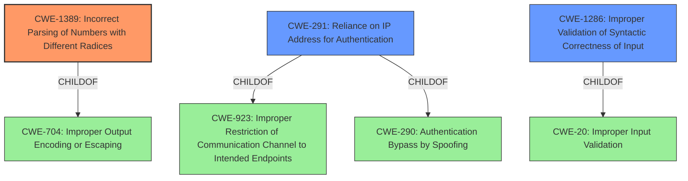

# Analysis Report for CVE-2021-29921

# Vulnerability Analysis Report: CVE-2021-29921

## Description


## Analysis (with Relationship Data)

# Summary
| CWE ID    | CWE Name                                                              | Confidence | CWE Abstraction Level | CWE Vulnerability Mapping Label | CWE-Vulnerability Mapping Notes |
| :-------- | :-------------------------------------------------------------------- | :--------- | :-------------------- | :------------------------------ | :------------------------------ |
| CWE-1389  | Incorrect Parsing of Numbers with Different Radices                 | 0.9        | Base                  | Primary                         | Allowed                       |
| CWE-291   | Reliance on IP Address for Authentication                           | 0.7        | Variant               | Secondary                       | Allowed                       |
| CWE-1286 | Improper Validation of Syntactic Correctness of Input | 0.6 | Base | Secondary | Allowed |

## Evidence and Confidence

*   **Confidence Score:** 0.8
*   **Evidence Strength:** HIGH

## Relationship Analysis
The primary CWE identified is CWE-1389 (**Incorrect Parsing of Numbers with Different Radices**), which is a Base level CWE. It's related to CWE-704 (Improper Output Encoding or Escaping) via a ChildOf relationship. CWE-291 (**Reliance on IP Address for Authentication**) is a Variant of CWE-923 (**Improper Restriction of Communication Channel to Intended Endpoints**) and CWE-290 (**Authentication Bypass by Spoofing**). CWE-1286 (**Improper Validation of Syntactic Correctness of Input**) is a child of CWE-20 (**Improper Input Validation**). Given the specificity of the **mishandling of leading zeros**, CWE-1389 is the most accurate.



## Vulnerability Chain
The vulnerability chain starts with the **improper handling of leading zero characters** (CWE-1389), which leads to potential bypass of access control mechanisms. In some contexts, reliance on IP addresses for authentication (CWE-291) can be directly bypassed due to this mishandling, thus the sequence can be seen as CWE-1389 -> CWE-291. There is also an element of improper input validation that needs to be considered (CWE-1286), in that there is **incorrect validation of the intended decimal-based IP address format.**

## Summary of Analysis
The initial assessment identified that the core issue is the **mishandling of leading zero characters** in IP address strings by the `ipaddress` library, which can lead to bypassing access control. The CVE reference links confirm this and provide more detail, such as the vulnerability allowing for SSRF, RFI and LFI attacks. The primary CWE, CWE-1389, directly addresses this.

The selection is primarily based on the "Vulnerability Description Key Phrases" which highlights the **weakness** is the **mishandling of leading zero characters**. This combined with the CVE reference links providing the root_cause as the `ipaddress` module improperly validates IPv4 octets, specifically, it strips leading zeros instead of evaluating them as valid IP addresses makes CWE-1389 the most specific and appropriate.

CWE-1389 is at the optimal level of specificity because it clearly describes the **root cause** of the vulnerability. It is a base level CWE, which is preferred.

CWE-291 (**Reliance on IP Address for Authentication**) is included as a secondary CWE because the vulnerability ultimately leads to a bypass of access control mechanisms relying on IP addresses.

CWE-1286 (**Improper Validation of Syntactic Correctness of Input**) is also included, as the input validation is not correctly handling the different bases.

Relevant CWE Information:

# Enhanced Context (25 CWEs)
The following CWEs were identified as potentially relevant to this vulnerability:

## CWE-1289: Improper Validation of Unsafe Equivalence in Input
**Abstraction Level**: Base
**Similarity Score**: 0.75
**Source**: dense

**Description**:
The product receives an input value that is used as a resource identifier or other type of reference, but it does not validate or incorrectly validates that the input is equivalent to a potentially-unsafe value.

**Mapping Guidance**:
- Usage: Allowed
- Rationale: This CWE entry is at the Base level of abstraction, which is a preferred level of abstraction for mapping to the root causes of vulnerabilities.

*This CWE was not selected because it focuses on the validation of input against potentially unsafe values, whereas the described vulnerability is about the incorrect parsing of numerical inputs with different radices. The vulnerability is more about a parsing error rather than validating against unsafe values.*

## CWE-330: Use of Insufficiently Random Values
**Abstraction Level**: Class
**Similarity Score**: 0.75
**Source**: dense

**Description**:
The product uses insufficiently random numbers or values in a security context that depends on unpredictable numbers.

**Mapping Guidance**:
- Usage: Discouraged
- Rationale: This CWE entry is a level-1 Class (i.e., a child of a Pillar). It might have lower-level children that would be more appropriate

*This CWE was not selected because the vulnerability is not related to the use of random numbers or values.*

## CWE-754: Improper Check for Unusual or Exceptional Conditions
**Abstraction Level**: Class
**Similarity Score**: 0.74
**Source**: dense

**Description**:
The product does not check or incorrectly checks for unusual or exceptional conditions that are not expected to occur frequently during day to day operation of the product.

**Mapping Guidance**:
- Usage: Allowed-with-Review
- Rationale: This CWE entry is a Class and might have Base-level children that would be more appropriate

*This CWE was not selected because the core issue is not about failing to check for unusual conditions, but about incorrectly parsing numerical inputs.*

## CWE-807: Reliance on Untrusted Inputs in a Security Decision
**Abstraction Level**: Base
**Similarity Score**: 0.74
**Source**: dense

**Description**:
The product uses a protection mechanism that relies on the existence or values of an input, but the input can be modified by an untrusted actor in a way that bypasses the protection mechanism.

**Mapping Guidance**:
- Usage: Allowed
- Rationale: This CWE entry is at the Base level of abstraction, which is a preferred level of abstraction for mapping to the root causes of vulnerabilities.

*This CWE is too general and doesn't capture the specifics of the incorrect parsing of numbers with different radices.*

## CWE-41: Improper Resolution of Path Equivalence
**Abstraction Level**: Base
**Similarity Score**: 0.73
**Source**: dense

**Description**:
The product is vulnerable to file system contents disclosure through path equivalence. Path equivalence involves the use of special characters in file and directory names. The associated manipulations are intended to generate multiple names for the same object.

**Mapping Guidance**:
- Usage: Allowed
- Rationale: This CWE entry is at the Base level of abstraction, which is a preferred level of abstraction for mapping to the root causes of vulnerabilities.

*This CWE is not related to the described vulnerability, which involves numerical parsing and IP address handling, not file system path manipulation.*

## CWE-667: Improper Locking
**Abstraction Level**: Class
**Similarity Score**: 0.73
**Source**: dense

**Description**:
The product does not properly acquire or release a lock on a resource, leading to unexpected resource state changes and behaviors.

**Mapping Guidance**:
- Usage: Allowed-with-Review
- Rationale: This CWE entry is a Class and might have Base-level children that would be more appropriate

*This CWE is not relevant as it pertains to improper locking mechanisms, not numerical parsing errors.*

## CWE-252: Unchecked Return Value
**Abstraction Level**: Base
**Similarity Score**: 0.73
**Source**: dense

**Description**:
The product does not check the return value from


## CWE Relationship Analysis

Current CWEs represent these abstraction levels: .


### Vulnerability Chain Analysis

**Chain starting from CWE-754:**
- 754 (Improper Check for Unusual or Exceptional Conditions) - ROOT


**Chain starting from CWE-667:**
- 667 (Improper Locking) - ROOT


### CWE Relationship Diagram

```mermaid
graph TD
    classDef primary fill:#f96,stroke:#333,stroke-width:2px
    classDef secondary fill:#69f,stroke:#333
    classDef tertiary fill:#9e9,stroke:#333
```


*Report generated on 2025-04-01 21:13:10*
