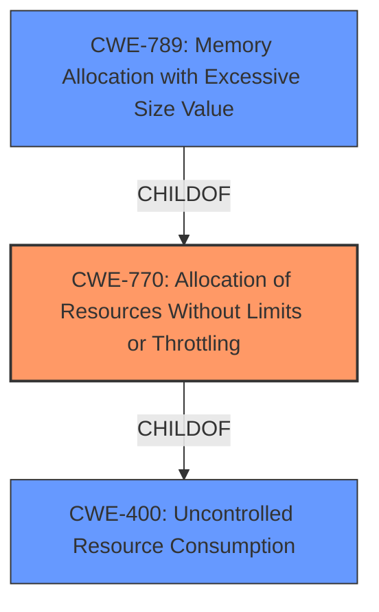

# Enhanced Analysis for CVE-2021-29932

# Summary
| CWE ID | CWE Name | Confidence | CWE Abstraction Level | CWE Vulnerability Mapping Label | CWE-Vulnerability Mapping Notes |
|---|---|---|---|---|---|
| CWE-770 | Allocation of Resources Without Limits or Throttling | 1.0 | Base | Allowed | Primary CWE: The product allocates resources without limits, leading to a denial of service. |
| CWE-400 | Uncontrolled Resource Consumption | 0.7 | Class | Discouraged | Secondary CWE: The product does not properly control the allocation and maintenance of a limited resource. |
| CWE-789 | Memory Allocation with Excessive Size Value | 0.6 | Variant | Allowed | Secondary CWE: The product allocates memory based on an untrusted, large size value. |

## Evidence and Confidence

*   **Confidence Score:** 0.8
*   **Evidence Strength:** HIGH

## Relationship Analysis
The primary CWE is CWE-770 (Allocation of Resources Without Limits or Throttling), which is a Base level CWE. CWE-400 (Uncontrolled Resource Consumption) is a parent Class of CWE-770, indicating a more general form of resource exhaustion. CWE-789 (Memory Allocation with Excessive Size Value) is a child Variant of CWE-770 and represents a more specific scenario where excessive memory allocation is the problem. The selection of CWE-770 is based on the evidence that the vulnerability involves allocation of resources without limits.



## Vulnerability Chain
The vulnerability chain starts with the attacker providing a duration string with a large exponent. The `parse_duration::parse` function then uses `BigInt` and its `pow` function to handle this exponent, leading to excessive CPU and memory consumption. This results in a denial of service.

Large exponent -> Excessive resource allocation (CWE-770) -> Denial of Service

## Summary of Analysis
The initial analysis focused on the **root cause** of the denial of service, which is the **lack of limits on resource allocation** when handling large exponents.

The "**Root cause of vulnerability:** The `parse_duration::parse` function uses `BigInt` and its `pow` function to handle duration strings with exponents. An arbitrarily large exponent can cause the function to consume excessive CPU and memory."

The Retriever Results highlighted CWE-770 (Allocation of Resources Without Limits or Throttling) as the best match, aligning with the vulnerability description. The graph relationships showed that CWE-770 is a child of CWE-400 (Uncontrolled Resource Consumption) and a parent of CWE-789 (Memory Allocation with Excessive Size Value).

The final decision to select CWE-770 as the primary CWE is based on its Base level of abstraction and its direct relevance to the vulnerability's root cause. CWE-400 is a more general class, while CWE-789 is more specific to memory allocation, but the issue isn't exclusively about memory. CWE-770 captures the broader problem of allocating resources (CPU, memory) without appropriate limits. The choice of CWE-770 reflects the optimal level of specificity, directly addressing the **lack of limits** on resource allocation that leads to the denial of service.

Relevant CWE Information:

# Enhanced Context (25 CWEs)
The following CWEs were identified as potentially relevant to this vulnerability:

## CWE-405: Asymmetric Resource Consumption (Amplification)
**Abstraction Level**: Class
**Similarity Score**: 0.77
**Source**: dense

**Description**:
The product does not properly control situations in which an adversary can cause the product to consume or produce excessive resources without requiring the adversary to invest equivalent work or otherwise prove authorization, i.e., the adversary's influence is "asymmetric."

**Mapping Guidance**:
- Usage: Allowed-with-Review
- Rationale: This CWE entry is a Class and might have Base-level children that would be more appropriate

*Not Selected:* This is a class level CWE, and CWE-770 is a better fit and more specific.

## CWE-366: Race Condition within a Thread
**Abstraction Level**: Base
**Similarity Score**: 0.76
**Source**: dense

**Description**:
If two threads of execution use a resource simultaneously, there exists the possibility that resources may be used while invalid, in turn making the state of execution undefined.

**Mapping Guidance**:
- Usage: Allowed
- Rationale: This CWE entry is at the Base level of abstraction, which is a preferred level of abstraction for mapping to the root causes of vulnerabilities.

*Not Selected:* This vulnerability does not appear to have any multithreading issues.

## CWE-362: Concurrent Execution using Shared Resource with Improper Synchronization ('Race Condition')
**Abstraction Level**: Class
**Similarity Score**: 0.75
**Source**: dense

**Description**:
The product contains a concurrent code sequence that requires temporary, exclusive access to a shared resource, but a timing window exists in which the shared resource can be modified by another code sequence operating concurrently.

**Mapping Guidance**:
- Usage: Allowed-with-Review
- Rationale: This CWE entry is a Class and might have Base-level children that would be more appropriate

*Not Selected:* This vulnerability does not appear to have any multithreading issues.

## CWE-404: Improper Resource Shutdown or Release
**Abstraction Level**: Class
**Similarity Score**: 0.75
**Source**: dense

**Description**:
The product does not release or incorrectly releases a resource before it is made available for re-use.

**Mapping Guidance**:
- Usage: Allowed-with-Review
- Rationale: This CWE entry is a Class and might have Base-level children that would be more appropriate

*Not Selected:* The issue is related to allocation, not release.

## CWE-667: Improper Locking
**Abstraction Level**: Class
**Similarity Score**: 0.75
**Source**: dense

**Description**:
The product does not properly acquire or release a lock on a resource, leading to unexpected resource state changes and behaviors.

**Mapping Guidance**:
- Usage: Allowed-with-Review
- Rationale: This CWE entry is a Class and might have Base-level children that would be more appropriate

*Not Selected:* The issue is not related to locking.

## CWE-662: Improper Synchronization
**Abstraction Level**: Class
**Similarity Score**: 0.75
**Source**: dense

**Description**:
The product utilizes multiple threads or processes to allow temporary access to a shared resource that can only be exclusive to one process at a time, but it does not properly synchronize these actions, which might cause simultaneous accesses of this resource by multiple threads or processes.

**Mapping Guidance**:
- Usage: Discouraged
- Rationale: This CWE entry is a level-1 Class (i.e., a child of a Pillar). It might have lower-level children that would be more appropriate

*Not Selected:* The issue is not related to synchronization.

## CWE-1325: Improperly Controlled Sequential Memory Allocation
**Abstraction Level**: Base
**Similarity Score**: 0.75
**Source**: dense

**Description**:
The product manages a group of objects or resources and performs a separate memory allocation for each object, but it does not properly limit the total amount of memory that is consumed by all of the combined objects.

**Mapping Guidance**:
- Usage: Allowed
- Rationale: This CWE entry is at the Base level of abstraction, which is a preferred level of abstraction for mapping to the root causes of vulnerabilities.

*Not Selected:* The vulnerability is more general than memory allocation.

## CWE-367: Time-of-check Time-of-use (TOCTOU) Race Condition
**Abstraction Level**: Base
**Similarity Score**: 0.75
**Source**: dense

**Description**:
The product checks the state of a resource before using that resource, but the resource's state can change between the check and the use in a way that invalidates the results of the check. This can cause the product to perform invalid actions when the resource is in an unexpected state.

**Mapping Guidance**:
- Usage: Allowed
- Rationale: This CWE entry is at the Base level of abstraction, which is a preferred level of abstraction for mapping to the root causes of vulnerabilities.

*Not Selected:* This vulnerability does not appear to have any multithreading issues.

## CWE-664: Improper Control of a Resource Through its Lifetime
**Abstraction Level**: Pillar
**Similarity Score**: 0.74
**Source**: dense

**Description**:
The product does not


## CWE Relationship Analysis

Current CWEs represent these abstraction levels: .


### Vulnerability Chain Analysis

**Chain starting from CWE-667:**
- 667 (Improper Locking) - ROOT


**Chain starting from CWE-662:**
- 662 (Improper Synchronization) - ROOT


### CWE Relationship Diagram

```mermaid
graph TD
    classDef primary fill:#f96,stroke:#333,stroke-width:2px
    classDef secondary fill:#69f,stroke:#333
    classDef tertiary fill:#9e9,stroke:#333
```