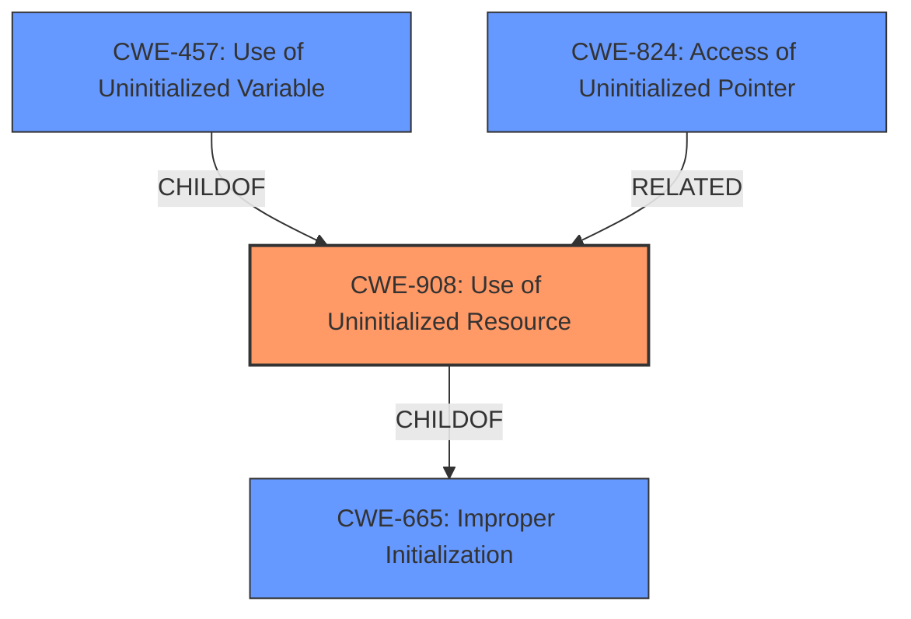

# Analysis Report for CVE-2021-29934

# Vulnerability Analysis Report: CVE-2021-29934

## Description


## Analysis (with Relationship Data)

# Summary
| CWE ID | CWE Name | Confidence | CWE Abstraction Level | CWE Vulnerability Mapping Label | CWE-Vulnerability Mapping Notes |
|---|---|---|---|---|---|
| CWE-908 | Use of Uninitialized Resource | 1.00 | Base | Primary | Allowed |
| CWE-457 | Use of Uninitialized Variable | 0.75 | Variant | Secondary | Allowed |
| CWE-824 | Access of Uninitialized Pointer | 0.75 | Base | Secondary | Allowed |
| CWE-665 | Improper Initialization | 0.50 | Class | Secondary | Discouraged |

## Evidence and Confidence

*   **Confidence Score:** 0.90
*   **Evidence Strength:** HIGH

## Relationship Analysis
The primary CWE is CWE-908 (Use of Uninitialized Resource), which is a base-level CWE. CWE-908 has a parent-child relationship with CWE-665 (Improper Initialization). CWE-457 (Use of Uninitialized Variable) is a variant of CWE-908. CWE-824 (Access of Uninitialized Pointer) is related to uninitialized resources, but it is more specific to pointers. The relationships show that the vulnerability involves using an uninitialized resource, which can be further specified as a variable or a pointer. The abstraction levels influenced the selection, as the goal was to find the most specific CWE that accurately represents the weakness.



## Vulnerability Chain
The chain of root cause and weaknesses is as follows:
1.  Missing or **improper initialization** of a resource (likely due to a design or coding error).
2.  Use of the **uninitialized resource** in a `Read` operation.
3.  Exposure of potentially sensitive information due to **reading the contents of uninitialized memory**.

The root cause is the missing or **improper initialization** of the resource, while the impact is the exposure of sensitive information.

## Summary of Analysis
The initial analysis identified CWE-908 (Use of Uninitialized Resource) as the primary CWE, based on the vulnerability description and the retriever results. The description clearly states that the vulnerability involves **reading the contents of uninitialized memory**, which aligns with the definition of CWE-908. The retriever results also ranked CWE-908 as the top candidate.

The analysis also considered CWE-457 (Use of Uninitialized Variable) and CWE-824 (Access of Uninitialized Pointer) as potential candidates. While the vulnerability description does not explicitly mention variables or pointers, the underlying issue involves using uninitialized memory, which can be associated with both variables and pointers. Therefore, CWE-457 and CWE-824 were included as secondary CWEs.

CWE-665 (Improper Initialization) was also considered, as it represents a higher-level class that encompasses the missing or **improper initialization** of a resource. While CWE-665 is a relevant factor, CWE-908 provides a more specific description of the vulnerability, which involves using the **uninitialized resource**.

The final decision was based on the evidence from the vulnerability description, the retriever results, and the relationships between the CWEs. CWE-908 was selected as the primary CWE because it accurately represents the weakness and is at the base level of abstraction. CWE-457 and CWE-824 were included as secondary CWEs to provide additional context. CWE-665 was included as a secondary CWE, but it is less specific than CWE-908.

The following excerpt from the CVE Reference Links Content Summary supports this decision: "The primary weakness is the use of an uninitialized buffer as input to a `Read` trait implementation." This statement directly aligns with the definition of CWE-908, which involves using a resource that has not been initialized.

The selected CWEs are at the optimal level of specificity because they accurately represent the weakness and provide sufficient context without being overly general or specific.

Relevant CWE Information:

# Enhanced Context (25 CWEs)

## CWE-476: NULL Pointer Dereference
**Abstraction Level**: Base
**Similarity Score**: 0.78
**Source**: dense

**Description**:
The product dereferences a pointer that it expects to be valid but is NULL.

**Mapping Guidance**:
- Usage: Allowed
- Rationale: This CWE entry is at the Base level of abstraction, which is a preferred level of abstraction for mapping to the root causes of vulnerabilities.

## CWE-824: Access of Uninitialized Pointer
**Abstraction Level**: Base
**Similarity Score**: 0.77
**Source**: dense

**Description**:
The product accesses or uses a pointer that has not been initialized.

**Mapping Guidance**:
- Usage: Allowed
- Rationale: This CWE entry is at the Base level of abstraction, which is a preferred level of abstraction for mapping to the root causes of vulnerabilities.

## CWE-822: Untrusted Pointer Dereference
**Abstraction Level**: Base
**Similarity Score**: 0.76
**Source**: dense

**Description**:
The product obtains a value from an untrusted source, converts this value to a pointer, and dereferences the resulting pointer.

**Mapping Guidance**:
- Usage: Allowed
- Rationale: This CWE entry is at the Base level of abstraction, which is a preferred level of abstraction for mapping to the root causes of vulnerabilities.

## CWE-909: Missing Initialization of Resource
**Abstraction Level**: Class
**Similarity Score**: 0.75
**Source**: dense

**Description**:
The product does not initialize a critical resource.

**Mapping Guidance**:
- Usage: Allowed-with-Review
- Rationale: This CWE entry is a Class and might have Base-level children that would be more appropriate

## CWE-457: Use of Uninitialized Variable
**Abstraction Level**: Variant
**Similarity Score**: 0.75
**Source**: dense

**Description**:
The code uses a variable that has not been initialized, leading to unpredictable or unintended results.

**Mapping Guidance**:
- Usage: Allowed
- Rationale: This CWE entry is at the Variant level of abstraction, which is a preferred level of abstraction for mapping to the root causes of vulnerabilities.

## CWE-908: Use of Uninitialized Resource
**Abstraction Level**: Base
**Similarity Score**: 0.75
**Source**: dense

**Description**:
The product uses or accesses a resource that has not been initialized.

**Mapping Guidance**:
- Usage: Allowed
- Rationale: This CWE entry is at the Base level of abstraction, which is a preferred level of abstraction for mapping to the root causes of vulnerabilities.

## CWE-665: Improper Initialization
**Abstraction Level**: Class
**Similarity Score**: 0.75
**Source**: dense

**Description**:
The product does not initialize or incorrectly initializes a resource, which might leave the resource in an unexpected state when it is accessed or used.

**Mapping Guidance**:
- Usage: Discouraged
- Rationale: This CWE entry is a level-1 Class (i.e., a child of a Pillar). It might have lower-level children that would be more appropriate

## CWE-404: Improper Resource Shutdown or Release
**Abstraction Level**: Class
**Similarity Score**: 0.75
**Source**: dense

**Description**:
The product does not release or incorrectly releases a resource before it is made available for re-use.

**Mapping Guidance**:
- Usage: Allowed-with-Review
- Rationale: This CWE entry is a Class and might have Base-level children that would be more appropriate

## CWE-252: Unchecked Return Value
**Abstraction Level**: Base
**Similarity Score**: 0.75
**Source**: dense

**Description**:
The product does not check the return value from a method or function, which can prevent it from detecting unexpected states and conditions.

**Mapping Guidance**:
- Usage: Allowed
- Rationale: This CWE entry is at the Base level of abstraction, which is a preferred level of abstraction for mapping to the root causes of vulnerabilities.

## CWE-226: Sensitive Information in Resource Not Removed Before Reuse
**Abstraction Level**: Base
**Similarity Score**: 0.75
**Source**: dense

**Description**:
The product releases a resource such as memory or a file so that it can be made available for reuse, but it does not clear or "zero


## CWE Relationship Analysis

Current CWEs represent these abstraction levels: .


### Vulnerability Chain Analysis

**Chain starting from CWE-476:**
- 476 (NULL Pointer Dereference) - ROOT


**Chain starting from CWE-404:**
- 404 (Improper Resource Shutdown or Release) - ROOT


### CWE Relationship Diagram

```mermaid
graph TD
    classDef primary fill:#f96,stroke:#333,stroke-width:2px
    classDef secondary fill:#69f,stroke:#333
    classDef tertiary fill:#9e9,stroke:#333
```


*Report generated on 2025-04-02 01:25:28*
