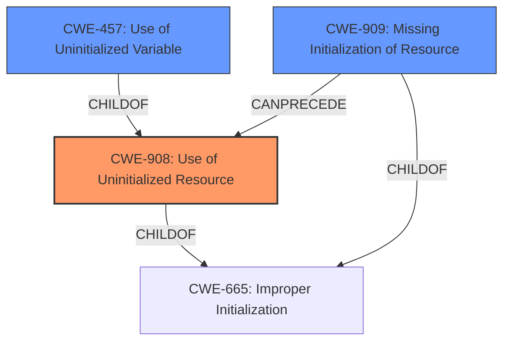

# Analysis for CVE-2021-29937

# Summary
| CWE ID | CWE Name | Confidence | CWE Abstraction Level | CWE Vulnerability Mapping Label | CWE-Vulnerability Mapping Notes |
|---|---|---|---|---|---|
| CWE-908 | Use of Uninitialized Resource | 0.9 | Base | Allowed | Primary CWE |
| CWE-457 | Use of Uninitialized Variable | 0.7 | Variant | Allowed | Secondary Candidate |
| CWE-909 | Missing Initialization of Resource | 0.6 | Class | Allowed-with-Review | Secondary Candidate |

## Evidence and Confidence

*   **Confidence Score:** 0.9
*   **Evidence Strength:** HIGH

## Relationship Analysis
The primary CWE selected is CWE-908, which represents the **use of uninitialized resources**. CWE-909, a class-level CWE, describes the **missing initialization of resources** and can precede CWE-908. CWE-457, a variant-level CWE, represents the **use of uninitialized variables** and is a child of CWE-908. The relationships suggest a chain where a missing initialization (CWE-909) leads to the use of an uninitialized resource (CWE-908), possibly involving an uninitialized variable (CWE-457). The choice of CWE-908 as the primary CWE reflects the actual vulnerability: the **use of uninitialized memory**.

## Vulnerability Chain
The vulnerability chain starts with the missing initialization of memory within the `miscvec_with_size()` function. This leads to the use of **uninitialized memory** when the `clone()` operation panics. The chain is:
1.  **Missing Initialization**: Memory allocated but not initialized
2.  **Use of Uninitialized Resource** (CWE-908): Attempt to clone into uninitialized memory
3.  **Panic During Clone**: `value.clone()` fails
4.  **Drop of Uninitialized Memory**: Vector is dropped, leading to undefined behavior

## Summary of Analysis
The analysis focuses on the root cause of the vulnerability: the use of uninitialized memory. The vulnerability description explicitly mentions the **"drop of uninitialized memory"**. The CVE Reference Links Content Summary states that the `misc::vec_with_size` function creates a vector filled with **uninitialized memory**. This memory is then populated with clones of a provided value. If the clone operation fails, the function drops the vector containing the **uninitialized memory**, leading to undefined behavior.

The retriever results identify CWE-908 (**Use of Uninitialized Resource**) as the top candidate. This aligns with the vulnerability description and the root cause identified in the CVE Reference Links Content Summary. CWE-457 (**Use of Uninitialized Variable**) is also a strong candidate, as the **uninitialized memory** can be considered an uninitialized variable. However, CWE-908 is more appropriate because it directly addresses the use of the **uninitialized resource** (memory), while CWE-457 focuses on variables.

CWE-909 (**Missing Initialization of Resource**) is considered because the **uninitialized memory** implies a failure to properly initialize the memory. However, the core issue is the use of the **uninitialized resource**, making CWE-908 the primary CWE.

The selection of CWE-908 is at the Base level of abstraction, which is preferred for mapping root causes. It is also an ALLOWED usage according to MITRE's mapping guidance.

The other CWEs were considered but not selected as primary CWEs. CWE-252 (**Unchecked Return Value**) and CWE-366 (**Race Condition within a Thread**) do not directly relate to the root cause of the vulnerability. CWE-362 (**Concurrent Execution using Shared Resource with Improper Synchronization ('Race Condition')**) is also not relevant because the vulnerability does not involve concurrent execution. CWE-665 (**Improper Initialization**) is too high-level and doesn't fully capture the specific issue. CWE-119 (**Improper Restriction of Operations within the Bounds of a Memory Buffer**) is a class-level CWE that is discouraged.

Based on the evidence, relationship analysis, and mapping guidance, CWE-908 is the most appropriate primary CWE for this vulnerability.

Relevant CWE Information:
-   Vulnerability Description Key Phrases
    -   **rootcause:** **uninitialized memory**
-   CVE Reference Links Content Summary
    -   **Root cause of vulnerability**: The `misc::vec_with_size` function in the `telemetry` crate creates a vector of a specified size and fills it with **uninitialized memory**.
    -   **Weaknesses/vulnerabilities present**: If the `clone()` operation panics (fails with an error), the function will drop the vector, and since the vector was filled with **uninitialized memory**, dropping it results in undefined behavior.