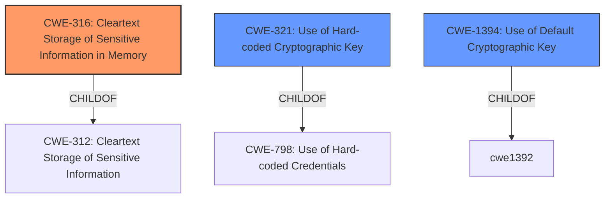

# Analysis for CVE-2021-29950

# Summary
| CWE ID | CWE Name | Confidence | CWE Abstraction Level | CWE Vulnerability Mapping Label | CWE-Vulnerability Mapping Notes |
|---|---|---|---|---|---|
| CWE-316 | Cleartext Storage of Sensitive Information in Memory | 0.9 | Variant | Allowed | Primary CWE |
| CWE-321 | Use of Hard-coded Cryptographic Key | 0.6 | Variant | Allowed | Secondary Candidate |
| CWE-1394 | Use of Default Cryptographic Key | 0.5 | Base | Allowed | Secondary Candidate |

## Evidence and Confidence

*   **Confidence Score:** 0.9
*   **Evidence Strength:** HIGH

## Relationship Analysis
The primary CWE selected is CWE-316, which is a variant of CWE-312 (Cleartext Storage of Sensitive Information). The vulnerability involves sensitive OpenPGP keys being left unprotected in memory, directly aligning with CWE-316's description. CWE-321 (Use of Hard-coded Cryptographic Key) and CWE-1394 (Use of Default Cryptographic Key) were considered due to the involvement of cryptographic keys, but were deemed less relevant as the core issue is not the key itself being hardcoded or a default key, but rather the failure to protect it in memory. The abstraction levels were chosen to be as specific as possible, aligning with the detailed nature of the vulnerability description.

## Vulnerability Chain
The chain of events leading to the vulnerability can be mapped as follows:
1.  Thunderbird **unprotects** a secret OpenPGP key for use.
2.  An operation (decryption, signing, key import) **fails**.
3.  The **key remains in memory in its unprotected state** (CWE-316), which is the **root cause**.
4.  An attacker with memory access can **extract the unprotected key**.
5.  The attacker can perform **unauthorized actions** using the key.

## Summary of Analysis
Initially, the analysis focused on identifying the root cause of the vulnerability, which is the **failure to re-protect the secret key** after an operation fails. The retriever results suggested CWE-316 (Cleartext Storage of Sensitive Information in Memory) as the top candidate, which aligns with the vulnerability description of the **key remaining unprotected in memory**.

The vulnerability description clearly states that "If the task runs into a failure, the secret key may remain in memory in its unprotected state." This is direct evidence supporting CWE-316.

The graph relationships helped clarify the specificity of the CWEs. While CWE-321 and CWE-1394 were related to cryptographic keys, they did not directly address the issue of the key being left unprotected in memory. CWE-316, being a variant of CWE-312, provided the most accurate representation of the vulnerability.

The selected CWE, CWE-316, is at the optimal level of specificity as it directly describes the weakness of sensitive information (the OpenPGP key) being stored in cleartext in memory after a failure condition. This is more specific than the class CWE-312. CWE-321 and CWE-1394 were considered but were deemed less relevant as they focus on the nature of the key itself (hardcoded or default) rather than the key's protection state in memory.

Relevant CWE Information:

# Enhanced Context (25 CWEs)
The following CWEs were identified as potentially relevant to this vulnerability:

## CWE-1204: Generation of Weak Initialization Vector (IV)
**Abstraction Level**: Base
**Similarity Score**: 0.83
**Source**: dense

**Description**:
The product uses a cryptographic primitive that uses an Initialization
			Vector (IV), but the product does not generate IVs that are
			sufficiently unpredictable or unique according to the expected
			cryptographic requirements for that primitive.
			

**Mapping Guidance**:
- Usage: Allowed
- Rationale: This CWE entry is at the Base level of abstraction, which is a preferred level of abstraction for mapping to the root causes of vulnerabilities.

## CWE-1240: Use of a Cryptographic Primitive with a Risky Implementation
**Abstraction Level**: Base
**Similarity Score**: 0.80
**Source**: dense

**Description**:
To fulfill the need for a cryptographic primitive, the product implements a cryptographic algorithm using a non-standard, unproven, or disallowed/non-compliant cryptographic implementation.

**Mapping Guidance**:
- Usage: Allowed
- Rationale: This CWE entry is at the Base level of abstraction, which is a preferred level of abstraction for mapping to the root causes of vulnerabilities.

## CWE-1391: Use of Weak Credentials
**Abstraction Level**: Class
**Similarity Score**: 0.78
**Source**: dense

**Description**:
The product uses weak credentials (such as a default key or hard-coded password) that can be calculated, derived, reused, or guessed by an attacker.

**Mapping Guidance**:
- Usage: Allowed-with-Review
- Rationale: This CWE entry is a Class and might have Base-level children that would be more appropriate

## CWE-330: Use of Insufficiently Random Values
**Abstraction Level**: Class
**Similarity Score**: 0.78
**Source**: dense

**Description**:
The product uses insufficiently random numbers or values in a security context that depends on unpredictable numbers.

**Mapping Guidance**:
- Usage: Discouraged
- Rationale: This CWE entry is a level-1 Class (i.e., a child of a Pillar). It might have lower-level children that would be more appropriate

## CWE-331: Insufficient Entropy
**Abstraction Level**: Base
**Similarity Score**: 0.77
**Source**: dense

**Description**:
The product uses an algorithm or scheme that produces insufficient entropy, leaving patterns or clusters of values that are more likely to occur than others.

**Mapping Guidance**:
- Usage: Allowed
- Rationale: This CWE entry is at the Base level of abstraction, which is a preferred level of abstraction for mapping to the root causes of vulnerabilities.

## CWE-321: Use of Hard-coded Cryptographic Key
**Abstraction Level**: Variant
**Similarity Score**: 0.77
**Source**: dense

**Description**:
The use of a hard-coded cryptographic key significantly increases the possibility that encrypted data may be recovered.

**Mapping Guidance**:
- Usage: Allowed
- Rationale: This CWE entry is at the Variant level of abstraction, which is a preferred level of abstraction for mapping to the root causes of vulnerabilities.

## CWE-328: Use of Weak Hash
**Abstraction Level**: Base
**Similarity Score**: 0.76
**Source**: dense

**Description**:
The product uses an algorithm that produces a digest (output value) that does not meet security expectations for a hash function that allows an adversary to reasonably determine the original input (preimage attack), find another input that can produce the same hash (2nd preimage attack), or find multiple inputs that evaluate to the same hash (birthday attack).

**Mapping Guidance**:
- Usage: Allowed
- Rationale: This CWE entry is at the Base level of abstraction, which is a preferred level of abstraction for mapping to the root causes of vulnerabilities.

## CWE-335: Incorrect Usage of Seeds in Pseudo-Random Number Generator (PRNG)
**Abstraction Level**: Base
**Similarity Score**: 0.76
**Source**: dense

**Description**:
The product uses a Pseudo-Random Number Generator (PRNG) but does not correctly manage seeds.

**Mapping Guidance**:
- Usage: Allowed
- Rationale: This CWE entry is at the Base level of abstraction, which is a preferred level of abstraction for mapping to the root causes of vulnerabilities.

## CWE-327: Use of a Broken or Risky Cryptographic Algorithm
**Abstraction Level**: Class
**Similarity Score**: 0.75
**Source**: dense

**Description**:
The product uses a broken or risky cryptographic algorithm or protocol.

**Mapping Guidance**:
- Usage: Allowed-with-Review
- Rationale: This CWE entry is a Class and might have Base-level children that would be more appropriate

## CWE-203: Observable Discrepancy
**Abstraction Level**: Base
**Similarity Score**: 0