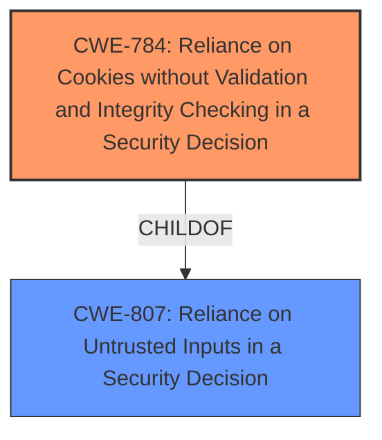

# Analysis for CVE-2021-29958

# Summary
| CWE ID | CWE Name | Confidence | CWE Abstraction Level | CWE Vulnerability Mapping Label | CWE-Vulnerability Mapping Notes |
|---|---|---|---|---|---|
| CWE-784 | Reliance on Cookies without Validation and Integrity Checking in a Security Decision | 0.8 | Variant | Allowed | Primary CWE |
| CWE-807 | Reliance on Untrusted Inputs in a Security Decision | 0.6 | Base | Allowed | Secondary Candidate |

## Evidence and Confidence

*   **Confidence Score:** 0.7
*   **Evidence Strength:** MEDIUM

## Relationship Analysis
The primary CWE, CWE-784, is a Variant of CWE-807, which means it's a more specific case of relying on untrusted inputs. The vulnerability involves the client not checking whether it was in normal or private browsing mode when a download was initiated, leading to private mode cookies being shared in normal browsing mode. This aligns with CWE-784 because it involves **reliance on cookies without proper validation**. The parent CWE, CWE-807, is considered as a possible secondary CWE.

## Vulnerability Chain
The vulnerability chain starts with the **lack of context awareness** during download initiation. This leads to **private mode cookies being shared** in normal browsing mode, resulting in a **privacy violation**.

## Summary of Analysis
The initial analysis pointed to CWE-784 as the primary weakness, because the **reliance on cookies without proper validation** is the core issue. The system **fails to check the origin of the request**, leading to cookies from a private browsing session being accessible in a normal browsing session. This is supported by the "Vulnerability Description Key Phrases" and the "CVE Reference Links Content Summary" which state that the client did not check whether it was in normal or private browsing mode.

The evidence indicates a problem related to the **improper use of cookies and a lack of validation** of their context. The choice of CWE-784 at the Variant level is appropriate because it specifically addresses the use of cookies in security decisions without proper validation and integrity checking.

Relevant CWE Information:

# Enhanced Context (25 CWEs)
The following CWEs were identified as potentially relevant to this vulnerability:

## CWE-807: Reliance on Untrusted Inputs in a Security Decision
**Abstraction Level**: Base
**Similarity Score**: 0.78
**Source**: dense

**Description**:
The product uses a protection mechanism that relies on the existence or values of an input, but the input can be modified by an untrusted actor in a way that bypasses the protection mechanism.

**Mapping Guidance**:
- Usage: Allowed
- Rationale: This CWE entry is at the Base level of abstraction, which is a preferred level of abstraction for mapping to the root causes of vulnerabilities.

## CWE-784: Reliance on Cookies without Validation and Integrity Checking in a Security Decision
**Abstraction Level**: Variant
**Similarity Score**: 0.476
**Source**: dense

**Description**:
The product uses a protection mechanism that relies on the existence or values of a cookie, but it does not properly ensure that the cookie is valid for the associated user.

### Observed Examples
- **CVE-2009-1549:** Attacker can bypass authentication by setting a cookie to a specific value.
- **CVE-2009-1619:** Attacker can bypass authentication and gain admin privileges by setting an "admin" cookie to 1.
- **CVE-2009-0864:** Content management system allows admin privileges by setting a "login" cookie to "OK."

CWE-807 is a more general case of the same problem and can be considered as a possible secondary CWE, but CWE-784 provides a more accurate representation of the vulnerability.

CWE-425, CWE-201, CWE-209, CWE-125, and CWE-295 were considered but deemed less relevant. They focus on different aspects, such as direct requests, sensitive information exposure in sent data or error messages, out-of-bounds reads, and certificate validation, which are not the primary issues in this vulnerability.