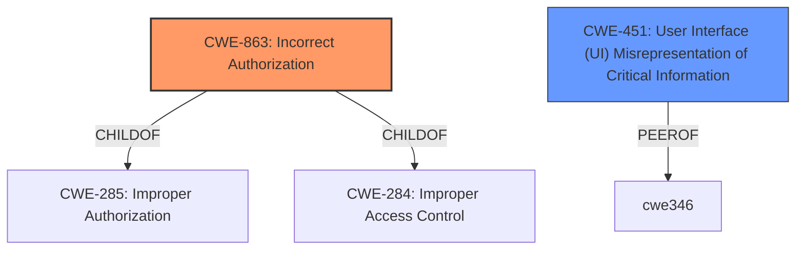

# Analysis Report for CVE-2021-29959

# Vulnerability Analysis Report: CVE-2021-29959

## Description


## Analysis (with Relationship Data)

# Summary
| CWE ID | CWE Name | Confidence | CWE Abstraction Level | CWE Vulnerability Mapping Label | CWE-Vulnerability Mapping Notes |
|---|---|---|---|---|---|
| CWE-863 | Incorrect Authorization | 0.8 | Class | Allowed-with-Review | Primary CWE |
| CWE-451 | User Interface (UI) Misrepresentation of Critical Information | 0.6 | Class | Allowed-with-Review | Secondary CWE |

## Evidence and Confidence

*   **Confidence Score:** 0.8
*   **Evidence Strength:** HIGH

## Relationship Analysis
The primary CWE is CWE-863, which is a Class-level CWE. CWE-863 is a child of CWE-285 (Improper Authorization) and CWE-284 (Access Control). It represents a general authorization problem. The secondary CWE is CWE-451, which is also a Class-level CWE. It describes issues where critical information is misrepresented in the user interface. Both CWEs are connected through the potential impact on user trust and security perception.



## Vulnerability Chain
The vulnerability chain begins with **incorrect authorization** (CWE-863) by Firefox, which stems from improper handling of camera and microphone permissions. Because the website can then re-enable the camera without user consent, the user may be misled into believing their camera is off when it is actually on. This results in **user interface misrepresentation** (CWE-451) as a consequence.

## Summary of Analysis
The initial assessment focused on identifying the **root cause** of the vulnerability. Based on the provided information, the primary weakness lies in **incorrect authorization**, which allowed a website to re-enable camera access without explicit user consent. This corresponds directly to the description of CWE-863, as Firefox was performing an authorization check, but performing it incorrectly. Furthermore, the **impact** of this vulnerability involves **user interface misrepresentation** (CWE-451), where the user is not accurately informed about the camera's status. This is a secondary weakness because the incorrect authorization is the underlying issue.

The evidence from the "CVE Reference Links Content Summary" section supports this classification:

*   "Inconsistent permission handling: Firefox incorrectly treated camera and microphone permissions as a pair when obtained through a single `getUserMedia` call, instead of managing them separately."
*   "Insufficient permission revocation: The `recording-device-stopped` event was not triggered when individual tracks from a `getUserMedia` call were stopped if other tracks from the same call were still active."
*   "A malicious website, having obtained initial permission to access both camera and microphone, could trick users by turning off the camera (and the camera hardware light) while maintaining the microphone active. This allows the site to then re-enable the camera without user consent."

The selection of CWE-863 and CWE-451 is at the optimal level of specificity because they directly address the root cause and the resulting impact of the vulnerability. Alternative CWEs, such as those related to race conditions or synchronization issues, were considered but deemed less relevant as they did not accurately reflect the core problem of **incorrect authorization** and **UI misrepresentation**.

**CWE Considered But Not Used**
*   CWE-367: Time-of-check Time-of-use (TOCTOU) Race Condition - While there might be a timing issue involved, the core of the problem is not a race condition but an authorization bypass.
*   CWE-362: Concurrent Execution using Shared Resource with Improper Synchronization ('Race Condition') - Similar to CWE-367, this is not the primary issue.
*   CWE-667: Improper Locking - Locking issues are not directly relevant to this vulnerability.
*   CWE-1021: Improper Restriction of Rendered UI Layers or Frames - Clickjacking is not relevant here.
*   CWE-476: NULL Pointer Dereference - There is no mention of null pointer dereferences in the description.
*   CWE-668: Exposure of Resource to Wrong Sphere - Too high-level and not specific enough.
*   CWE-1385: Missing Origin Validation in WebSockets and CWE-346: Origin Validation Error - These are related to web sockets which is not the scope of the vulnerability.
*   CWE-252: Unchecked Return Value and CWE-476: NULL Pointer Dereference - These are related to code errors that are not mentioned in the description.
*   CWE-178: Improper Handling of Case Sensitivity, CWE-416: Use After Free, CWE-386: Symbolic Name not Mapping to Correct Object, CWE-609: Double-Checked Locking, CWE-364: Signal Handler Race Condition, CWE-1265: Unintended Reentrant Invocation of Non-reentrant Code Via Nested Calls, CWE-415: Double Free, CWE-289: Authentication Bypass by Alternate Name - These are related to specific code errors and attack vectors that are not part of the description.


## CWE Relationship Analysis

Current CWEs represent these abstraction levels: .


### Vulnerability Chain Analysis

**Chain starting from CWE-362:**
- 362 (Concurrent Execution using Shared Resource with Improper Synchronization ('Race Condition')) - ROOT


**Chain starting from CWE-364:**
- 364 (Signal Handler Race Condition) - ROOT


### CWE Relationship Diagram

```mermaid
graph TD
    classDef primary fill:#f96,stroke:#333,stroke-width:2px
    classDef secondary fill:#69f,stroke:#333
    classDef tertiary fill:#9e9,stroke:#333
```


*Report generated on 2025-04-02 07:34:09*
