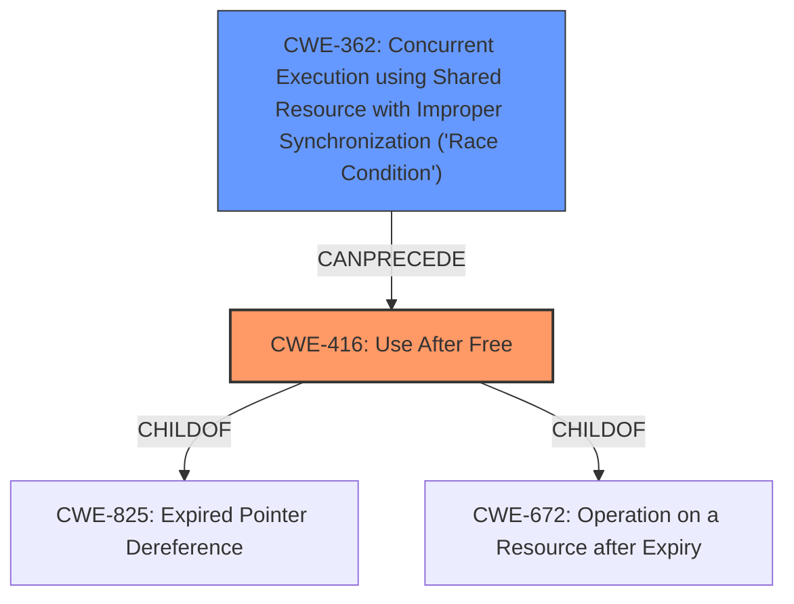

# Analysis Report for CVE-2021-29970

# Vulnerability Analysis Report: CVE-2021-29970

## Description


## Analysis (with Relationship Data)

# Summary
| CWE ID | CWE Name | Confidence | CWE Abstraction Level | CWE Vulnerability Mapping Label | CWE-Vulnerability Mapping Notes |
|---|---|---|---|---|---|
| CWE-416 | Use After Free | 1.0 | Variant | Allowed | Primary CWE |
| CWE-362 | Concurrent Execution using Shared Resource with Improper Synchronization ('Race Condition') | 0.8 | Class | Allowed-with-Review | Secondary CWE |

## Evidence and Confidence

*   **Confidence Score:** 0.9
*   **Evidence Strength:** HIGH

## Relationship Analysis
The primary weakness is CWE-416 **Use After Free**, a **Variant**, arising from a race condition, CWE-362, a **Class**. CWE-416 is a child of CWE-825 and CWE-672, while CWE-362 can precede CWE-416. The choice of CWE-416 is favored due to its precise description of the **memory corruption** caused by accessing freed memory, whereas CWE-362 explains the **race condition** that allows this to happen.



## Vulnerability Chain
The vulnerability chain begins with a **race condition** (CWE-362) during the destruction of `PresShell` and the shutdown of `DocAccessible`. This leads to a **use-after-free** (CWE-416) when the `PresShell` attempts to access the already freed `DocAccessible`. The **use-after-free** causes **memory corruption** and a potential exploitable crash.

## Summary of Analysis
The initial assessment, focusing on the **use-after-free** and **memory corruption**, aligns well with CWE-416. The additional context of a **race condition** during object destruction strongly suggests CWE-362. The provided evidence is strong, as the "CVE Reference Links Content Summary" details the vulnerability's root cause and mechanism.

The choice of CWE-416 is based on its specific description of accessing memory after it has been freed: "The product reuses or references memory after it has been freed." The supporting evidence is in the vulnerability description: "The vulnerability is triggered due to a race condition that occurs during the shutdown process... This creates a situation where the `PresShell` has a pointer to a `DocAccessible` that has already been freed leading to a **use-after-free** (UAF)."

CWE-362 is selected due to the **race condition** that allows the **use-after-free** to occur. As described in the "CVE Reference Links Content Summary": "The vulnerability is triggered due to a **race condition** during `PresShell` destruction where the sequence of operations regarding document accessible objects and selection listeners are not synchronized."

The selected CWEs are at the optimal level of specificity, with CWE-416 being a **Variant** and CWE-362 being a **Class**. The retriever results also support this selection, with CWE-416 having the highest score.

Other CWEs Considered:
*   CWE-787 **Out-of-bounds Write**: This CWE was considered due to the mention of **memory corruption**, but **use-after-free** is a more precise description of the root cause.
*   CWE-908 **Use of Uninitialized Resource**: This CWE was considered, but the issue isn't about using an uninitialized resource, but using a resource after it has been freed.


## CWE Relationship Analysis

Current CWEs represent these abstraction levels: .


### Vulnerability Chain Analysis

**Chain starting from CWE-787:**
- 787 (Out-of-bounds Write) - ROOT


**Chain starting from CWE-416:**
- 416 (Use After Free) - ROOT


### CWE Relationship Diagram

```mermaid
graph TD
    classDef primary fill:#f96,stroke:#333,stroke-width:2px
    classDef secondary fill:#69f,stroke:#333
    classDef tertiary fill:#9e9,stroke:#333
```


*Report generated on 2025-04-01 19:56:56*
