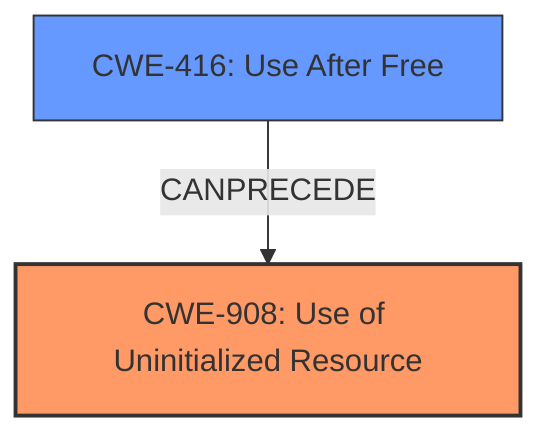

# Analysis for CVE-2021-29980

# Summary

| CWE ID  | CWE Name                                                       | Confidence | CWE Abstraction Level | CWE Vulnerability Mapping Label | CWE-Vulnerability Mapping Notes |
| :-------- | :------------------------------------------------------------- | :--------- | :---------------------- | :------------------------------ | :------------------------------ |
| CWE-908   | Use of Uninitialized Resource                                  | 1.0        | Base                    | Primary                         | Allowed                       |
| CWE-416   | Use After Free                                                 | 0.9        | Variant                 | Secondary                       | Allowed                       |

## Evidence and Confidence

*   **Confidence Score:** 0.95
*   **Evidence Strength:** HIGH

## Relationship Analysis

The primary weakness is CWE-908, reflecting the use of uninitialized memory. The secondary weakness is CWE-416, as the uninitialized memory is then incorrectly freed, leading to a use-after-free condition. These are related, with CWE-908 potentially preceding CWE-416.

## Vulnerability Chain

The vulnerability chain begins with uninitialized memory (CWE-908) in the `mGlyphs` member, followed by an incorrect `free()` operation, which results in a double-free condition and memory corruption (CWE-416), ultimately leading to a potentially exploitable crash.

## Summary of Analysis

The initial assessment identified CWE-908 as the primary weakness due to the **uninitialized memory** issue in the `RecordedFillGlyphs` constructor. This directly aligns with the provided "Vulnerability Description Key Phrases" and "CVE Reference Links Content Summary," which explicitly states, "The primary weakness is the **lack of initialization** of the `mGlyphs` member". The subsequent incorrect free operation leading to a double-free condition supports the inclusion of CWE-416 as a secondary weakness.

The "CVE Reference Links Content Summary" explicitly mentions the root cause: "The vulnerability stems from **uninitialized memory** within a canvas object. Specifically, the `mGlyphs` member in `RecordedFillGlyphs` is not initialized in the constructor. If an error occurs during the construction of a `RecordedFillGlyphs` object, a destructor is called, which attempts to `delete[]` the **uninitialized `mGlyphs` pointer, leading to a double-free**."

The graph relationships influenced the final selection by illustrating the connection between uninitialized resources and use-after-free vulnerabilities. The selected CWEs are at the optimal level of specificity, with CWE-908 as the base cause and CWE-416 as a consequence of the initial weakness.

Relevant CWE Information:

# Enhanced Context (25 CWEs)

## CWE-908: Use of Uninitialized Resource

**Abstraction:** Base

The vulnerability description clearly states that the `mGlyphs` member is not initialized, leading to an incorrect `free()` operation. This directly matches the description of CWE-908: "The product uses or accesses a resource that has not been initialized." The security implication is memory corruption and a potentially exploitable crash.

## CWE-416: Use After Free

**Abstraction:** Variant

The vulnerability description and CVE summary indicate that the uninitialized memory is then freed, and later, this memory is accessed again, leading to a double-free condition. This aligns with CWE-416: "The product reuses or references memory after it has been freed." The security implication is memory corruption and potential for arbitrary code execution.

### Other CWEs Considered But Not Used

*   **CWE-787: Out-of-bounds Write:** While memory corruption is a result of the double-free, the root cause is the use of uninitialized memory, not directly an out-of-bounds write. Therefore, it's less applicable.
*   **CWE-457: Use of Uninitialized Variable:** This is similar to CWE-908 but more specific to variables. Since the uninitialized resource is a memory location, CWE-908 is more appropriate.
*   **CWE-909: Missing Initialization of Resource:** This is a class-level CWE. CWE-908 is a more specific base-level CWE, making it a better fit.
*   **CWE-401: Missing Release of Memory after Effective Lifetime:** Not applicable, since the issue is not a memory leak but a double-free caused by attempting to free uninitialized memory.
*   **CWE-123: Write-what-where Condition:** Not directly applicable. The vulnerability stems from an attempt to free an uninitialized resource, not arbitrary writing to memory.
*   **CWE-704: Incorrect Type Conversion or Cast:** The issue does not involve type conversion or casting, making this CWE irrelevant.
*   **CWE-125: Out-of-bounds Read:** The vulnerability does not directly involve reading data past the end of a buffer.
*   **CWE-843: Access of Resource Using Incompatible Type ('Type Confusion'):** Not directly applicable as the root cause is not related to type confusion, but instead the uninitialized resource.