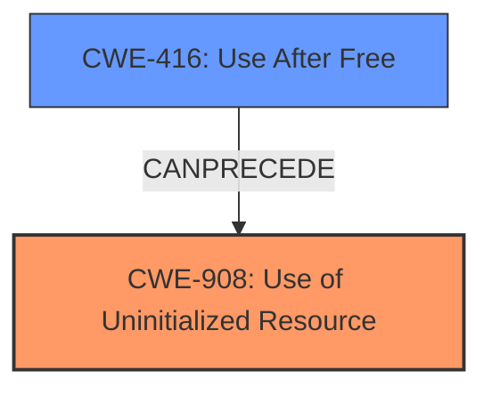

# Analysis for CVE-2021-29980

# Summary

| CWE ID  | CWE Name                                                       | Confidence | CWE Abstraction Level | CWE Vulnerability Mapping Label | CWE-Vulnerability Mapping Notes |
| :-------- | :------------------------------------------------------------- | :--------- | :---------------------- | :------------------------------ | :------------------------------ |
| CWE-908   | Use of Uninitialized Resource                                  | 1.0        | Base                    | Primary                         | Allowed                       |
| CWE-416   | Use After Free                                                 | 0.9        | Variant                 | Secondary                       | Allowed                       |

## Evidence and Confidence

*   **Confidence Score:** 0.95
*   **Evidence Strength:** HIGH

## Relationship Analysis

The primary weakness is CWE-908, reflecting the use of uninitialized memory. The secondary weakness is CWE-416, as the uninitialized memory is then incorrectly freed, leading to a use-after-free condition. These are related, with CWE-908 potentially preceding CWE-416.

## Vulnerability Chain

The vulnerability chain begins with uninitialized memory (CWE-908) in the `mGlyphs` member, followed by an incorrect `free()` operation, which results in a double-free condition and memory corruption (CWE-416), ultimately leading to a potentially exploitable crash.

## Summary of Analysis

The initial assessment identified CWE-908 as the primary weakness due to the **uninitialized memory** issue in the `RecordedFillGlyphs` constructor. This directly aligns with the provided "Vulnerability Description Key Phrases" and "CVE Reference Links Content Summary," which explicitly states, "The primary weakness is the **lack of initialization** of the `mGlyphs` member". The subsequent incorrect free operation leading to a double-free condition supports the inclusion of CWE-416 as a secondary weakness.

The "CVE Reference Links Content Summary" explicitly mentions the root cause: "The vulnerability stems from **uninitialized memory** within a canvas object. Specifically, the `mGlyphs` member in `RecordedFillGlyphs` is not initialized in the constructor. If an error occurs during the construction of a `RecordedFillGlyphs` object, a destructor is called, which attempts to `delete[]` the **uninitialized `mGlyphs` pointer, leading to a double-free**."

The graph relationships influenced the final selection by illustrating the connection between uninitialized resources and use-after-free vulnerabilities. The selected CWEs are at the optimal level of specificity, with CWE-908 as the base cause and CWE-416 as a consequence of the initial weakness.

Relevant CWE Information:

# Enhanced Context (25 CWEs)

## CWE-908: Use of Uninitialized Resource

**Abstraction:** Base

The vulnerability description clearly states that the `mGlyphs` member is not initialized, leading to an incorrect `free()` operation. This directly matches the description of CWE-908: "The product uses or accesses a resource that has not been initialized." The security implication is memory corruption and a potentially exploitable crash.

## CWE-416: Use After Free

**Abstraction:** Variant

The vulnerability description and CVE summary indicate that the uninitialized memory is then freed, and later, this memory is accessed again, leading to a double-free condition. This aligns with CWE-416: "The product reuses or references memory after it has been freed." The security implication is memory corruption and potential for arbitrary code execution.

### Other CWEs Considered But Not Used

*   **CWE-787: Out-of-bounds Write:** While memory corruption is a result of the double-free, the root cause is the use of uninitialized memory, not directly an out-of-bounds write. Therefore, it's less applicable.
*   **CWE-457: Use of Uninitialized Variable:** This is similar to CWE-908 but more specific to variables. Since the uninitialized resource is a memory location, CWE-908 is more appropriate.
*   **CWE-909: Missing Initialization of Resource:** This is a class-level CWE. CWE-908 is a more specific base-level CWE, making it a better fit.
*   **CWE-401: Missing Release of Memory after Effective Lifetime:** Not applicable, since the issue is not a memory leak but a double-free caused by attempting to free uninitialized memory.
*   **CWE-123: Write-what-where Condition:** Not directly applicable. The vulnerability stems from an attempt to free an uninitialized resource, not arbitrary writing to memory.
*   **CWE-704: Incorrect Type Conversion or Cast:** The issue does not involve type conversion or casting, making this CWE irrelevant.
*   **CWE-125: Out-of-bounds Read:** The vulnerability does not directly involve reading data past the end of a buffer.
*   **CWE-843: Access of Resource Using Incompatible Type ('Type Confusion'):** Not directly applicable as the root cause is not related to type confusion, but instead the uninitialized resource.

# Enhanced Query for CVE-2021-29980

## Vulnerability Description
Uninitialized memory in a canvas object could have caused an incorrect free() leading to memory corruption and a potentially exploitable crash. This vulnerability affects Thunderbird < 78.13, Thunderbird < 91, Firefox ESR < 78.13, and Firefox < 91.

### Vulnerability Description Key Phrases
- **rootcause:** **Uninitialized memory ... incorrect free()**
- **impact:** memory corruption and potentially exploitable crash
- **product:** Thunderbird and Firefox ESR and Firefox
- **version:** < 78.13, < 91, < 78.13, < 91

## CVE Reference Links Content Summary
Based on the provided content, here's an analysis of CVE-2021-29980:

**Root Cause of Vulnerability:**
- The vulnerability stems from uninitialized memory within a canvas object. Specifically, the `mGlyphs` member in `RecordedFillGlyphs` is not initialized in the constructor. If an error occurs during the construction of a `RecordedFillGlyphs` object, a destructor is called, which attempts to `delete[]` the uninitialized `mGlyphs` pointer, leading to a double-free.

**Weaknesses/Vulnerabilities Present:**
- **Uninitialized Memory:** The primary weakness is the lack of initialization of the `mGlyphs` member in the `RecordedFillGlyphs` constructor.
- **Double-Free:** The incorrect handling of the uninitialized memory leads to a double-free condition.

**Impact of Exploitation:**
- **Memory Corruption:** The double-free leads to memory corruption, which can cause a crash and potentially be exploited for arbitrary code execution.
- **Exploitable Crash:** The memory corruption can cause a potentially exploitable crash.

**Attack Vectors:**
- The vulnerability can be triggered by manipulating canvas objects in web content, specifically when an error occurs during creation of a `RecordedFillGlyphs` object and subsequent resource cleanup.
- Specifically, by crafting specific HTML content using canvas and triggering certain operations, a double free can be provoked.
- The vulnerability can be triggered through a combination of an iframe with specific javascript code, that triggers resource allocation/deallocation, and then causes a reload of the page, leading to the double free condition.

**Required Attacker Capabilities/Position:**
- An attacker needs to be able to serve or inject malicious HTML content that leverages canvas operations to trigger the vulnerability.
- They need to be able to cause an error during the creation of `RecordedFillGlyphs` to cause the double-free in the destructor.
- A user must either visit the malicious page, or be exposed to the crafted HTML content through other means.

**Additional Notes:**
- The issue affects both Firefox and Thunderbird, because the underlying rendering code is shared between the products.
- The vulnerability has been classified as "high" severity, and is considered remotely exploitable.
- The vulnerability affects Linux, Windows, and potentially other operating systems.
- The bug was fixed by initializing the `mGlyphs` pointer in the `RecordedFillGlyphs` constructor.
- This vulnerability is also related to Bug 1715051.

## Retriever Results

### Top Combined Results

| Rank | CWE ID | Name | Abstraction | Usage  | Retrievers | Individual Scores |
|------|--------|------|-------------|-------|------------|-------------------|
| 1 | 908 | Use of Uninitialized Resource | Base | Allowed | sparse | 0.376 |
| 2 | 787 | Out-of-bounds Write | Base | Allowed | sparse | 0.347 |
| 3 | 457 | Use of Uninitialized Variable | Variant | Allowed | sparse | 0.304 |
| 4 | 416 | Use After Free | Variant | Allowed | sparse | 0.299 |
| 5 | 909 | Missing Initialization of Resource | Class | Allowed-with-Review | sparse | 0.295 |
| 6 | 401 | Missing Release of Memory after Effective Lifetime | Variant | Allowed | dense | 0.521 |
| 7 | 123 | Write-what-where Condition | Base | Allowed | graph | 0.003 |
| 8 | 704 | Incorrect Type Conversion or Cast | Class | Allowed-with-Review | sparse | 0.286 |
| 9 | 125 | Out-of-bounds Read | Base | Allowed | sparse | 0.267 |
| 10 | 843 | Access of Resource Using Incompatible Type ('Type Confusion') | Base | Allowed | sparse | 0.259 |

# Complete CWE Specifications

## CWE-908: Use of Uninitialized Resource
**Abstraction:** Base
**Status:** Incomplete

### Description
The product uses or accesses a resource that has not been initialized.

### Extended Description
When a resource has not been properly initialized, the product may behave unexpectedly. This may lead to a crash or invalid memory access, but the consequences vary depending on the type of resource and how it is used within the product.

### Alternative Terms
None

### Relationships
ChildOf -> CWE-665
ChildOf -> CWE-665

### Mapping Guidance
**Usage:** Allowed
**Rationale:** This CWE entry is at the Base level of abstraction, which is a preferred level of abstraction for mapping to the root causes of vulnerabilities.
**Comments:** Carefully read both the name and description to ensure that this mapping is an appropriate fit. Do not try to 'force' a mapping to a lower-level Base/Variant simply to comply with this preferred level of abstraction.
**Reasons:**
- Acceptable-Use

### Observed Examples
- **CVE-2019-9805:** Chain: Creation of the packet client occurs before initialization is complete (CWE-696) resulting in a read from uninitialized memory (CWE-908), causing memory corruption.
- **CVE-2008-4197:** Use of uninitialized memory may allow code execution.
- **CVE-2008-2934:** Free of an uninitialized pointer leads to crash and possible code execution.

## CWE-787: Out-of-bounds Write
**Abstraction:** Base
**Status:** Draft

### Description
The product writes data past the end, or before the beginning, of the intended buffer.

### Extended Description
Not provided

### Alternative Terms
Memory Corruption: Often used to describe the consequences of writing to memory outside the bounds of a buffer, or to memory that is otherwise invalid.

### Relationships
ChildOf -> CWE-119
ChildOf -> CWE-119
ChildOf -> CWE-119
ChildOf -> CWE-119

### Mapping Guidance
**Usage:** Allowed
**Rationale:** This CWE entry is at the Base level of abstraction, which is a preferred level of abstraction for mapping to the root causes of vulnerabilities.
**Comments:** Carefully read both the name and description to ensure that this mapping is an appropriate fit. Do not try to 'force' a mapping to a lower-level Base/Variant simply to comply with this preferred level of abstraction.
**Reasons:**
- Acceptable-Use

### Observed Examples
- **CVE-2023-1017:** The reference implementation code for a Trusted Platform Module does not implement length checks on data, allowing for an attacker to write 2 bytes past the end of a buffer.
- **CVE-2021-21220:** Chain: insufficient input validation (CWE-20) in browser allows heap corruption (CWE-787), as exploited in the wild per CISA KEV.
- **CVE-2021-28664:** GPU kernel driver allows memory corruption because a user can obtain read/write access to read-only pages, as exploited in the wild per CISA KEV.

## CWE-457: Use of Uninitialized Variable
**Abstraction:** Variant
**Status:** Draft

### Description
The code uses a variable that has not been initialized, leading to unpredictable or unintended results.

### Extended Description
In some languages such as C and C++, stack variables are not initialized by default. They generally contain junk data with the contents of stack memory before the function was invoked. An attacker can sometimes control or read these contents. In other languages or conditions, a variable that is not explicitly initialized can be given a default value that has security implications, depending on the logic of the program. The presence of an uninitialized variable can sometimes indicate a typographic error in the code.

### Alternative Terms
None

### Relationships
ChildOf -> CWE-908
ChildOf -> CWE-665
ChildOf -> CWE-665

### Mapping Guidance
**Usage:** Allowed
**Rationale:** This CWE entry is at the Variant level of abstraction, which is a preferred level of abstraction for mapping to the root causes of vulnerabilities.
**Comments:** Carefully read both the name and description to ensure that this mapping is an appropriate fit. Do not try to 'force' a mapping to a lower-level Base/Variant simply to comply with this preferred level of abstraction.
**Reasons:**
- Acceptable-Use

### Observed Examples
- **CVE-2019-15900:** Chain: sscanf() call is used to check if a username and group exists, but the return value of sscanf() call is not checked (CWE-252), causing an uninitialized variable to be checked (CWE-457), returning success to allow authorization bypass for executing a privileged (CWE-863).
- **CVE-2008-3688:** Chain: A denial of service may be caused by an uninitialized variable (CWE-457) allowing an infinite loop (CWE-835) resulting from a connection to an unresponsive server.
- **CVE-2008-0081:** Uninitialized variable leads to code execution in popular desktop application.

## CWE-416: Use After Free
**Abstraction:** Variant
**Status:** Stable

### Description
The product reuses or references memory after it has been freed. At some point afterward, the memory may be allocated again and saved in another pointer, while the original pointer references a location somewhere within the new allocation. Any operations using the original pointer are no longer valid because the memory "belongs" to the code that operates on the new pointer.

### Extended Description
Not provided

### Alternative Terms
Dangling pointer: a pointer that no longer points to valid memory, often after it has been freed
UAF: commonly used acronym for Use After Free
Use-After-Free

### Relationships
ChildOf -> CWE-825
ChildOf -> CWE-672
ChildOf -> CWE-672
ChildOf -> CWE-672
CanPrecede -> CWE-120
CanPrecede -> CWE-123

### Mapping Guidance
**Usage:** Allowed
**Rationale:** This CWE entry is at the Variant level of abstraction, which is a preferred level of abstraction for mapping to the root causes of vulnerabilities.
**Comments:** Carefully read both the name and description to ensure that this mapping is an appropriate fit. Do not try to 'force' a mapping to a lower-level Base/Variant simply to comply with this preferred level of abstraction.
**Reasons:**
- Acceptable-Use

### Observed Examples
- **CVE-2022-20141:** Chain: an operating system kernel has insufficent resource locking (CWE-413) leading to a use after free (CWE-416).
- **CVE-2022-2621:** Chain: two threads in a web browser use the same resource (CWE-366), but one of those threads can destroy the resource before the other has completed (CWE-416).
- **CVE-2021-0920:** Chain: mobile platform race condition (CWE-362) leading to use-after-free (CWE-416), as exploited in the wild per CISA KEV.

## CWE-909: Missing Initialization of Resource
**Abstraction:** Class
**Status:** Incomplete

### Description
The product does not initialize a critical resource.

### Extended Description
Many resources require initialization before they can be properly used. If a resource is not initialized, it could contain unpredictable or expired data, or it could be initialized to defaults that are invalid. This can have security implications when the resource is expected to have certain properties or values.

### Alternative Terms
None

### Relationships
ChildOf -> CWE-665
ChildOf -> CWE-665
CanPrecede -> CWE-908

### Mapping Guidance
**Usage:** Allowed-with-Review
**Rationale:** This CWE entry is a Class and might have Base-level children that would be more appropriate
**Comments:** Examine children of this entry to see if there is a better fit
**Reasons:**
- Abstraction

### Observed Examples
- **CVE-2020-20739:** A variable that has its value set in a conditional statement is sometimes used when the conditional fails, sometimes causing data leakage
- **CVE-2005-1036:** Chain: Bypass of access restrictions due to improper authorization (CWE-862) of a user results from an improperly initialized (CWE-909) I/O permission bitmap

## CWE-401: Missing Release of Memory after Effective Lifetime
**Abstraction:** Variant
**Status:** Draft

### Description
The product does not sufficiently track and release allocated memory after it has been used, which slowly consumes remaining memory.

### Extended Description
This is often triggered by improper handling of malformed data or unexpectedly interrupted sessions. In some languages, developers are responsible for tracking memory allocation and releasing the memory. If there are no more pointers or references to the memory, then it can no longer be tracked and identified for release.

### Alternative Terms
Memory Leak

### Relationships
ChildOf -> CWE-772
ChildOf -> CWE-404
ChildOf -> CWE-404

### Mapping Guidance
**Usage:** Allowed
**Rationale:** This CWE entry is at the Variant level of abstraction, which is a preferred level of abstraction for mapping to the root causes of vulnerabilities.
**Comments:** Carefully read both the name and description to ensure that this mapping is an appropriate fit. Do not try to 'force' a mapping to a lower-level Base/Variant simply to comply with this preferred level of abstraction.
**Reasons:**
- Acceptable-Use

### Additional Notes
**[Relationship]** This is often a resultant weakness due to improper handling of malformed data or early termination of sessions.

**[Terminology]** "memory leak" has sometimes been used to describe other kinds of issues, e.g. for information leaks in which the contents of memory are inadvertently leaked (CVE-2003-0400 is one such example of this terminology conflict).

### Observed Examples
- **CVE-2005-3119:** Memory leak because function does not free() an element of a data structure.
- **CVE-2004-0427:** Memory leak when counter variable is not decremented.
- **CVE-2002-0574:** chain: reference count is not decremented, leading to memory leak in OS by sending ICMP packets.

## CWE-123: Write-what-where Condition
**Abstraction:** Base
**Status:** Draft

### Description
Any condition where the attacker has the ability to write an arbitrary value to an arbitrary location, often as the result of a buffer overflow.

### Extended Description
Not provided

### Alternative Terms
None

### Relationships
ChildOf -> CWE-787
ChildOf -> CWE-119
ChildOf -> CWE-119

### Mapping Guidance
**Usage:** Allowed
**Rationale:** This CWE entry is at the Base level of abstraction, which is a preferred level of abstraction for mapping to the root causes of vulnerabilities.
**Comments:** Carefully read both the name and description to ensure that this mapping is an appropriate fit. Do not try to 'force' a mapping to a lower-level Base/Variant simply to comply with this preferred level of abstraction.
**Reasons:**
- Acceptable-Use

### Observed Examples
- **CVE-2022-21668:** Chain: Python library does not limit the resources used to process images that specify a very large number of bands (CWE-1284), leading to excessive memory consumption (CWE-789) or an integer overflow (CWE-190).
- **CVE-2022-0545:** Chain: 3D renderer has an integer overflow (CWE-190) leading to write-what-where condition (CWE-123) using a crafted image.

## CWE-704: Incorrect Type Conversion or Cast
**Abstraction:** Class
**Status:** Incomplete

### Description
The product does not correctly convert an object, resource, or structure from one type to a different type.

### Extended Description
Not provided

### Alternative Terms
None

### Relationships
ChildOf -> CWE-664

### Mapping Guidance
**Usage:** Allowed-with-Review
**Rationale:** This CWE entry is a Class and might have Base-level children that would be more appropriate
**Comments:** Examine children of this entry to see if there is a better fit
**Reasons:**
- Abstraction

### Observed Examples
- **CVE-2021-43537:** Chain: in a web browser, an unsigned 64-bit integer is forcibly cast to a 32-bit integer (CWE-681) and potentially leading to an integer overflow (CWE-190). If an integer overflow occurs, this can cause heap memory corruption (CWE-122)
- **CVE-2022-3979:** Chain: data visualization program written in PHP uses the "!=" operator instead of the type-strict "!==" operator (CWE-480) when validating hash values, potentially leading to an incorrect type conversion (CWE-704)

## CWE-125: Out-of-bounds Read
**Abstraction:** Base
**Status:** Draft

### Description
The product reads data past the end, or before the beginning, of the intended buffer.

### Extended Description
Not provided

### Alternative Terms
OOB read: Shorthand for "Out of bounds" read

### Relationships
ChildOf -> CWE-119
ChildOf -> CWE-119
ChildOf -> CWE-119
ChildOf -> CWE-119

### Mapping Guidance
**Usage:** Allowed
**Rationale:** This CWE entry is at the Base level of abstraction, which is a preferred level of abstraction for mapping to the root causes of vulnerabilities.
**Comments:** Carefully read both the name and description to ensure that this mapping is an appropriate fit. Do not try to 'force' a mapping to a lower-level Base/Variant simply to comply with this preferred level of abstraction.
**Reasons:**
- Acceptable-Use

### Observed Examples
- **CVE-2023-1018:** The reference implementation code for a Trusted Platform Module does not implement length checks on data, allowing for an attacker to read 2 bytes past the end of a buffer.
- **CVE-2020-11899:** Out-of-bounds read in IP stack used in embedded systems, as exploited in the wild per CISA KEV.
- **CVE-2014-0160:** Chain: "Heartbleed" bug receives an inconsistent length parameter (CWE-130) enabling an out-of-bounds read (CWE-126), returning memory that could include private cryptographic keys and other sensitive data.

## CWE-843: Access of Resource Using Incompatible Type ('Type Confusion')
**Abstraction:** Base
**Status:** Incomplete

### Description
The product allocates or initializes a resource such as a pointer, object, or variable using one type, but it later accesses that resource using a type that is incompatible with the original type.

### Extended Description

When the product accesses the resource using an incompatible type, this could trigger logical errors because the resource does not have expected properties. In languages without memory safety, such as C and C++, type confusion can lead to out-of-bounds memory access.

While this weakness is frequently associated with unions when parsing data with many different embedded object types in C, it can be present in any application that can interpret the same variable or memory location in multiple ways.

This weakness is not unique to C and C++. For example, errors in PHP applications can be triggered by providing array parameters when scalars are expected, or vice versa. Languages such as Perl, which perform automatic conversion of a variable of one type when it is accessed as if it were another type, can also contain these issues.

### Alternative Terms
Object Type Confusion

### Relationships
ChildOf -> CWE-704
ChildOf -> CWE-704
CanPrecede -> CWE-119

### Mapping Guidance
**Usage:** Allowed
**Rationale:** This CWE entry is at the Base level of abstraction, which is a preferred level of abstraction for mapping to the root causes of vulnerabilities.
**Comments:** Carefully read both the name and description to ensure that this mapping is an appropriate fit. Do not try to 'force' a mapping to a lower-level Base/Variant simply to comply with this preferred level of abstraction.
**Reasons:**
- Acceptable-Use

### Additional Notes
**[Applicable Platform]** 

This weakness is possible in any type-unsafe programming language.

**[Research Gap]** 

Type confusion weaknesses have received some attention by applied researchers and major software vendors for C and C++ code. Some publicly-reported vulnerabilities probably have type confusion as a root-cause weakness, but these may be described as "memory corruption" instead.

For other languages, there are very few public reports of type confusion weaknesses. These are probably under-studied. Since many programs rely directly or indirectly on loose typing, a potential "type confusion" behavior might be intentional, possibly requiring more manual analysis.

### Observed Examples
- **CVE-2010-4577:** Type confusion in CSS sequence leads to out-of-bounds read.
- **CVE-2011-0611:** Size inconsistency allows code execution, first discovered when it was actively exploited in-the-wild.
- **CVE-2010-0258:** Improperly-parsed file containing records of different types leads to code execution when a memory location is interpreted as a different object than intended.

