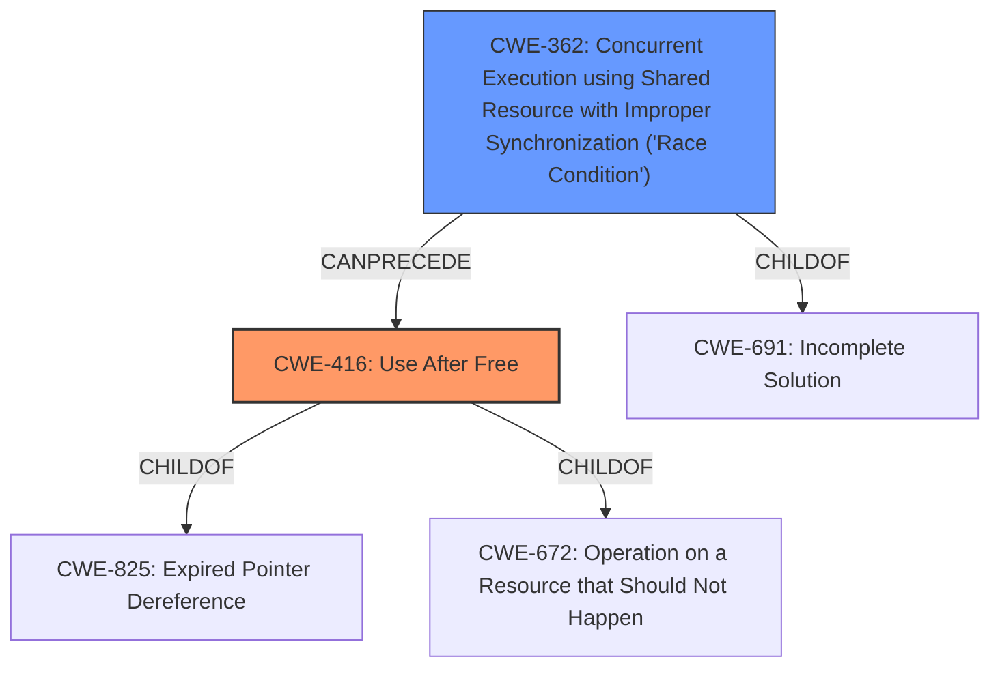

# Raw Analyzer Response for CVE-2021-29986

# Summary
| CWE ID | CWE Name | Confidence | CWE Abstraction Level | CWE Vulnerability Mapping Label | CWE-Vulnerability Mapping Notes |
|---|---|---|---|---|---|
| CWE-416 | Use After Free | 0.9 | Variant | Allowed | Primary CWE |
| CWE-362 | Concurrent Execution using Shared Resource with Improper Synchronization ('Race Condition') | 0.8 | Class | Allowed-with-Review | Secondary Candidate |

## Evidence and Confidence

*   **Confidence Score:** 0.85
*   **Evidence Strength:** HIGH

## Relationship Analysis
The primary CWE is CWE-416 (Use After Free), which directly reflects the vulnerability's description and CVE details. The secondary CWE is CWE-362 (Concurrent Execution using Shared Resource with Improper Synchronization ('Race Condition')), indicating the root cause leading to the use-after-free condition.

## Vulnerability Chain
The vulnerability chain starts with a **race condition** (CWE-362) where multiple threads concurrently access a shared resource (hostname string). Due to **improper synchronization**, this leads to a **use-after-free** condition (CWE-416) when the hostname string is freed or modified by one thread while another thread is still using it within the `getaddrinfo` function. The impact is **memory corruption** and a potential crash, which could be exploited for arbitrary code execution.

## Summary of Analysis
The analysis is based on the provided evidence, which includes a clear description of the vulnerability, its root cause, and its impact. The key phrases "**race condition**" and "memory corruption" in the vulnerability description, along with the CVE reference links content summary detailing the use-after-free and thread safety issues, provide strong support for the selected CWEs.

The Retriever Results also support these choices, with CWE-362 and CWE-416 appearing among the top candidates.

CWE-416 is chosen as the primary CWE because the vulnerability description explicitly mentions the use-after-free condition. The CVE reference links further confirm this, stating that "the core issue is that the hostname string used by the DNS resolver thread can be freed or modified while the `getaddrinfo` function is still using it, leading to a use-after-free condition."

CWE-362 is selected as a secondary CWE because the "**race condition**" is the underlying cause that leads to the use-after-free. The CVE reference links also highlight the lack of proper synchronization as a contributing factor.

The selected CWEs are at the optimal level of specificity because they accurately represent the weakness and its root cause, as evidenced by the vulnerability description and supporting information.

Relevant CWE Information:

# Enhanced Context (25 CWEs)
The following CWEs were identified as potentially relevant to this vulnerability:

## CWE-843: Access of Resource Using Incompatible Type ('Type Confusion')
**Abstraction Level**: Base
**Similarity Score**: 0.79
**Source**: dense

**Description**:
The product allocates or initializes a resource such as a pointer, object, or variable using one type, but it later accesses that resource using a type that is incompatible with the original type.

**Mapping Guidance**:
- Usage: Allowed
- Rationale: This CWE entry is at the Base level of abstraction, which is a preferred level of abstraction for mapping to the root causes of vulnerabilities.

Analysis: While memory corruption occurs, the root cause isn't related to type confusion, so this CWE isn't appropriate.

## CWE-366: Race Condition within a Thread
**Abstraction Level**: Base
**Similarity Score**: 0.77
**Source**: dense

**Description**:
If two threads of execution use a resource simultaneously, there exists the possibility that resources may be used while invalid, in turn making the state of execution undefined.

**Mapping Guidance**:
- Usage: Allowed
- Rationale: This CWE entry is at the Base level of abstraction, which is a preferred level of abstraction for mapping to the root causes of vulnerabilities.

Analysis: CWE-366 is more specific than CWE-362, but CWE-362 more accurately captures the synchronization aspect.

## CWE-367: Time-of-check Time-of-use (TOCTOU) Race Condition
**Abstraction Level**: Base
**Similarity Score**: 0.77
**Source**: dense

**Description**:
The product checks the state of a resource before using that resource, but the resource's state can change between the check and the use in a way that invalidates the results of the check. This can cause the product to perform invalid actions when the resource is in an unexpected state.

**Mapping Guidance**:
- Usage: Allowed
- Rationale: This CWE entry is at the Base level of abstraction, which is a preferred level of abstraction for mapping to the root causes of vulnerabilities.

Analysis: While a race condition exists, it isn't a TOCTOU issue because the check/use pattern doesn't exist.

## CWE-362: Concurrent Execution using Shared Resource with Improper Synchronization ('Race Condition')
**Abstraction Level**: Class
**Similarity Score**: 0.76
**Source**: dense

**Description**:
The product contains a concurrent code sequence that requires temporary, exclusive access to a shared resource, but a timing window exists in which the shared resource can be modified by another code sequence operating concurrently.

**Mapping Guidance**:
- Usage: Allowed-with-Review
- Rationale: This CWE entry is a Class and might have Base-level children that would be more appropriate

Analysis: Chosen as a secondary CWE due to the race condition and improper synchronization of threads accessing the shared hostname string.

## CWE-667: Improper Locking
**Abstraction Level**: Class
**Similarity Score**: 0.76
**Source**: dense

**Description**:
The product does not properly acquire or release a lock on a resource, leading to unexpected resource state changes and behaviors.

**Mapping Guidance**:
- Usage: Allowed-with-Review
- Rationale: This CWE entry is a Class and might have Base-level children that would be more appropriate

Analysis: This could be related to the race condition, but CWE-362 is a better fit.

## CWE-404: Improper Resource Shutdown or Release
**Abstraction Level**: Class
**Similarity Score**: 0.76
**Source**: dense

**Description**:
The product does not release or incorrectly releases a resource before it is made available for re-use.

**Mapping Guidance**:
- Usage: Allowed-with-Review
- Rationale: This CWE entry is a Class and might have Base-level children that would be more appropriate

Analysis: This is more of a symptom than the root cause.

## CWE-1289: Improper Validation of Unsafe Equivalence in Input
**Abstraction Level**: Base
**Similarity Score**: 0.76
**Source**: dense

**Description**:
The product receives an input value that is used as a resource identifier or other type of reference, but it does not validate or incorrectly validates that the input is equivalent to a potentially-unsafe value.

**Mapping Guidance**:
- Usage: Allowed
- Rationale: This CWE entry is at the Base level of abstraction, which is a preferred level of abstraction for mapping to the root causes of vulnerabilities.

Analysis: This CWE doesn't fit the description of the vulnerability.

## CWE-125: Out-of-bounds Read
**Abstraction Level**: Base
**Similarity Score**: 0.75
**Source**: dense

**Description**:
The product reads data past the end, or before the beginning, of the intended buffer.

**Mapping Guidance**:
- Usage: Allowed
- Rationale: This CWE entry is at the Base level of abstraction, which is a preferred level of abstraction for mapping to the root causes of vulnerabilities.

Analysis: The vulnerability description specifies a use-after-free and resulting memory corruption, which is writing to memory, making this an inappropriate match.

## CWE-226: Sensitive Information in Resource Not Removed Before Reuse
**Abstraction Level**: Base
**Similarity Score**: 0.75
**Source**: dense

**Description**:
The product releases a resource such as memory or a file so that it can be made available for reuse, but it does not clear or "zeroize" the information contained in the resource