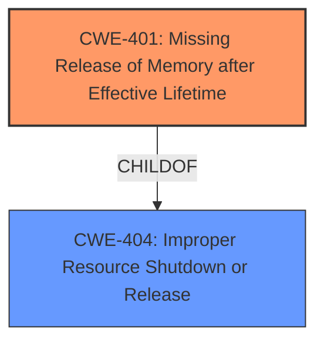

# Analysis Report for CVE-2021-30002

# Vulnerability Analysis Report: CVE-2021-30002

## Description


## Analysis (with Relationship Data)

# Summary
| CWE ID | CWE Name | Confidence | CWE Abstraction Level | CWE Vulnerability Mapping Label | CWE-Vulnerability Mapping Notes |
|---|---|---|---|---|---|
| CWE-401 | Missing Release of Memory after Effective Lifetime | 1.0 | Variant | Allowed | Primary CWE |

## Evidence and Confidence

*   **Confidence Score:** 1.0
*   **Evidence Strength:** HIGH

## Relationship Analysis
The primary relationship that influenced the decision was the ChildOf relationship, linking CWE-401 to its parents, specifically CWE-404 (Improper Resource Shutdown or Release). This indicated that the memory leak is a specific type of resource management issue. The variant level of CWE-401 also aligns well with the specific nature of the **memory leak** vulnerability described.



## Vulnerability Chain
The chain of events is as follows:

1.  The `video_usercopy` function in the Linux kernel fails to release allocated memory. (**ROOT CAUSE:** CWE-401 Missing Release of Memory after Effective Lifetime)
2.  Repeated calls to the function exhaust available memory.
3.  The system becomes unresponsive or crashes due to memory exhaustion, resulting in a denial of service.

## Summary of Analysis
The initial assessment focused on identifying the **memory leak** as the primary **weakness**. The evidence from the "CVE Reference Links Content Summary" clearly states that the root cause is a **failure to deallocate allocated memory**, which directly aligns with CWE-401 (Missing Release of Memory after Effective Lifetime).

The "Retriever Results" also listed CWE-401 as the top candidate with a score of 1.0, further supporting this choice. The description of CWE-401 precisely matches the vulnerability: "The product does not sufficiently track and release allocated memory after it has been used, which slowly consumes remaining memory."

The decision to select CWE-401 is strongly based on the evidence provided, particularly the explicit mention of a **memory leak** and the root cause analysis in the CVE summary. This aligns with the definition and examples provided for CWE-401, making it the most specific and accurate classification for this vulnerability.

Relevant CWE Information:

# Enhanced Context (25 CWEs)
The following CWEs were identified as potentially relevant to this vulnerability:

## CWE-401: Missing Release of Memory after Effective Lifetime
**Abstraction:** Variant
**Status:** Draft

### Description
The product does not sufficiently track and release allocated memory after it has been used, which slowly consumes remaining memory.

### Extended Description
This is often triggered by improper handling of malformed data or unexpectedly interrupted sessions. In some languages, developers are responsible for tracking memory allocation and releasing the memory. If there are no more pointers or references to the memory, then it can no longer be tracked and identified for release.

### Alternative Terms
Memory Leak

### Relationships
ChildOf -> CWE-772
ChildOf -> CWE-404
ChildOf -> CWE-404

### Mapping Guidance
**Usage:** Allowed
**Rationale:** This CWE entry is at the Variant level of abstraction, which is a preferred level of abstraction for mapping to the root causes of vulnerabilities.
**Comments:** Carefully read both the name and description to ensure that this mapping is an appropriate fit. Do not try to 'force' a mapping to a lower-level Base/Variant simply to comply with this preferred level of abstraction.
**Reasons:**
- Acceptable-Use


### Additional Notes
**[Relationship]** This is often a resultant weakness due to improper handling of malformed data or early termination of sessions.

**[Terminology]** "memory leak" has sometimes been used to describe other kinds of issues, e.g. for information leaks in which the contents of memory are inadvertently leaked (CVE-2003-0400 is one such example of this terminology conflict).


### Observed Examples
- **CVE-2005-3119:** Memory leak because function does not free() an element of a data structure.
- **CVE-2004-0427:** Memory leak when counter variable is not decremented.
- **CVE-2002-0574:** chain: reference count is not decremented, leading to memory leak in OS by sending ICMP packets.


## CWE Relationship Analysis

Current CWEs represent these abstraction levels: .


### Vulnerability Chain Analysis

**Chain starting from CWE-772:**
- 772 (Missing Release of Resource after Effective Lifetime) - ROOT


**Chain starting from CWE-404:**
- 404 (Improper Resource Shutdown or Release) - ROOT


### CWE Relationship Diagram

```mermaid
graph TD
    classDef primary fill:#f96,stroke:#333,stroke-width:2px
    classDef secondary fill:#69f,stroke:#333
    classDef tertiary fill:#9e9,stroke:#333
```


*Report generated on 2025-04-02 05:55:18*
