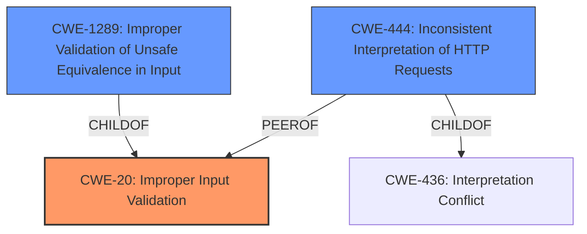

# Analysis for CVE-2021-30004

# Summary
| CWE ID | CWE Name | Confidence | CWE Abstraction Level | CWE Vulnerability Mapping Label | CWE-Vulnerability Mapping Notes |
|---|---|---|---|---|---|
| CWE-20 | Improper Input Validation | 0.8 | Class | Primary | Allowed |
| CWE-1289 | Improper Validation of Unsafe Equivalence in Input | 0.7 | Base | Secondary | Allowed |
| CWE-444 | Inconsistent Interpretation of HTTP Requests ('HTTP Request/Response Smuggling') | 0.6 | Base | Secondary | Allowed |

## Evidence and Confidence

*   **Confidence Score:** 0.8
*   **Evidence Strength:** HIGH

## Relationship Analysis
The primary weakness is **Improper Input Validation (CWE-20)**, which is a broad class. The analysis considered that the specific vulnerability involves **mishandling AlgorithmIdentifier parameters**, suggesting a lack of validation. Then **Improper Validation of Unsafe Equivalence in Input (CWE-1289)** was considered a more specific Base level candidate, as the input is being used as a resource identifier and it is not being properly validated against a potentially unsafe value. **Inconsistent Interpretation of HTTP Requests (CWE-444)** was considered as it involves mishandling HTTP requests which have inconsistencies, but the vulnerability is not directly related to HTTP requests, and is more about mishandling parameters in TLS/PKCS1.

## Vulnerability Chain
The vulnerability chain starts with the **mishandling of AlgorithmIdentifier parameters (CWE-20)** due to insufficient input validation. This leads to the potential for forging attacks, which can further lead to arbitrary code execution.
  - Root Cause: **Improper Input Validation (CWE-20)**
  - Weakness: Insufficient Validation of `DigestAlgorithmIdentifier`
  - Impact: Potential for Forging Attacks, Arbitrary Code Execution

## Summary of Analysis
The initial assessment identified **Improper Input Validation (CWE-20)** as the primary weakness, due to the **mishandling of AlgorithmIdentifier parameters**. The analysis was based on the following evidence: "**rootcause:** **mishandling of AlgorithmIdentifier parameters**" and "The vulnerability stems from insufficient validation of `DigestAlgorithmIdentifier` parameters".

The analysis considered **Improper Validation of Unsafe Equivalence in Input (CWE-1289)** as a more specific alternative, but ultimately **CWE-20** was chosen as it better represents the overall root cause. The vulnerability involves a broad lack of validation of parameters, rather than specifically validating equivalence to unsafe values.

The final decision was to assign **CWE-20** as the primary CWE, with a confidence score of 0.8, based on the provided evidence and the CWE's characteristics.
**CWE-1289** and **CWE-444** are potential secondary CWEs due to the unsafe input or mishandling of requests that may arise as a result of the vulnerability. However, they do not represent the primary root cause.

Relevant CWE Information:

# Enhanced Context (25 CWEs)
The following CWEs were identified as potentially relevant to this vulnerability:

## CWE-444: Inconsistent Interpretation of HTTP Requests ('HTTP Request/Response Smuggling')
**Abstraction Level**: Base
**Similarity Score**: 0.83
**Source**: dense

**Description**:
The product acts as an intermediary HTTP agent
         (such as a proxy or firewall) in the data flow between two
         entities such as a client and server, but it does not
         interpret malformed HTTP requests or responses in ways that
         are consistent with how the messages will be processed by
         those entities that are at the ultimate destination.

**Mapping Guidance**:
- Usage: Allowed
- Rationale: This CWE entry is at the Base level of abstraction, which is a preferred level of abstraction for mapping to the root causes of vulnerabilities.

## CWE-113: Improper Neutralization of CRLF Sequences in HTTP Headers ('HTTP Request/Response Splitting')
**Abstraction Level**: Variant
**Similarity Score**: 0.76
**Source**: dense

**Description**:
The product receives data from an HTTP agent/component (e.g., web server, proxy, browser, etc.), but it does not neutralize or incorrectly neutralizes CR and LF characters before the data is included in outgoing HTTP headers.

**Mapping Guidance**:
- Usage: Allowed
- Rationale: This CWE entry is at the Variant level of abstraction, which is a preferred level of abstraction for mapping to the root causes of vulnerabilities.

## CWE-319: Cleartext Transmission of Sensitive Information
**Abstraction Level**: Base
**Similarity Score**: 0.75
**Source**: dense

**Description**:
The product transmits sensitive or security-critical data in cleartext in a communication channel that can be sniffed by unauthorized actors.

**Mapping Guidance**:
- Usage: Allowed
- Rationale: This CWE entry is at the Base level of abstraction, which is a preferred level of abstraction for mapping to the root causes of vulnerabilities.

## CWE-204: Observable Response Discrepancy
**Abstraction Level**: Base
**Similarity Score**: 0.74
**Source**: dense

**Description**:
The product provides different responses to incoming requests in a way that reveals internal state information to an unauthorized actor outside of the intended control sphere.

**Mapping Guidance**:
- Usage: Allowed
- Rationale: This CWE entry is at the Base level of abstraction, which is a preferred level of abstraction for mapping to the root causes of vulnerabilities.

## CWE-300: Channel Accessible by Non-Endpoint
**Abstraction Level**: Class
**Similarity Score**: 0.74
**Source**: dense

**Description**:
The product does not adequately verify the identity of actors at both ends of a communication channel, or does not adequately ensure the integrity of the channel, in a way that allows the channel to be accessed or influenced by an actor that is not an endpoint.

**Mapping Guidance**:
- Usage: Discouraged
- Rationale: CWE-300 is commonly misused for vulnerabilities in which the prerequisites for exploitation require the adversary to be in a privileged "in-the-middle" position.

## CWE-130: Improper Handling of Length Parameter Inconsistency
**Abstraction Level**: Base
**Similarity Score**: 0.74
**Source**: dense

**Description**:
The product parses a formatted message or structure, but it does not handle or incorrectly handles a length field that is inconsistent with the actual length of the associated data.

**Mapping Guidance**:
- Usage: Allowed
- Rationale: This CWE entry is at the Base level of abstraction, which is a preferred level of abstraction for mapping to the root causes of vulnerabilities.

## CWE-1289: Improper Validation of Unsafe Equivalence in Input
**Abstraction Level**: Base
**Similarity Score**: 0.74
**Source**: dense

**Description**:
The product receives an input value that is used as a resource identifier or other type of reference, but it does not validate or incorrectly validates that the input is equivalent to a potentially-unsafe value.

**Mapping Guidance**:
- Usage: Allowed
- Rationale: This CWE entry is at the Base level of abstraction, which is a preferred level of abstraction for mapping to the root causes of vulnerabilities.

## CWE-134: Use of Externally-Controlled Format String
**Abstraction Level**: Base
**Similarity Score**: 0.74
**Source**: dense

**Description**:
The product uses a function that accepts a format string as an argument, but the format string originates from an external source.

**Mapping Guidance**:
- Usage: Allowed
- Rationale: This CWE entry is at the Base level of abstraction, which is a preferred level of abstraction for mapping to the root causes of vulnerabilities.

## CWE-203: Observable Discrepancy
**Abstraction Level**: Base
**Similarity Score**: 0.74
**Source**: dense

**Description**:
The product behaves differently or sends different responses under different circumstances in a way that is observable to an unauthorized actor, which exposes security-relevant information about the state of the product, such as whether a particular operation was successful or not.

**Mapping Guidance**:
- Usage: Allowed
- Rationale: This CWE entry is at the Base level of abstraction, which is a preferred level of abstraction for mapping to the root causes of vulnerabilities.

## CWE-