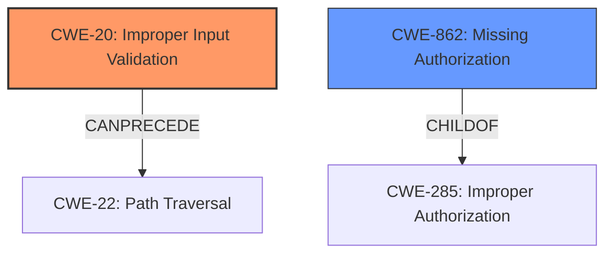

# Analysis for CVE-2021-30005

# Summary
| CWE ID | CWE Name | Confidence | CWE Abstraction Level | CWE Vulnerability Mapping Label | CWE-Vulnerability Mapping Notes |
|---|---|---|---|---|---|
| CWE-20 (Primary) | Improper Input Validation | 0.8 | Class | Discouraged | The vulnerability stems from **insufficient checks** when getting the project from VCS, which is a form of improper input validation. |
| CWE-862 (Secondary) | Missing Authorization | 0.6 | Class | Allowed-with-Review | Although not explicitly stated, the **insufficient checks** when getting the project from VCS might involve missing authorization checks. |

## Evidence and Confidence

*   **Confidence Score:** 0.7
*   **Evidence Strength:** MEDIUM

## Relationship Analysis
The primary CWE is CWE-20, "Improper Input Validation".
CWE-20 is a class-level CWE, and it has several children that are more specific, like CWE-1284, CWE-1285, CWE-1286, CWE-1287, CWE-1288, and CWE-1289. However, based on the provided information, it's hard to determine which of these more specific CWEs would be the best fit.

CWE-862, "Missing Authorization" is a potential secondary CWE because the **insufficient checks** mentioned in the vulnerability description might relate to missing authorization.

## Vulnerability Chain
The vulnerability chain starts with the **insufficient checks** (CWE-20) when getting the project from VCS. This **insufficient check** could lead to missing authorization (CWE-862), which then enables local code execution.

## Summary of Analysis
The vulnerability description indicates that the root cause is **insufficient checks** when getting the project from VCS, leading to local code execution. The "CVE Reference Links Content Summary" confirms this, stating, "Insufficient validation within PyCharm’s checks for fetching projects from VCS." and lists "Insufficient input validation" as a weakness.

CWE-20, "Improper Input Validation," aligns with the description of **insufficient checks**. This CWE is a Class, but the available information doesn't allow for a more specific classification.

CWE-862, "Missing Authorization," is considered as a secondary CWE because the **insufficient checks** might involve missing authorization checks when getting the project from VCS.

Although some retriever results suggest other CWEs, such as CWE-367 "Time-of-check Time-of-use (TOCTOU) Race Condition", "CWE-754: Improper Check for Unusual or Exceptional Conditions" or "CWE-95: Improper Neutralization of Directives in Dynamically Evaluated Code ('Eval Injection')", they don't fit as closely as CWE-20 and CWE-862. The primary issue is **insufficient validation** of input, making CWE-20 the most relevant.

The selection of CWE-20 is at the appropriate level of specificity, given the available evidence. While a more specific CWE could potentially be identified with further analysis, the current evidence supports CWE-20 as the primary weakness.